# Flutter Notes

Course: Mobile Computing  
Main example used throughout: Fitness Tracker App  
Audience: Beginner Flutter students preparing for written exams and practical viva

---

## How to Study These Notes

Read each topic in this order:

1. Understand the definition.
2. Read the simple explanation.
3. Connect it with the Fitness Tracker app example.
4. Study the diagram.
5. Practice the long question answer.
6. Test yourself with MCQs.

In exams, do not only write code. First write the concept, then explain with points, then give a small example.

---

# 1. Introduction to Flutter App Development

## 1.1 Definition

Flutter is an open-source UI software development kit created by Google. It is used to build applications for Android, iOS, web, desktop, and embedded devices using a single codebase.

Flutter apps are mainly written in the Dart programming language. Flutter uses widgets to build the user interface. A widget is a small building block of the screen, such as text, button, image, row, column, or full page.

## 1.2 Native vs Cross-Platform Development

### Native App Development

Native app development means building an app separately for each operating system using its official language and tools.

Examples:

- Android app: Kotlin or Java with Android Studio
- iOS app: Swift or Objective-C with Xcode

If a company wants both Android and iOS apps, it usually needs two separate codebases.

### Cross-Platform App Development

Cross-platform development means building one app using one codebase and running it on multiple platforms.

Examples:

- Flutter
- React Native
- Xamarin
- Ionic

In Flutter, we write Dart code once and use it for Android, iOS, web, and desktop with platform-specific adjustments when needed.

### Simple Analogy

Native development is like preparing two separate meals for two people because each person has a different taste. Cross-platform development is like preparing one meal that both people can eat, with small changes in spices when needed.

### Comparison Table

| Basis | Native Development | Cross-Platform Development |
|---|---|---|
| Codebase | Separate code for Android and iOS | Mostly one shared codebase |
| Language | Kotlin/Java for Android, Swift for iOS | Dart in Flutter, JavaScript in React Native |
| Cost | Higher | Lower for many projects |
| Development time | More time | Faster |
| Performance | Usually very high | High, depends on framework |
| UI consistency | Platform-specific | Can be same across platforms |
| Team size | Often needs Android and iOS teams | One Flutter team can build both |
| Best for | Platform-heavy apps, special native features | Business apps, startups, fast delivery |

### Diagram: Native vs Cross-Platform

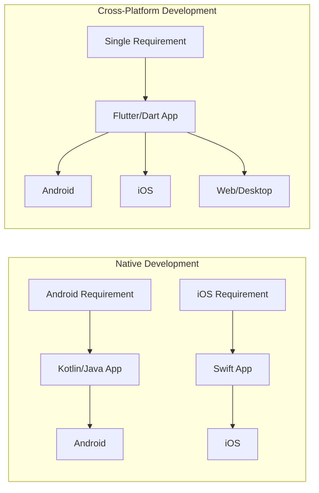

## 1.3 Fitness Tracker App Example

Suppose we are building a Fitness Tracker app with these features:

- User profile
- Daily step count
- Water intake
- Workout list
- Progress chart
- Dark theme

In native development:

- Android team builds the app in Kotlin.
- iOS team builds the app in Swift.
- Both teams repeat many screens and logic separately.

In Flutter:

- One Flutter team builds the profile screen, workout screen, and progress screen once.
- The same Dart code runs on Android and iOS.
- Platform-specific features like health sensor access can be connected using plugins or platform channels.

## 1.4 Why Flutter?

Flutter is popular because it gives fast development, beautiful UI, good performance, and one codebase for many platforms.

### Main Advantages of Flutter

1. Single codebase  
   One Dart codebase can run on Android, iOS, web, desktop, and more.

2. Fast development  
   Hot reload helps developers see UI changes quickly without restarting the whole app.

3. Rich widget system  
   Flutter provides many ready-made widgets such as Text, Button, ListView, Card, AppBar, and NavigationBar.

4. Beautiful UI  
   Flutter can create custom designs easily because UI is built from widgets.

5. Good performance  
   Flutter compiles Dart code to native machine code for mobile and uses its own rendering engine.

6. Consistent design  
   The app can look the same on Android and iOS if needed.

7. Strong community and packages  
   Many useful packages are available on pub.dev, such as provider, flutter_bloc, google_fonts, http, and firebase packages.

## 1.5 Flutter vs React Native, Kotlin, and Swift

### Flutter vs React Native

| Basis | Flutter | React Native |
|---|---|---|
| Main language | Dart | JavaScript or TypeScript |
| UI rendering | Uses Flutter widgets and rendering engine | Uses native components through bridge/new architecture |
| Performance | Generally strong and consistent | Good, but can depend on bridge/native modules |
| UI consistency | Easier to make same UI everywhere | Native look is common |
| Learning curve | Need to learn Dart and widgets | Easier for web JavaScript developers |
| Hot reload | Yes | Yes |

Flutter is often preferred when the app needs highly custom UI, smooth animation, and strong design consistency.

### Flutter vs Kotlin

Kotlin is mainly used for native Android development. Flutter is used for cross-platform development.

| Basis | Flutter | Kotlin Android |
|---|---|---|
| Platform | Android, iOS, web, desktop | Mainly Android |
| UI | Flutter widgets | Android views or Jetpack Compose |
| Code sharing | One codebase for many platforms | Android-focused |
| Best use | Cross-platform apps | Android-specific apps |

Kotlin is best when the project is only Android and needs deep Android platform features. Flutter is better when the same app is needed on Android and iOS quickly.

### Flutter vs Swift

Swift is mainly used for native iOS development. Flutter is used for cross-platform development.

| Basis | Flutter | Swift iOS |
|---|---|---|
| Platform | Android, iOS, web, desktop | iOS, iPadOS, macOS, watchOS |
| UI | Flutter widgets | UIKit or SwiftUI |
| Code sharing | High across platforms | Apple-platform focused |
| Best use | Multi-platform apps | Apple-specific apps |

Swift is best for Apple-only apps. Flutter is better when one app must run on both Android and iOS.

## 1.6 Flutter Architecture

Flutter architecture is layered. Each layer has a clear responsibility.

### Important Parts

1. Dart language  
   Developers write app logic and UI in Dart.

2. Flutter framework  
   Provides widgets, animation, painting, gestures, layout, material design, cupertino design, and navigation.

3. Engine  
   The engine is written mainly in C++. It handles rendering, text, input, and low-level tasks.

4. Rendering engines: Impeller and Skia  
   Flutter uses rendering technology to convert UI into pixels on the screen. Impeller is the modern rendering runtime used by Flutter on current mobile platforms. Skia is also part of Flutter rendering history and is still relevant for some platforms and renderers.

5. Platform embedder  
   Connects Flutter to Android, iOS, web, Windows, macOS, or Linux.

6. Platform channels  
   Allow Dart code to communicate with native Kotlin/Java or Swift/Objective-C code.

### Diagram: Flutter Architecture

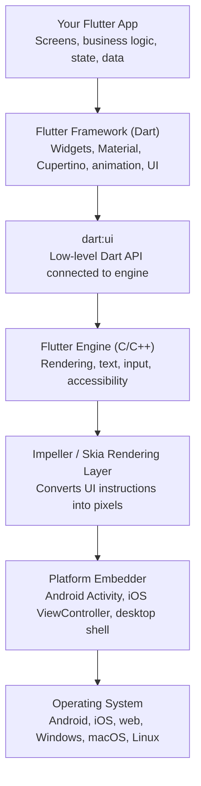

### Platform Channels Diagram

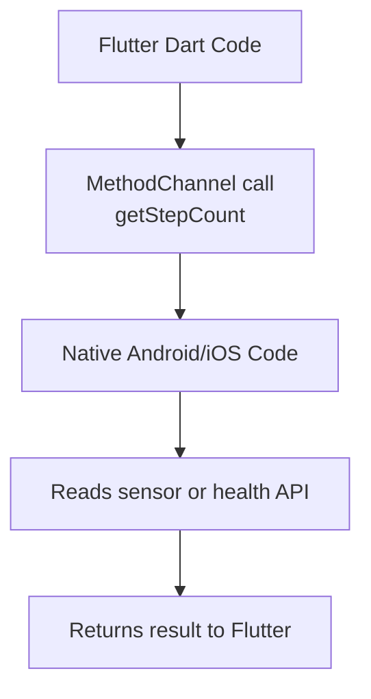

### Fitness Tracker App Example

In the Fitness Tracker app:

- Flutter widgets build the dashboard, buttons, lists, and charts.
- Dart handles logic such as calculating calories.
- State management updates the UI when steps increase.
- Platform channels or plugins can access phone sensors or health APIs.
- The rendering engine draws smooth progress bars and animations.

## 1.7 Common Exam Points and Mistakes

Important points:

- Flutter is not only for Android. It supports multiple platforms.
- Dart is the programming language used by Flutter.
- Everything visible in Flutter UI is usually built using widgets.
- Flutter does not depend completely on native UI widgets for drawing its UI.
- Platform channels are used when Flutter needs native platform features.

Common mistakes:

- Writing "Flutter is a programming language." Correct: Dart is the programming language. Flutter is a UI SDK/framework.
- Writing "Flutter and Dart are same." Correct: Dart is the language, Flutter is the toolkit.
- Saying "Flutter cannot use native features." Correct: Flutter can use native features through plugins and platform channels.

## 1.8 Sample Long Question and Answer

### Question

Explain native and cross-platform mobile application development. Why is Flutter preferred for cross-platform app development? Explain with suitable examples.

### Answer

Native mobile application development means creating separate applications for each platform using the official language and tools of that platform. For Android, developers commonly use Kotlin or Java with Android Studio. For iOS, developers use Swift or Objective-C with Xcode. Native apps usually provide high performance and direct access to platform features, but they require separate development for Android and iOS.

Cross-platform mobile application development means creating one application using a single codebase that can run on multiple platforms. Flutter is an example of a cross-platform framework. In Flutter, developers write code in Dart and use Flutter widgets to create the user interface. The same code can run on Android, iOS, web, and desktop with minor changes.

Flutter is preferred because it reduces development time and cost. It provides hot reload, which allows developers to see changes quickly. It also provides many ready-made widgets for building beautiful user interfaces. Flutter gives good performance because Dart code is compiled to native code on mobile platforms, and Flutter uses its own rendering engine to draw the UI.

For example, in a Fitness Tracker app, the dashboard, profile page, workout list, and water intake screen can be written once in Flutter and used for both Android and iOS. If the app needs phone sensor data, Flutter can use plugins or platform channels to communicate with native Android or iOS code. Therefore, Flutter is useful for building modern, fast, and beautiful cross-platform mobile applications.

## 1.9 MCQs

1. Flutter is mainly used for:
   - A. Database management
   - B. Mobile, web, and desktop app development
   - C. Operating system development
   - D. Hardware design
   - Answer: B

2. The main programming language used in Flutter is:
   - A. Java
   - B. Swift
   - C. Dart
   - D. PHP
   - Answer: C

3. Native Android apps are commonly developed using:
   - A. Kotlin
   - B. Swift
   - C. Dart only
   - D. HTML only
   - Answer: A

4. Platform channels in Flutter are used to:
   - A. Change font size only
   - B. Communicate with native platform code
   - C. Delete widgets
   - D. Run SQL queries only
   - Answer: B

5. The main advantage of cross-platform development is:
   - A. Separate code for every platform
   - B. No UI support
   - C. One codebase for multiple platforms
   - D. Only web support
   - Answer: C

---

# 2. Dart Programming Basics

## 2.1 Definition

Dart is a modern programming language created by Google. Flutter uses Dart to write user interface, logic, functions, classes, and data handling code.

In Flutter, Dart is used to:

- Create widgets
- Handle button clicks
- Store data
- Call APIs
- Manage state
- Navigate between screens

## 2.2 Variables, Data Types, and Operators

### Variables

A variable is a named storage location used to store data.

Example:

```dart
String userName = 'Aadarsh';
int steps = 4500;
double calories = 230.5;
bool goalCompleted = false;
```

### Common Dart Data Types

| Data type | Meaning | Example |
|---|---|---|
| int | Whole number | 5000 |
| double | Decimal number | 65.5 |
| num | int or double | 10, 10.5 |
| String | Text | 'Fitness App' |
| bool | true or false | true |
| dynamic | Can store any type | dynamic value = 10 |
| var | Type is guessed by Dart | var name = 'Ram' |

### var vs dynamic

`var` means Dart decides the type from the first value. After that, the type should not change.

```dart
var steps = 1000;
// steps = 'hello'; // Error because steps is int
```

`dynamic` means the value can change type later.

```dart
dynamic value = 1000;
value = 'steps';
```

Use `dynamic` carefully because it reduces type safety.

### Operators

Operators are symbols used to perform operations.

| Type | Operators | Example |
|---|---|---|
| Arithmetic | +, -, *, /, %, ~/ | steps + 100 |
| Relational | >, <, >=, <=, ==, != | steps > 5000 |
| Logical | &&, ||, ! | isLoggedIn && hasGoal |
| Assignment | =, +=, -= | steps += 500 |

Example:

```dart
int steps = 4500;
int goal = 8000;

bool completed = steps >= goal;
print(completed); // false
```

## 2.3 Control Flow

Control flow controls which code runs and how many times it runs.

### if-else

```dart
int steps = 9000;

if (steps >= 8000) {
  print('Goal completed');
} else {
  print('Keep walking');
}
```

### switch

```dart
String workout = 'cardio';

switch (workout) {
  case 'cardio':
    print('Run for 20 minutes');
    break;
  case 'strength':
    print('Do pushups');
    break;
  default:
    print('Choose a workout');
}
```

### for loop

```dart
for (int day = 1; day <= 7; day++) {
  print('Day $day workout completed');
}
```

### while loop

```dart
int waterGlasses = 0;

while (waterGlasses < 8) {
  waterGlasses++;
  print('Glass $waterGlasses completed');
}
```

## 2.4 Functions

A function is a reusable block of code that performs a task.

```dart
int calculateRemainingSteps(int steps, int goal) {
  return goal - steps;
}

void main() {
  int remaining = calculateRemainingSteps(4500, 8000);
  print('Remaining steps: $remaining');
}
```

### Function Parts

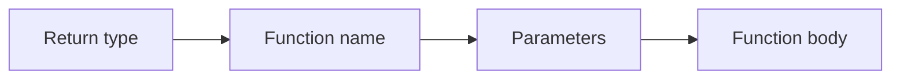

Example:

```dart
double calculateBMI(double weight, double height) {
  return weight / (height * height);
}
```

## 2.5 OOP in Dart

OOP means Object-Oriented Programming. It organizes code using classes and objects.

### Class

A class is a blueprint.

### Object

An object is a real item created from a class.

### Analogy

A class is like a house map. An object is the real house built using that map.

### Example

```dart
class User {
  String name;
  int age;

  User(this.name, this.age);

  void showProfile() {
    print('$name is $age years old');
  }
}

void main() {
  User user = User('Aadarsh', 22);
  user.showProfile();
}
```

### OOP Concepts

| Concept | Meaning | Fitness app example |
|---|---|---|
| Class | Blueprint | User, Workout, Goal |
| Object | Real instance | User('Ram', 20) |
| Encapsulation | Keeping data and methods together | User class stores name and profile method |
| Inheritance | One class gets features from another | PremiumUser extends User |
| Polymorphism | Same method behaves differently | Different workout classes calculate calories differently |

## 2.6 Collections: List, Map, and Set

### List

A List stores multiple values in order. Duplicate values are allowed.

```dart
List<String> workouts = ['Running', 'Yoga', 'Cycling'];
print(workouts[0]); // Running
```

Fitness app use:

- Store workout names
- Store daily step history
- Show items in ListView

### Map

A Map stores data in key-value pairs.

```dart
Map<String, int> weeklySteps = {
  'Monday': 5000,
  'Tuesday': 7000,
  'Wednesday': 8000,
};

print(weeklySteps['Monday']); // 5000
```

Fitness app use:

- Store day name and step count
- Store user settings
- Store API JSON response

### Set

A Set stores unique values only.

```dart
Set<String> completedWorkouts = {'Yoga', 'Running', 'Yoga'};
print(completedWorkouts); // {Yoga, Running}
```

Fitness app use:

- Store unique badges
- Store unique selected workout categories

## 2.7 Null Safety

Null safety helps prevent errors caused by using a value that does not exist.

In Dart, a variable cannot contain null unless we allow it using `?`.

```dart
String name = 'Aadarsh';
// name = null; // Error

String? nickname;
nickname = null; // Allowed
```

### Simple Analogy

Imagine a water bottle. If the bottle is empty and we try to drink from it, we get a problem. Null safety tells us clearly whether the bottle may be empty before we drink.

### Important Operators

| Operator | Meaning | Example |
|---|---|---|
| ? | Variable can be null | String? name |
| ?? | Use default value if null | name ?? 'Guest' |
| ! | I promise this is not null | name! |
| ?. | Access safely if not null | user?.name |

Example:

```dart
String? userName;

print(userName ?? 'Guest User');
```

Avoid using `!` unless you are sure the value is not null.

## 2.8 Diagram: Dart Basics in Fitness App

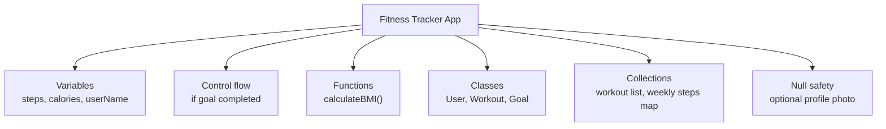

## 2.9 Common Exam Points and Mistakes

Important points:

- Dart is strongly typed.
- `var` infers type, `dynamic` can change type.
- Lists are ordered, Maps are key-value, Sets are unique.
- Null safety prevents many runtime errors.
- Functions help reuse code.

Common mistakes:

- Using `dynamic` everywhere.
- Forgetting that List index starts from 0.
- Confusing Map with List.
- Using `!` without checking null.

## 2.10 Sample Long Question and Answer

### Question

Explain Dart variables, data types, functions, collections, and null safety with examples.

### Answer

Dart is the programming language used in Flutter. It supports variables, data types, functions, collections, object-oriented programming, and null safety.

A variable is used to store data. Dart has different data types such as `int` for whole numbers, `double` for decimal numbers, `String` for text, and `bool` for true or false values. For example, a Fitness Tracker app can store `int steps = 5000`, `double calories = 250.5`, and `String userName = 'Ram'`.

Functions are reusable blocks of code. They help avoid repetition. For example, a function named `calculateBMI()` can take weight and height and return BMI. Dart also supports OOP using classes and objects. A `User` class can store user name, age, and methods related to the user.

Collections are used to store multiple values. A List stores ordered values, a Map stores key-value pairs, and a Set stores unique values. In a Fitness Tracker app, a List can store workout names, a Map can store daily step counts, and a Set can store unique badges.

Null safety is an important Dart feature that prevents errors caused by null values. A normal variable cannot store null, but a nullable variable can be declared using `?`. For example, `String? profilePhoto` means the profile photo may or may not exist. The `??` operator can provide a default value if the variable is null. Thus, Dart features make Flutter app development safer, cleaner, and easier.

## 2.11 MCQs

1. Which data type is used for true or false values in Dart?
   - A. String
   - B. int
   - C. bool
   - D. List
   - Answer: C

2. Which collection stores key-value pairs?
   - A. List
   - B. Map
   - C. Set
   - D. String
   - Answer: B

3. Which symbol makes a Dart variable nullable?
   - A. !
   - B. ?
   - C. #
   - D. &
   - Answer: B

4. What is a class?
   - A. A blueprint for objects
   - B. Only a loop
   - C. Only a variable
   - D. A database
   - Answer: A

5. Which collection removes duplicate values?
   - A. List
   - B. Map
   - C. Set
   - D. int
   - Answer: C

---

# 3. Setting Up Flutter

## 3.1 Definition

Setting up Flutter means installing the tools required to create, run, test, and debug Flutter applications.

The common tools are:

- Flutter SDK
- Dart SDK, included with Flutter
- Android Studio
- Android SDK
- Emulator or physical device
- Code editor such as Android Studio or VS Code

## 3.2 Installing Flutter SDK and Android Studio Setup

### Basic Steps

1. Download Flutter SDK from the official Flutter website.
2. Extract the Flutter SDK to a suitable folder.
3. Add Flutter to the system PATH.
4. Install Android Studio.
5. Install Android SDK and command-line tools.
6. Install Flutter and Dart plugins in Android Studio if using Android Studio as editor.
7. Run `flutter doctor`.
8. Fix any missing dependencies shown by `flutter doctor`.
9. Create or open an emulator, or connect a physical Android phone.

### flutter doctor

`flutter doctor` checks whether Flutter is properly installed.

Example:

```bash
flutter doctor
```

It reports problems such as:

- Android SDK missing
- Android licenses not accepted
- Device not connected
- Editor plugin missing

## 3.3 Flutter Project and Folder Structure

After creating a Flutter project, we see folders and files like these:

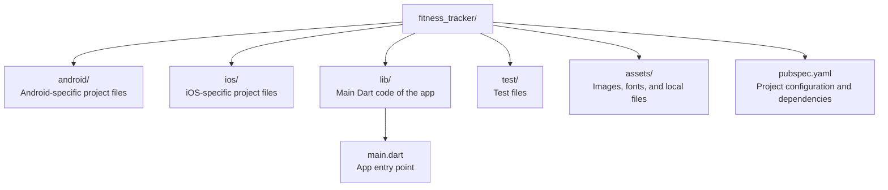

### Important Files

| File/folder | Purpose |
|---|---|
| lib/main.dart | Main starting file of Flutter app |
| pubspec.yaml | Defines app dependencies, assets, fonts |
| android/ | Native Android configuration |
| ios/ | Native iOS configuration |
| test/ | Widget and unit tests |
| assets/ | Images and files used by app |

## 3.4 runApp()

`runApp()` is the function that starts a Flutter application.

Example:

```dart
import 'package:flutter/material.dart';

void main() {
  runApp(const FitnessApp());
}

class FitnessApp extends StatelessWidget {
  const FitnessApp({super.key});

  @override
  Widget build(BuildContext context) {
    return const MaterialApp(
      home: Text('Fitness Tracker'),
    );
  }
}
```

Simple meaning:

- `main()` is the first function that runs.
- `runApp()` tells Flutter which widget is the root of the app.
- `FitnessApp` becomes the starting widget.

## 3.5 App-Level Wrappers: MaterialApp and CupertinoApp

### MaterialApp

`MaterialApp` is used to build apps following Google's Material Design style.

It provides:

- Theme
- Navigation
- Routes
- App title
- Localization support
- Material widgets

Example:

```dart
MaterialApp(
  title: 'Fitness Tracker',
  theme: ThemeData(primarySwatch: Colors.green),
  home: const DashboardScreen(),
)
```

### CupertinoApp

`CupertinoApp` is used to build apps following Apple's iOS design style.

Example:

```dart
CupertinoApp(
  title: 'Fitness Tracker',
  home: CupertinoPageScaffold(
    navigationBar: CupertinoNavigationBar(
      middle: Text('Fitness Tracker'),
    ),
    child: Center(child: Text('Dashboard')),
  ),
)
```

### Difference

| Basis | MaterialApp | CupertinoApp |
|---|---|---|
| Design style | Android/Google Material style | iOS/Apple style |
| Common widgets | Scaffold, AppBar, FloatingActionButton | CupertinoPageScaffold, CupertinoButton |
| Best for | Most Flutter apps | iOS-style apps |

## 3.6 Running First Flutter App

Basic commands:

```bash
flutter create fitness_tracker
cd fitness_tracker
flutter run
```

To run the app:

- Start emulator, or
- Connect phone using USB debugging, then
- Run `flutter run`

## 3.7 Hot Reload vs Hot Restart

### Hot Reload

Hot reload updates UI changes quickly without restarting the whole app. It keeps the current app state in many cases.

Example:

- Change button color.
- Change text.
- Change padding.
- Press hot reload.
- App updates quickly.

### Hot Restart

Hot restart restarts the Dart app from the beginning. It clears the current state.

Example:

- If a counter value was 10, after hot restart it may become 0 again.

### Comparison

| Basis | Hot Reload | Hot Restart |
|---|---|---|
| Speed | Faster | Slower than hot reload |
| Keeps state | Usually yes | No |
| Restarts app | No | Yes |
| Use case | UI changes | App initialization changes |

## 3.8 Diagram: Flutter App Start Flow

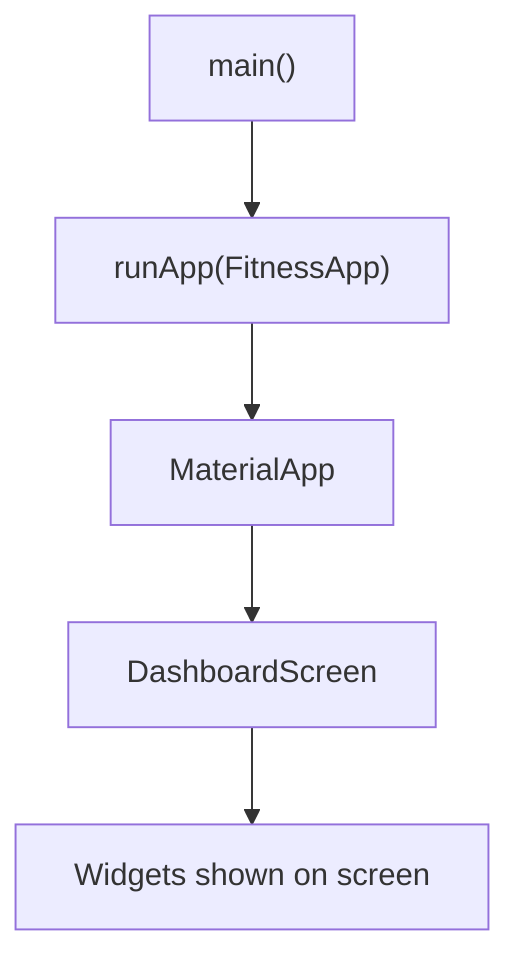

## 3.9 Common Exam Points and Mistakes

Important points:

- `main()` is the entry point of a Dart program.
- `runApp()` starts the Flutter widget tree.
- Most Flutter code is written inside the `lib` folder.
- `pubspec.yaml` manages packages, assets, and fonts.
- Hot reload keeps state in many cases; hot restart resets state.

Common mistakes:

- Forgetting to add assets in `pubspec.yaml`.
- Thinking hot reload always works for every change.
- Confusing `MaterialApp` with `Scaffold`.
- Writing UI directly without a root app widget.

## 3.10 Sample Long Question and Answer

### Question

Explain the steps for setting up Flutter and describe the basic Flutter project structure. Also explain `runApp()`, `MaterialApp`, and hot reload.

### Answer

To set up Flutter, first we download and install the Flutter SDK from the official Flutter website. Then we add Flutter to the system PATH so that the `flutter` command can be used from the terminal. Next, we install Android Studio and required Android SDK tools. If we use Android Studio for development, we install the Flutter and Dart plugins. After installation, we run `flutter doctor` to check whether all required tools are available. If any problem is shown, such as missing Android SDK or unaccepted Android licenses, we fix it.

A Flutter project contains several important folders and files. The `lib` folder contains the main Dart code of the application. The `main.dart` file inside `lib` is usually the starting point. The `pubspec.yaml` file contains project configuration, dependencies, assets, and fonts. The `android` folder contains Android-specific configuration, while the `ios` folder contains iOS-specific configuration. The `test` folder contains testing files.

In Flutter, the `main()` function is the entry point of the app. Inside `main()`, we call `runApp()` and pass the root widget of the application. `MaterialApp` is an app-level wrapper that provides Material Design, theme, navigation, and routing features. `CupertinoApp` is used for iOS-style apps.

Hot reload is a useful Flutter feature that allows developers to see code changes quickly without restarting the entire app. It is mostly used for UI changes and usually keeps the current state. Hot restart restarts the Dart app and clears the state. These features make Flutter development faster and easier.

## 3.11 MCQs

1. Which command checks Flutter installation?
   - A. flutter create
   - B. flutter doctor
   - C. flutter delete
   - D. flutter install only
   - Answer: B

2. Which folder contains main Dart app code?
   - A. android
   - B. ios
   - C. lib
   - D. build
   - Answer: C

3. Which file manages packages and assets?
   - A. main.dart
   - B. pubspec.yaml
   - C. AndroidManifest.xml
   - D. index.html
   - Answer: B

4. Which function starts a Flutter app?
   - A. startApp()
   - B. launch()
   - C. runApp()
   - D. openApp()
   - Answer: C

5. Hot restart usually:
   - A. Keeps all state
   - B. Clears app state and restarts the Dart app
   - C. Only changes text color
   - D. Deletes project files
   - Answer: B

---

# 4. Widgets and Layouts

## 4.1 Definition

Widgets are the basic building blocks of a Flutter user interface. Everything visible on the screen is created using widgets.

Examples:

- Text
- Button
- Image
- Row
- Column
- Container
- ListView
- Full screen/page

Layout means arranging widgets on the screen.

## 4.2 Widget Tree

Flutter apps are built as a tree of widgets.

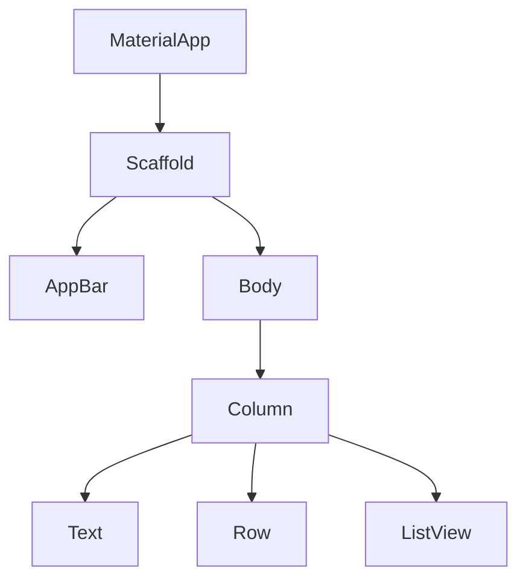

In the Fitness Tracker app, the dashboard screen may contain:

- AppBar showing app title
- Text showing today's steps
- Row showing calories and distance
- ListView showing workouts
- Button to add water intake

## 4.3 StatelessWidget vs StatefulWidget

### StatelessWidget

A StatelessWidget does not change its own internal data after it is built.

Use StatelessWidget when the UI is fixed or receives data from outside.

Example:

```dart
class AppTitle extends StatelessWidget {
  const AppTitle({super.key});

  @override
  Widget build(BuildContext context) {
    return const Text('Fitness Tracker');
  }
}
```

Fitness app example:

- App logo
- Static title
- About page text

### StatefulWidget

A StatefulWidget can change its internal data and rebuild the UI.

Use StatefulWidget when the screen changes because of user interaction.

Example:

```dart
class WaterCounter extends StatefulWidget {
  const WaterCounter({super.key});

  @override
  State<WaterCounter> createState() => _WaterCounterState();
}

class _WaterCounterState extends State<WaterCounter> {
  int glasses = 0;

  @override
  Widget build(BuildContext context) {
    return Column(
      children: [
        Text('Water: $glasses glasses'),
        ElevatedButton(
          onPressed: () {
            setState(() {
              glasses++;
            });
          },
          child: const Text('Add Glass'),
        ),
      ],
    );
  }
}
```

Fitness app example:

- Water counter
- Step counter
- Selected workout screen
- Form input screen

### Comparison

| Basis | StatelessWidget | StatefulWidget |
|---|---|---|
| State change | No internal state change | Can change internal state |
| Rebuild | When parent rebuilds | When `setState()` is called |
| Example | Static title | Counter |
| Complexity | Simpler | More complex |

## 4.4 Basic Widgets

### Text

Used to display text.

```dart
Text(
  'Today: 6500 steps',
  style: TextStyle(fontSize: 22, fontWeight: FontWeight.bold),
)
```

### Container

Used for box styling, size, padding, margin, color, decoration, and alignment.

```dart
Container(
  padding: const EdgeInsets.all(16),
  margin: const EdgeInsets.all(8),
  decoration: BoxDecoration(
    color: Colors.green.shade100,
    borderRadius: BorderRadius.circular(8),
  ),
  child: const Text('Daily Goal'),
)
```

### Row

Arranges children horizontally.

```dart
Row(
  mainAxisAlignment: MainAxisAlignment.spaceAround,
  children: const [
    Text('Steps'),
    Text('Calories'),
    Text('Distance'),
  ],
)
```

### Column

Arranges children vertically.

```dart
Column(
  children: const [
    Text('Morning Run'),
    Text('Yoga'),
    Text('Cycling'),
  ],
)
```

### Stack

Places widgets on top of each other.

```dart
Stack(
  children: [
    Image.asset('assets/banner.png'),
    const Positioned(
      bottom: 10,
      left: 10,
      child: Text('Fitness Challenge'),
    ),
  ],
)
```

Fitness app use:

- Put text over workout image
- Show badge over profile image

### ListView

Used to show a scrollable list.

```dart
ListView(
  children: const [
    ListTile(title: Text('Running')),
    ListTile(title: Text('Yoga')),
    ListTile(title: Text('Cycling')),
  ],
)
```

### ListView.builder

Used for long or dynamic lists. It builds items only when needed.

```dart
final workouts = ['Running', 'Yoga', 'Cycling'];

ListView.builder(
  itemCount: workouts.length,
  itemBuilder: (context, index) {
    return ListTile(
      title: Text(workouts[index]),
    );
  },
)
```

Use `ListView.builder` when the list comes from an API, database, or large collection.

## 4.5 Material and Cupertino Widgets

### Material Widgets

Material widgets follow Google's Material Design.

Examples:

- Scaffold
- AppBar
- ElevatedButton
- FloatingActionButton
- Card
- BottomNavigationBar

```dart
Scaffold(
  appBar: AppBar(title: const Text('Fitness Tracker')),
  body: const Center(child: Text('Dashboard')),
)
```

### Cupertino Widgets

Cupertino widgets follow Apple's iOS design style.

Examples:

- CupertinoButton
- CupertinoNavigationBar
- CupertinoSwitch
- CupertinoPageScaffold

```dart
CupertinoButton(
  onPressed: () {},
  child: const Text('Start Workout'),
)
```

## 4.6 Handling User Inputs

### TextField

Used to take text input from the user.

```dart
TextField(
  decoration: const InputDecoration(
    labelText: 'Enter your weight',
    border: OutlineInputBorder(),
  ),
  keyboardType: TextInputType.number,
)
```

### Buttons

Used to perform actions.

```dart
ElevatedButton(
  onPressed: () {
    print('Workout started');
  },
  child: const Text('Start Workout'),
)
```

### GestureDetector

Used to detect gestures such as tap, double tap, long press, and drag.

```dart
GestureDetector(
  onTap: () {
    print('Workout card tapped');
  },
  child: Container(
    padding: const EdgeInsets.all(16),
    child: const Text('Yoga'),
  ),
)
```

## 4.7 Diagram: Layout Example

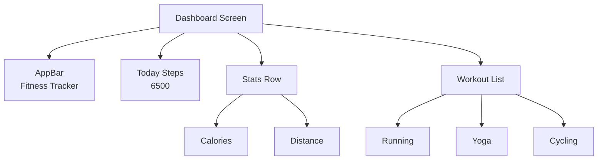

## 4.8 Common Exam Points and Mistakes

Important points:

- Widgets are immutable descriptions of UI.
- Layout widgets arrange other widgets.
- Row is horizontal, Column is vertical.
- ListView is scrollable.
- ListView.builder is better for large/dynamic lists.
- StatefulWidget is used when UI changes due to state.

Common mistakes:

- Putting a large ListView directly inside Column without Expanded.
- Confusing Row and Column axes.
- Using StatefulWidget when StatelessWidget is enough.
- Forgetting to call `setState()` after changing local state.

## 4.9 Sample Long Question and Answer

### Question

Explain StatelessWidget and StatefulWidget. Also describe commonly used Flutter layout widgets with examples.

### Answer

In Flutter, widgets are the basic building blocks of the user interface. A widget describes what should appear on the screen. Flutter has two important types of widgets: StatelessWidget and StatefulWidget.

A StatelessWidget is a widget that does not change its own internal data after it is built. It is used for static UI parts such as titles, icons, labels, and simple display screens. For example, the title "Fitness Tracker" in an app can be created using StatelessWidget.

A StatefulWidget is a widget that can change its internal data and update the user interface. It is used when the UI depends on user interaction or changing data. For example, a water counter in a Fitness Tracker app can increase when the user presses an "Add Glass" button. In this case, `setState()` is called to update the UI.

Flutter provides many layout widgets. `Text` displays text. `Container` is used for box styling, padding, margin, color, and decoration. `Row` arranges widgets horizontally, while `Column` arranges widgets vertically. `Stack` places widgets on top of each other. `ListView` displays a scrollable list, and `ListView.builder` is used for large or dynamic lists because it builds items only when needed.

Thus, widgets and layouts are central to Flutter development. By combining small widgets, developers can build complex and beautiful screens.

## 4.10 MCQs

1. Which widget arranges children vertically?
   - A. Row
   - B. Column
   - C. Stack
   - D. Text
   - Answer: B

2. Which widget is used for scrollable lists?
   - A. Container
   - B. Text
   - C. ListView
   - D. Padding
   - Answer: C

3. Which widget can change its internal state?
   - A. StatelessWidget
   - B. StatefulWidget
   - C. Text only
   - D. Icon only
   - Answer: B

4. Which widget places children on top of each other?
   - A. Row
   - B. Column
   - C. Stack
   - D. ListTile
   - Answer: C

5. What does `setState()` do?
   - A. Deletes the app
   - B. Updates state and rebuilds UI
   - C. Creates database
   - D. Installs packages
   - Answer: B

---

# 5. Styling and Theming

## 5.1 Definition

Styling means changing the appearance of widgets. It includes color, size, font, spacing, border, images, icons, and alignment.

Theming means defining common design rules for the whole app, such as primary color, text style, button style, dark theme, and light theme.

## 5.2 Padding, Margin, and Alignment

### Padding

Padding is space inside a widget, between the content and the border.

```dart
Padding(
  padding: const EdgeInsets.all(16),
  child: const Text('Daily Steps'),
)
```

### Margin

Margin is space outside a widget. In Flutter, margin is often added using `Container`.

```dart
Container(
  margin: const EdgeInsets.all(12),
  child: const Text('Workout Card'),
)
```

### Simple Analogy

Think of a photo frame.

- Padding is the space between the photo and the frame.
- Margin is the space between the frame and other objects on the wall.

### Alignment

Alignment controls where a child is placed inside its parent.

```dart
Container(
  alignment: Alignment.center,
  child: const Text('Goal Completed'),
)
```

## 5.3 Custom Fonts and Icons

### Icons

Flutter provides built-in Material icons.

```dart
Icon(Icons.directions_run, color: Colors.green, size: 32)
```

Fitness app examples:

- Running icon for workout
- Water drop icon for water intake
- Heart icon for health

### Custom Fonts

Custom fonts can be added by placing font files in the project and registering them in `pubspec.yaml`.

Example:

```yaml
flutter:
  fonts:
    - family: Poppins
      fonts:
        - asset: assets/fonts/Poppins-Regular.ttf
```

Then use:

```dart
Text(
  'Fitness Tracker',
  style: TextStyle(fontFamily: 'Poppins'),
)
```

## 5.4 Using Images in Flutter

Flutter supports different types of images.

### Asset Image

Asset images are stored inside the app project.

```yaml
flutter:
  assets:
    - assets/images/workout.png
```

```dart
Image.asset('assets/images/workout.png')
```

Use case:

- App logo
- Workout banners
- Local icons

### Network Image

Network images are loaded from the internet.

```dart
Image.network('https://example.com/workout.png')
```

Use case:

- User profile image from server
- Online workout image

### File Image

File image is loaded from a file on the device.

```dart
Image.file(imageFile)
```

Use case:

- User selects profile photo from phone gallery

### Memory Image

Memory image is loaded from bytes in memory.

```dart
Image.memory(imageBytes)
```

Use case:

- Image received as bytes from API or generated inside app

## 5.5 google_fonts Package

The `google_fonts` package allows using Google Fonts easily without manually adding font files.

Add dependency:

```bash
flutter pub add google_fonts
```

Use in code:

```dart
import 'package:google_fonts/google_fonts.dart';

Text(
  'Fitness Tracker',
  style: GoogleFonts.poppins(
    fontSize: 24,
    fontWeight: FontWeight.bold,
  ),
)
```

Exam note: `flutter pub add google_fonts` adds the latest suitable package version to `pubspec.yaml`.

## 5.6 Theming App: Light Theme and Dark Theme

Theme defines the common look of the whole app.

Example:

```dart
MaterialApp(
  theme: ThemeData(
    brightness: Brightness.light,
    primaryColor: Colors.green,
  ),
  darkTheme: ThemeData(
    brightness: Brightness.dark,
    primaryColor: Colors.greenAccent,
  ),
  themeMode: ThemeMode.system,
  home: const DashboardScreen(),
)
```

### Light Theme

Light theme uses bright background and dark text.

### Dark Theme

Dark theme uses dark background and light text.

### Why Theme is Useful

- Consistent design
- Easier maintenance
- Better user experience
- Supports system dark mode
- Avoids repeating style code everywhere

## 5.7 Diagram: Styling Concepts

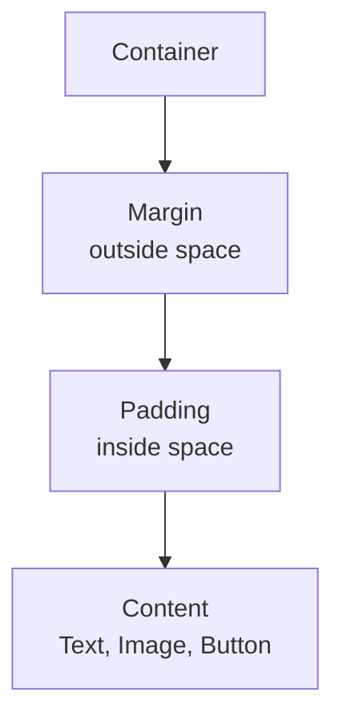

## 5.8 Common Exam Points and Mistakes

Important points:

- Padding is inside space.
- Margin is outside space.
- Assets must be registered in `pubspec.yaml`.
- ThemeData controls common app design.
- `google_fonts` helps use custom fonts easily.
- Dark theme improves usability in low light.

Common mistakes:

- Forgetting correct indentation in `pubspec.yaml`.
- Confusing padding and margin.
- Using too many different colors and fonts.
- Not handling network image loading errors in real apps.

## 5.9 Sample Long Question and Answer

### Question

Explain styling and theming in Flutter. Discuss padding, margin, images, custom fonts, and dark theme with examples.

### Answer

Styling in Flutter means changing the visual appearance of widgets. It includes color, font, size, spacing, border, images, and alignment. Theming means defining common styles for the entire application so that the design remains consistent.

Padding is the space inside a widget, between the content and its boundary. Margin is the space outside a widget, between that widget and other widgets. Alignment controls the position of a child inside its parent. For example, in a Fitness Tracker app, padding can be used inside a workout card so that the text does not touch the card border.

Flutter supports different types of images. `Image.asset()` is used for images stored inside the app project. `Image.network()` is used for images loaded from the internet. `Image.file()` is used for images stored on the device, and `Image.memory()` is used for image bytes in memory. Assets must be declared in the `pubspec.yaml` file.

Custom fonts can be added manually using font files or easily by using the `google_fonts` package. Icons can be added using Flutter's built-in icon library. In a Fitness Tracker app, running icons, water icons, and health icons improve the user interface.

Theming is done using `ThemeData`. A light theme uses a bright background and dark text, while a dark theme uses a dark background and light text. Flutter allows defining both `theme` and `darkTheme` in `MaterialApp`. This makes the app visually consistent and user-friendly.

## 5.10 MCQs

1. Padding means:
   - A. Space outside widget
   - B. Space inside widget
   - C. Database space
   - D. Internet speed
   - Answer: B

2. Which file is used to register assets?
   - A. main.dart
   - B. pubspec.yaml
   - C. styles.css
   - D. index.php
   - Answer: B

3. Which widget loads an image from internet?
   - A. Image.asset
   - B. Image.network
   - C. Image.file only
   - D. Text
   - Answer: B

4. Which class defines app theme in Flutter?
   - A. ThemeData
   - B. ListView
   - C. SetState
   - D. Navigator
   - Answer: A

5. The `google_fonts` package is used for:
   - A. Using Google Fonts
   - B. Creating database
   - C. Opening camera only
   - D. Sending SMS only
   - Answer: A

---

# 6. Navigation and Routing

## 6.1 Definition

Navigation means moving from one screen to another screen in an app.

Routing means defining and managing the paths or rules used to open different screens.

In a Fitness Tracker app, navigation is used to move between:

- Dashboard screen
- Workout detail screen
- Profile screen
- Settings screen
- Progress screen

## 6.2 Imperative vs Declarative Routing

### Imperative Routing

Imperative routing means telling the app directly what to do.

Example:

- Push this screen.
- Pop this screen.
- Go back.

In Flutter, `Navigator.push()` and `Navigator.pop()` are examples of imperative navigation.

### Declarative Routing

Declarative routing means describing what the navigation state should be, and the framework builds the correct screen stack.

Declarative routing is often used in larger apps and web-friendly navigation.

Examples:

- Router API
- go_router package

### Comparison

| Basis | Imperative Routing | Declarative Routing |
|---|---|---|
| Style | Command-based | State-based |
| Example | Navigator.push() | Router/go_router |
| Easy for beginners | Yes | More advanced |
| Best for | Small and medium apps | Large apps, deep links, web |

## 6.3 Stack Data Structure in Navigator

Flutter Navigator works like a stack.

A stack follows LIFO:

Last In, First Out.

This means the last screen pushed is the first screen popped.

### Simple Analogy

Think of plates kept one above another. The last plate placed on top is removed first.

### Navigator Stack Example

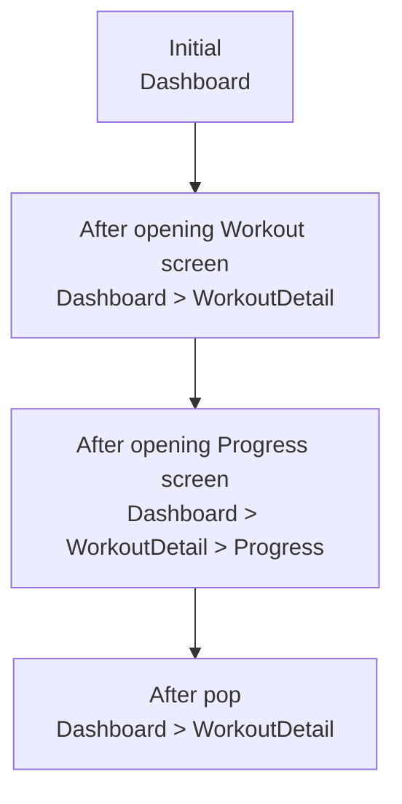

## 6.4 Navigator.push and Navigator.pop

### Navigator.push

Used to open a new screen.

```dart
Navigator.push(
  context,
  MaterialPageRoute(
    builder: (context) => const WorkoutDetailScreen(),
  ),
);
```

### Navigator.pop

Used to go back to the previous screen.

```dart
Navigator.pop(context);
```

Fitness app example:

- User taps a workout card.
- App pushes WorkoutDetailScreen.
- User presses back.
- App pops WorkoutDetailScreen and returns to DashboardScreen.

## 6.5 Named Routes

Named routes use string names for screens.

Example:

```dart
MaterialApp(
  initialRoute: '/',
  routes: {
    '/': (context) => const DashboardScreen(),
    '/profile': (context) => const ProfileScreen(),
    '/workout': (context) => const WorkoutScreen(),
  },
)
```

Navigate using:

```dart
Navigator.pushNamed(context, '/profile');
```

### Advantages of Named Routes

- Cleaner navigation code
- Central route management
- Useful for medium apps
- Easier to understand screen paths

## 6.6 Passing Data Between Screens

### Passing Data Through Constructor

```dart
class WorkoutDetailScreen extends StatelessWidget {
  final String workoutName;

  const WorkoutDetailScreen({
    super.key,
    required this.workoutName,
  });

  @override
  Widget build(BuildContext context) {
    return Scaffold(
      appBar: AppBar(title: Text(workoutName)),
      body: Text('Details for $workoutName'),
    );
  }
}
```

Navigation:

```dart
Navigator.push(
  context,
  MaterialPageRoute(
    builder: (context) => const WorkoutDetailScreen(
      workoutName: 'Running',
    ),
  ),
);
```

### Passing Data With Named Routes

```dart
Navigator.pushNamed(
  context,
  '/workoutDetail',
  arguments: 'Running',
);
```

Inside destination screen:

```dart
final workoutName = ModalRoute.of(context)!.settings.arguments as String;
```

## 6.7 Diagram: Navigator Stack

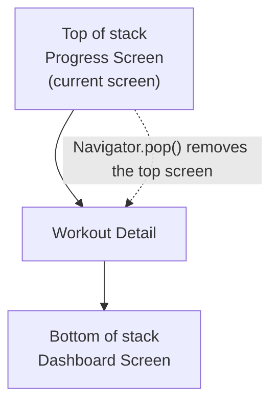

## 6.8 Common Exam Points and Mistakes

Important points:

- Navigation means moving between screens.
- Navigator uses stack behavior.
- `push()` adds a new screen.
- `pop()` removes the current screen.
- Named routes give names to screens.
- Data can be passed using constructors or route arguments.

Common mistakes:

- Calling Navigator without valid `BuildContext`.
- Forgetting to register named routes.
- Passing wrong argument type.
- Using complex declarative routing before understanding Navigator basics.

## 6.9 Sample Long Question and Answer

### Question

Explain navigation and routing in Flutter. Describe Navigator stack, push, pop, named routes, and passing data between screens.

### Answer

Navigation in Flutter means moving from one screen to another. Routing means defining and managing screen paths in an application. In a Fitness Tracker app, navigation is needed to move from the dashboard to workout details, profile, progress, and settings screens.

Flutter uses a Navigator to manage screens. The Navigator works like a stack data structure. A stack follows the Last In, First Out rule. When a new screen is opened using `Navigator.push()`, it is added to the top of the stack. When `Navigator.pop()` is called, the top screen is removed and the previous screen becomes visible.

For example, if the user is on the Dashboard screen and taps a workout card, the app can use `Navigator.push()` to open the WorkoutDetail screen. If the user presses the back button, `Navigator.pop()` removes the WorkoutDetail screen and returns to Dashboard.

Named routes allow developers to give names to screens, such as `/profile` or `/workout`. They are registered inside `MaterialApp` using the `routes` property. The app can then navigate using `Navigator.pushNamed()`. Named routes make navigation cleaner and easier to manage.

Data can be passed between screens using constructors or route arguments. For example, when opening a workout detail screen, the selected workout name such as "Running" can be passed to the next screen. This allows the detail screen to show correct information. Therefore, navigation and routing are important for building multi-screen Flutter applications.

## 6.10 MCQs

1. Navigator in Flutter works like:
   - A. Queue
   - B. Stack
   - C. Tree only
   - D. Database
   - Answer: B

2. Which method opens a new screen?
   - A. Navigator.push
   - B. Navigator.pop
   - C. print
   - D. setState only
   - Answer: A

3. Which method returns to previous screen?
   - A. Navigator.push
   - B. Navigator.pop
   - C. runApp
   - D. ThemeData
   - Answer: B

4. LIFO means:
   - A. Last In, First Out
   - B. Last In, Final Output
   - C. Long Input, Fast Output
   - D. Local Input File Output
   - Answer: A

5. Named routes are useful because:
   - A. They remove all widgets
   - B. They give string names to screens
   - C. They only change color
   - D. They replace Dart
   - Answer: B

---

# 7. State Management

## 7.1 Definition

State is the data that can change in an application.

State management means controlling how data changes and how the UI updates when data changes.

In a Fitness Tracker app, state includes:

- Current step count
- Water glasses
- Selected workout
- Login status
- Theme mode
- User profile
- API loading status

## 7.2 Why State Management is Needed

Without state management, it becomes difficult to:

- Update UI correctly
- Share data between screens
- Avoid repeated code
- Handle API loading and errors
- Keep app logic organized

### Simple Analogy

State is like the scoreboard in a game. When the score changes, everyone should see the new score. State management is the system that updates the scoreboard correctly.

## 7.3 setState for Local State

`setState()` is the simplest way to manage local state inside a StatefulWidget.

Use `setState()` when:

- State is used only in one widget or one screen
- App is small
- Logic is simple

Example:

```dart
class StepCounter extends StatefulWidget {
  const StepCounter({super.key});

  @override
  State<StepCounter> createState() => _StepCounterState();
}

class _StepCounterState extends State<StepCounter> {
  int steps = 0;

  void addSteps() {
    setState(() {
      steps += 100;
    });
  }

  @override
  Widget build(BuildContext context) {
    return Column(
      children: [
        Text('Steps: $steps'),
        ElevatedButton(
          onPressed: addSteps,
          child: const Text('Add 100 Steps'),
        ),
      ],
    );
  }
}
```

### Limitations of setState

- Not good for large apps
- Hard to share state between far screens
- UI and logic can become mixed
- Testing can become harder

## 7.4 Dependency Injection

Dependency Injection means providing an object from outside instead of creating it inside the class.

### Simple Explanation

If a screen needs a service, we pass the service to it. The screen does not create the service itself.

### Analogy

In a classroom, a student does not build a projector. The projector is provided to the class. In the same way, dependencies are provided to widgets or classes.

### Example

```dart
class FitnessService {
  int getTodaySteps() {
    return 6500;
  }
}

class DashboardScreen extends StatelessWidget {
  final FitnessService service;

  const DashboardScreen({super.key, required this.service});

  @override
  Widget build(BuildContext context) {
    return Text('Steps: ${service.getTodaySteps()}');
  }
}
```

### Benefits

- Easier testing
- Cleaner code
- Less tight coupling
- Easier to replace services

## 7.5 BuildContext

`BuildContext` is a handle to the location of a widget in the widget tree.

It helps widgets access:

- Theme
- Navigator
- MediaQuery
- Providers
- Parent widget information

Example:

```dart
Theme.of(context).colorScheme.primary;
Navigator.pushNamed(context, '/profile');
```

### Simple Analogy

BuildContext is like a home address. If Flutter knows your address in the widget tree, it can find nearby services such as theme, navigator, and provider.

### Common Uses

```dart
Navigator.of(context);
Theme.of(context);
MediaQuery.of(context);
Provider.of<FitnessProvider>(context);
```

## 7.6 InheritedWidget

`InheritedWidget` is a low-level Flutter widget used to pass data down the widget tree efficiently.

It allows child widgets to access shared data from an ancestor widget.

### Simple Explanation

If many children need the same data, the parent can provide that data using InheritedWidget.

### Diagram

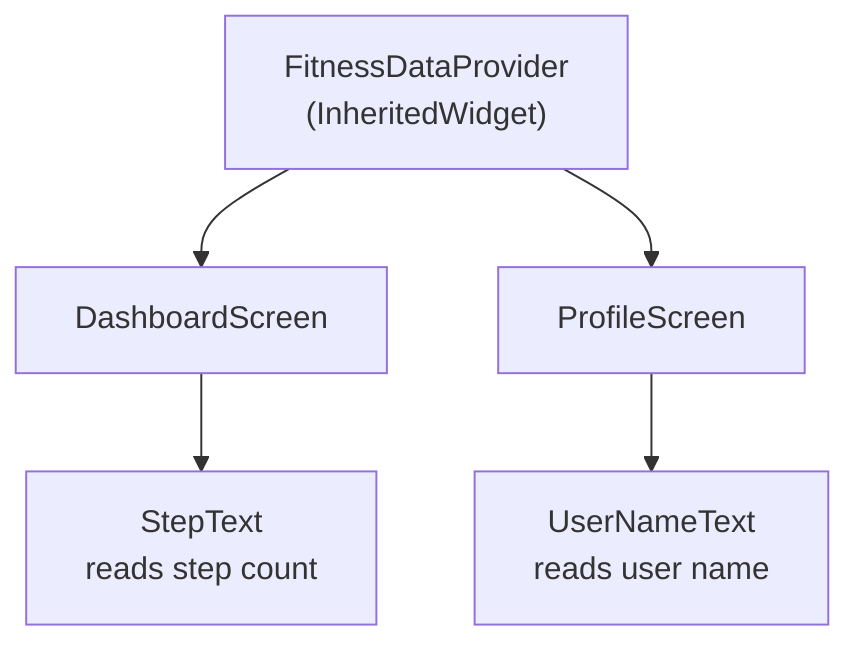

### Why It Matters

Many state management libraries are built on similar ideas. Provider also uses inherited mechanisms internally to make data available down the widget tree.

## 7.7 Provider

Provider is a popular Flutter state management package. It makes it easier to provide and read state across the widget tree.

### Main Provider Concepts

1. Provider  
   Provides an object to child widgets.

2. ChangeNotifier  
   A class that holds state and notifies listeners when data changes.

3. ChangeNotifierProvider  
   Provides a ChangeNotifier to the widget tree.

4. Consumer  
   Rebuilds part of the UI when provided data changes.

5. MultiProvider  
   Provides multiple providers at the same place.

6. Provider.of  
   Reads provider data using BuildContext.

Important note: In the Provider package, the common widget is `Consumer`. `ConsumerWidget` is commonly associated with Riverpod, not basic Provider. If an exam says Provider, write about `Consumer` unless your class specifically taught `ConsumerWidget`.

### ChangeNotifier Example

```dart
class FitnessProvider extends ChangeNotifier {
  int steps = 0;

  void addSteps() {
    steps += 100;
    notifyListeners();
  }
}
```

### Providing State

```dart
ChangeNotifierProvider(
  create: (context) => FitnessProvider(),
  child: const FitnessApp(),
)
```

### Reading State with Consumer

```dart
Consumer<FitnessProvider>(
  builder: (context, fitness, child) {
    return Text('Steps: ${fitness.steps}');
  },
)
```

### Updating State

```dart
ElevatedButton(
  onPressed: () {
    context.read<FitnessProvider>().addSteps();
  },
  child: const Text('Add Steps'),
)
```

### MultiProvider Example

```dart
MultiProvider(
  providers: [
    ChangeNotifierProvider(create: (_) => FitnessProvider()),
    ChangeNotifierProvider(create: (_) => ThemeProvider()),
  ],
  child: const FitnessApp(),
)
```

### Provider Data Flow Diagram

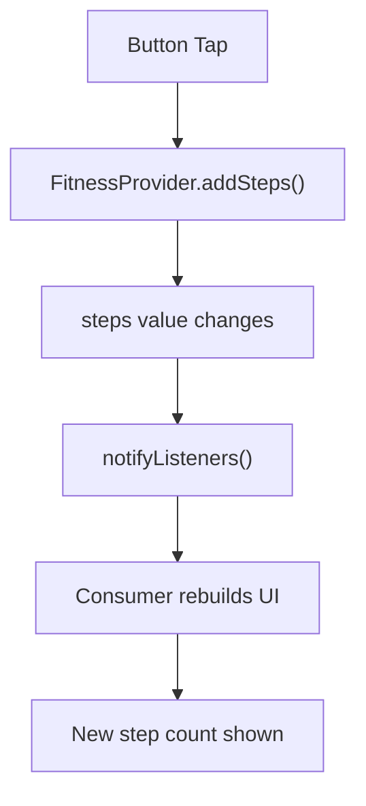

## 7.8 Bloc and flutter_bloc Concepts

Bloc means Business Logic Component. It separates business logic from UI.

The `flutter_bloc` package helps use Bloc pattern in Flutter.

### Main Bloc Concepts

| Concept | Meaning |
|---|---|
| Event | Something that happens |
| State | Current data/status |
| Bloc | Receives events and emits states |
| BlocProvider | Provides Bloc to widget tree |
| BlocBuilder | Rebuilds UI based on state |
| BlocListener | Performs one-time actions like showing snackbar |
| BlocConsumer | Combines builder and listener |

### Simple Example Meaning

In a Fitness Tracker app:

- Event: AddStepsPressed
- Bloc: StepBloc
- State: StepCountUpdated
- UI: Shows new step count

### Bloc Data Flow Diagram

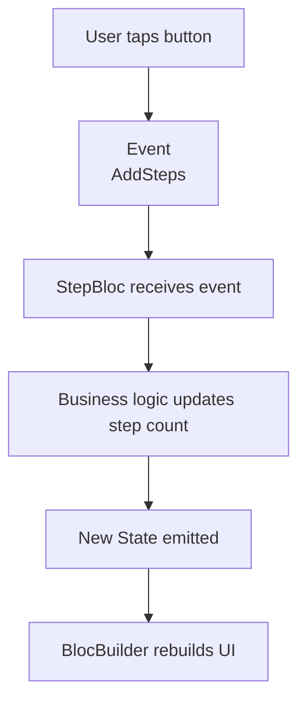

### Small Bloc-Style Example

```dart
abstract class StepEvent {}

class AddSteps extends StepEvent {}

class StepState {
  final int steps;
  StepState(this.steps);
}
```

In real Flutter Bloc code, the Bloc class receives events and emits new states.

### Provider vs Bloc

| Basis | Provider | Bloc |
|---|---|---|
| Complexity | Easier | More structured |
| Best for | Small to medium apps | Medium to large apps |
| Data flow | ChangeNotifier notifies UI | Event goes in, state comes out |
| Learning curve | Lower | Higher |
| Testing | Good | Very good for business logic |

## 7.9 Choosing State Management

| Situation | Recommended |
|---|---|
| One small counter on one screen | setState |
| Shared theme or user data | Provider |
| Medium app with simple shared state | Provider |
| Large app with many events and states | Bloc |
| Need strong separation of UI and logic | Bloc |

For exams, explain that no single solution is best for all cases. The choice depends on app size, complexity, team experience, and testing needs.

## 7.10 Common Exam Points and Mistakes

Important points:

- State means changing data.
- State management updates UI when data changes.
- `setState()` is simple but local.
- Dependency injection improves testability and flexibility.
- BuildContext represents widget location in widget tree.
- InheritedWidget passes data down the tree.
- Provider uses ChangeNotifier and Consumer commonly.
- Bloc uses events and states.

Common mistakes:

- Using `setState()` for whole app state.
- Calling `notifyListeners()` before changing data.
- Rebuilding too much UI unnecessarily.
- Confusing Provider `Consumer` with Riverpod `ConsumerWidget`.
- Putting business logic directly inside UI widgets in large apps.

## 7.11 Sample Long Question and Answer

### Question

Explain state management in Flutter. Discuss `setState`, dependency injection, BuildContext, InheritedWidget, Provider, and Bloc with examples.

### Answer

State is the data that can change in an application. State management is the process of controlling how data changes and how the user interface updates when that data changes. In a Fitness Tracker app, examples of state include step count, water intake, selected workout, login status, theme mode, and user profile information.

The simplest state management technique in Flutter is `setState()`. It is used inside a StatefulWidget to update local state. For example, a water counter can increase when the user presses a button. After changing the value, `setState()` is called so Flutter rebuilds the widget and displays the new value. However, `setState()` is not suitable for large apps because sharing data between many screens becomes difficult.

Dependency injection means providing required objects from outside instead of creating them inside a class. For example, a DashboardScreen can receive a FitnessService object from outside. This makes code easier to test and maintain. `BuildContext` represents the location of a widget in the widget tree. It is used to access Navigator, Theme, MediaQuery, and Provider data.

`InheritedWidget` is a low-level Flutter widget used to pass data down the widget tree. It allows child widgets to access shared data from parent widgets. Many state management solutions use a similar idea internally.

Provider is a popular state management package in Flutter. It commonly uses `ChangeNotifier` to store state and `notifyListeners()` to update listening widgets. `ChangeNotifierProvider` provides the state object, and `Consumer` rebuilds UI when the state changes. `MultiProvider` is used when there are multiple providers such as FitnessProvider and ThemeProvider.

Bloc stands for Business Logic Component. It separates business logic from UI. In Bloc, the UI sends events, the Bloc processes those events, and then emits states. `BlocProvider` provides the Bloc, and `BlocBuilder` rebuilds the UI based on the new state. Bloc is useful for large applications because it provides a structured and testable data flow.

Therefore, state management is one of the most important topics in Flutter. Small apps may use `setState()`, medium apps may use Provider, and larger apps may use Bloc depending on complexity.

## 7.12 MCQs

1. State means:
   - A. Data that can change
   - B. Only app icon
   - C. Only project name
   - D. Only Android folder
   - Answer: A

2. Which method updates local state inside StatefulWidget?
   - A. runApp
   - B. setState
   - C. MaterialApp
   - D. Image.asset
   - Answer: B

3. Which class is commonly used with Provider to notify UI?
   - A. ChangeNotifier
   - B. Navigator
   - C. TextField
   - D. AppBar
   - Answer: A

4. Bloc mainly uses:
   - A. Events and states
   - B. Only images
   - C. Only CSS
   - D. Only database tables
   - Answer: A

5. BuildContext represents:
   - A. Widget location in widget tree
   - B. Internet address
   - C. File extension
   - D. Android version only
   - Answer: A

---

# 8. Quick Revision Tables

## 8.1 Flutter Core Summary

| Topic | One-line exam answer |
|---|---|
| Flutter | UI SDK for building multi-platform apps using Dart |
| Dart | Programming language used by Flutter |
| Widget | Basic building block of Flutter UI |
| StatelessWidget | Widget without internal changing state |
| StatefulWidget | Widget with internal changing state |
| MaterialApp | Root wrapper for Material Design apps |
| CupertinoApp | Root wrapper for iOS-style apps |
| Scaffold | Basic page structure with app bar, body, drawer, etc. |
| Navigator | Manages screen stack |
| Provider | State management package using provided objects and listeners |
| Bloc | Pattern that separates business logic using events and states |

## 8.2 Exam Difference Table

| Pair | Main Difference |
|---|---|
| Native vs Cross-platform | Native uses separate platform code; cross-platform uses mostly one codebase |
| Hot reload vs Hot restart | Hot reload keeps state usually; hot restart clears state |
| Row vs Column | Row is horizontal; Column is vertical |
| Padding vs Margin | Padding is inside space; margin is outside space |
| ListView vs ListView.builder | ListView builds fixed list; builder is better for dynamic/large list |
| push vs pop | push opens screen; pop closes current screen |
| setState vs Provider | setState is local; Provider shares state |
| Provider vs Bloc | Provider is simpler; Bloc is more structured |

---

# 9. Important Long Questions for Practice

## Question 1

Compare native and cross-platform development. Explain why Flutter is suitable for building a Fitness Tracker app.

### Answer Outline

- Define native development.
- Define cross-platform development.
- Compare codebase, cost, time, performance, team size.
- Explain Flutter advantages: one codebase, widgets, hot reload, performance, packages.
- Connect with Fitness Tracker app: dashboard, workout list, profile, progress screen reused across Android and iOS.

## Question 2

Explain Flutter architecture with a neat diagram.

### Answer Outline

- Flutter is layered.
- Dart code and Flutter framework.
- Widgets, rendering, animation, gestures.
- `dart:ui` connects framework to engine.
- Engine handles rendering, text, input.
- Impeller/Skia convert UI to pixels.
- Platform embedder connects with OS.
- Platform channels connect Dart and native code.

## Question 3

Explain Dart null safety and collections with examples.

### Answer Outline

- Null safety prevents null errors.
- `String?` means nullable.
- `??` provides default value.
- `!` should be used carefully.
- List stores ordered data.
- Map stores key-value data.
- Set stores unique data.
- Fitness app examples: workout list, weekly steps map, badge set.

## Question 4

Explain navigation stack in Flutter.

### Answer Outline

- Navigation means moving between screens.
- Navigator manages route stack.
- Stack follows LIFO.
- `push()` adds a screen.
- `pop()` removes current screen.
- Named routes use string route names.
- Data can be passed with constructors or arguments.

## Question 5

Explain Provider and Bloc state management.

### Answer Outline

- State means changing app data.
- Provider uses ChangeNotifier and Consumer.
- `notifyListeners()` updates UI.
- MultiProvider provides multiple state objects.
- Bloc uses event, bloc, and state.
- Bloc separates business logic from UI.
- Provider is simpler; Bloc is better for large structured apps.

---

# 10. Extra MCQ Practice

1. Which widget provides basic Material page structure?
   - A. Scaffold
   - B. Text
   - C. Map
   - D. Set
   - Answer: A

2. Which file usually contains `main()` in a Flutter app?
   - A. lib/main.dart
   - B. ios/main.swift
   - C. android/app.gradle only
   - D. pubspec.lock only
   - Answer: A

3. Which widget is commonly used for app title bar in Material apps?
   - A. AppBar
   - B. Stack
   - C. GestureDetector
   - D. Set
   - Answer: A

4. Which widget detects taps and gestures?
   - A. GestureDetector
   - B. MaterialApp
   - C. ThemeData
   - D. List
   - Answer: A

5. Which routing style is command-based?
   - A. Imperative routing
   - B. Declarative routing
   - C. Database routing
   - D. CSS routing
   - Answer: A

6. Which package is commonly used for Provider state management?
   - A. provider
   - B. google_maps only
   - C. http only
   - D. image_picker only
   - Answer: A

7. Which widget is used to show iOS-style button?
   - A. CupertinoButton
   - B. ElevatedButton only
   - C. TextField
   - D. Row
   - Answer: A

8. Which command creates a new Flutter project?
   - A. flutter create app_name
   - B. flutter doctor app_name
   - C. dart delete app_name
   - D. pub remove all
   - Answer: A

9. Which keyword is used to create a class in Dart?
   - A. class
   - B. object
   - C. design
   - D. page
   - Answer: A

10. Which operator gives a default value when a variable is null?
    - A. ??
    - B. &&
    - C. ||
    - D. ++
    - Answer: A

---

# 11. References for Current Flutter Terminology

- Flutter architectural overview: https://docs.flutter.dev/resources/architectural-overview
- Impeller rendering engine: https://docs.flutter.dev/perf/impeller
- Platform channels: https://docs.flutter.dev/platform-integration/platform-channels
- Flutter UI and widgets: https://docs.flutter.dev/ui
- Flutter layout guide: https://docs.flutter.dev/ui/layout
