# Flutter Notes

Course: Mobile Computing  
Main example used throughout: Fitness Tracker App  
Audience: Beginner Flutter students preparing for written exams and practical viva

---

## How to Study These Notes

Read each topic in this order:

1. Understand the definition.
2. Read the simple explanation.
3. Connect it with the Fitness Tracker app example.
4. Study the diagram.
5. Practice the long question answer.
6. Test yourself with MCQs.

In exams, do not only write code. First write the concept, then explain with points, then give a small example.

---

## Curriculum Coverage

| Curriculum Unit | Main Course Topic | Covered In These Notes |
|---|---|---|
| Unit 1 | Introduction to Flutter and Dart | Chapters 1 and 2 |
| Unit 2 | Flutter basics, widgets, styling, theming | Chapters 3, 4, and 5 |
| Unit 3 | Navigation, routing, basic state management | Chapters 6 and 7 |
| Unit 4 | State management and HTTP/API integration | Chapters 7 and 8 |
| Unit 5 | Platform features and Firebase | Chapters 9 and 10 |
| Unit 6 | Advanced state management, location, notifications | Chapters 11 and 12 |
| Unit 7 | Animations, custom UI, testing | Chapters 13 and 14 |
| Unit 8 | Releasing app and final project preparation | Chapter 15 and practice sections |

---

# 1. Introduction to Flutter App Development

## 1.1 Definition

Flutter is an open-source UI software development kit created by Google. It is used to build applications for Android, iOS, web, desktop, and embedded devices using a single codebase.

Flutter apps are mainly written in the Dart programming language. Flutter uses widgets to build the user interface. A widget is a small building block of the screen, such as text, button, image, row, column, or full page.

## 1.2 Native vs Cross-Platform Development

### Native App Development

Native app development means building an app separately for each operating system using its official language and tools.

Examples:

- Android app: Kotlin or Java with Android Studio
- iOS app: Swift or Objective-C with Xcode

If a company wants both Android and iOS apps, it usually needs two separate codebases.

### Cross-Platform App Development

Cross-platform development means building one app using one codebase and running it on multiple platforms.

Examples:

- Flutter
- React Native
- Xamarin
- Ionic

In Flutter, we write Dart code once and use it for Android, iOS, web, and desktop with platform-specific adjustments when needed.

### Simple Analogy

Native development is like preparing two separate meals for two people because each person has a different taste. Cross-platform development is like preparing one meal that both people can eat, with small changes in spices when needed.

### Comparison Table

| Basis | Native Development | Cross-Platform Development |
|---|---|---|
| Codebase | Separate code for Android and iOS | Mostly one shared codebase |
| Language | Kotlin/Java for Android, Swift for iOS | Dart in Flutter, JavaScript in React Native |
| Cost | Higher | Lower for many projects |
| Development time | More time | Faster |
| Performance | Usually very high | High, depends on framework |
| UI consistency | Platform-specific | Can be same across platforms |
| Team size | Often needs Android and iOS teams | One Flutter team can build both |
| Best for | Platform-heavy apps, special native features | Business apps, startups, fast delivery |

### Diagram: Native vs Cross-Platform

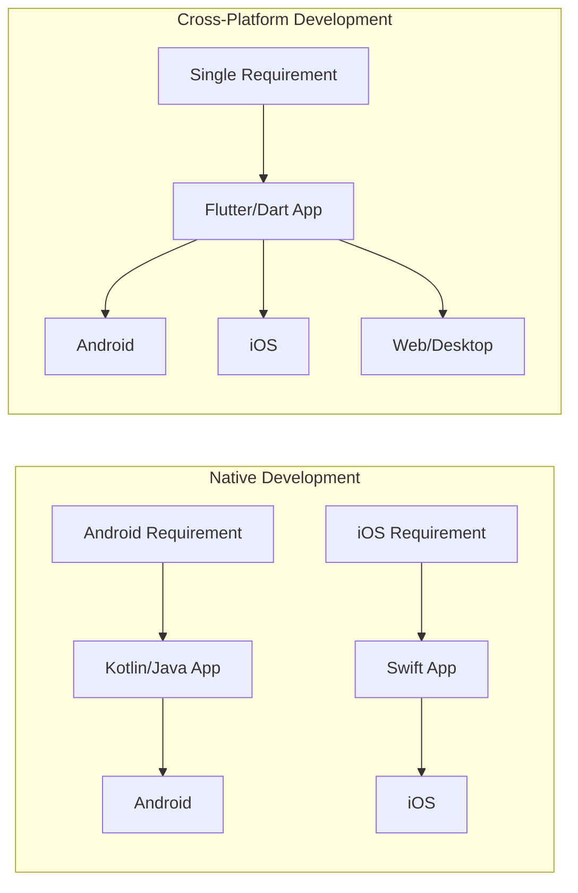

## 1.3 Fitness Tracker App Example

Suppose we are building a Fitness Tracker app with these features:

- User profile
- Daily step count
- Water intake
- Workout list
- Progress chart
- Dark theme

In native development:

- Android team builds the app in Kotlin.
- iOS team builds the app in Swift.
- Both teams repeat many screens and logic separately.

In Flutter:

- One Flutter team builds the profile screen, workout screen, and progress screen once.
- The same Dart code runs on Android and iOS.
- Platform-specific features like health sensor access can be connected using plugins or platform channels.

## 1.4 Why Flutter?

Flutter is popular because it gives fast development, beautiful UI, good performance, and one codebase for many platforms.

### Main Advantages of Flutter

1. Single codebase  
   One Dart codebase can run on Android, iOS, web, desktop, and more.

2. Fast development  
   Hot reload helps developers see UI changes quickly without restarting the whole app.

3. Rich widget system  
   Flutter provides many ready-made widgets such as Text, Button, ListView, Card, AppBar, and NavigationBar.

4. Beautiful UI  
   Flutter can create custom designs easily because UI is built from widgets.

5. Good performance  
   Flutter compiles Dart code to native machine code for mobile and uses its own rendering engine.

6. Consistent design  
   The app can look the same on Android and iOS if needed.

7. Strong community and packages  
   Many useful packages are available on pub.dev, such as provider, flutter_bloc, google_fonts, http, and firebase packages.

## 1.5 Flutter vs React Native, Kotlin, and Swift

### Flutter vs React Native

| Basis | Flutter | React Native |
|---|---|---|
| Main language | Dart | JavaScript or TypeScript |
| UI rendering | Uses Flutter widgets and rendering engine | Uses native components through bridge/new architecture |
| Performance | Generally strong and consistent | Good, but can depend on bridge/native modules |
| UI consistency | Easier to make same UI everywhere | Native look is common |
| Learning curve | Need to learn Dart and widgets | Easier for web JavaScript developers |
| Hot reload | Yes | Yes |

Flutter is often preferred when the app needs highly custom UI, smooth animation, and strong design consistency.

### Flutter vs Kotlin

Kotlin is mainly used for native Android development. Flutter is used for cross-platform development.

| Basis | Flutter | Kotlin Android |
|---|---|---|
| Platform | Android, iOS, web, desktop | Mainly Android |
| UI | Flutter widgets | Android views or Jetpack Compose |
| Code sharing | One codebase for many platforms | Android-focused |
| Best use | Cross-platform apps | Android-specific apps |

Kotlin is best when the project is only Android and needs deep Android platform features. Flutter is better when the same app is needed on Android and iOS quickly.

### Flutter vs Swift

Swift is mainly used for native iOS development. Flutter is used for cross-platform development.

| Basis | Flutter | Swift iOS |
|---|---|---|
| Platform | Android, iOS, web, desktop | iOS, iPadOS, macOS, watchOS |
| UI | Flutter widgets | UIKit or SwiftUI |
| Code sharing | High across platforms | Apple-platform focused |
| Best use | Multi-platform apps | Apple-specific apps |

Swift is best for Apple-only apps. Flutter is better when one app must run on both Android and iOS.

## 1.6 Flutter Architecture

Flutter architecture is layered. Each layer has a clear responsibility.

### Important Parts

1. Dart language  
   Developers write app logic and UI in Dart.

2. Flutter framework  
   Provides widgets, animation, painting, gestures, layout, material design, cupertino design, and navigation.

3. Engine  
   The engine is written mainly in C++. It handles rendering, text, input, and low-level tasks.

4. Rendering engines: Impeller and Skia  
   Flutter uses rendering technology to convert UI into pixels on the screen. Impeller is the modern rendering runtime used by Flutter on current mobile platforms. Skia is also part of Flutter rendering history and is still relevant for some platforms and renderers.

5. Platform embedder  
   Connects Flutter to Android, iOS, web, Windows, macOS, or Linux.

6. Platform channels  
   Allow Dart code to communicate with native Kotlin/Java or Swift/Objective-C code.

### Diagram: Flutter Architecture

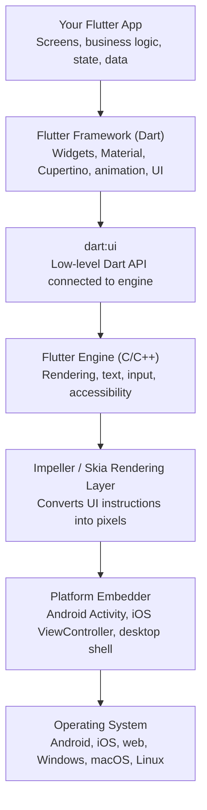

### Platform Channels Diagram

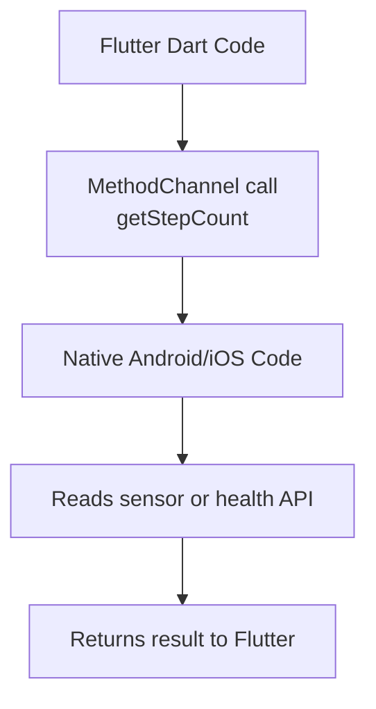

### Fitness Tracker App Example

In the Fitness Tracker app:

- Flutter widgets build the dashboard, buttons, lists, and charts.
- Dart handles logic such as calculating calories.
- State management updates the UI when steps increase.
- Platform channels or plugins can access phone sensors or health APIs.
- The rendering engine draws smooth progress bars and animations.

## 1.7 Common Exam Points and Mistakes

Important points:

- Flutter is not only for Android. It supports multiple platforms.
- Dart is the programming language used by Flutter.
- Everything visible in Flutter UI is usually built using widgets.
- Flutter does not depend completely on native UI widgets for drawing its UI.
- Platform channels are used when Flutter needs native platform features.

Common mistakes:

- Writing "Flutter is a programming language." Correct: Dart is the programming language. Flutter is a UI SDK/framework.
- Writing "Flutter and Dart are same." Correct: Dart is the language, Flutter is the toolkit.
- Saying "Flutter cannot use native features." Correct: Flutter can use native features through plugins and platform channels.

## 1.8 Sample Long Question and Answer

### Question

Explain native and cross-platform mobile application development. Why is Flutter preferred for cross-platform app development? Explain with suitable examples.

### Answer

Native mobile application development means creating separate applications for each platform using the official language and tools of that platform. For Android, developers commonly use Kotlin or Java with Android Studio. For iOS, developers use Swift or Objective-C with Xcode. Native apps usually provide high performance and direct access to platform features, but they require separate development for Android and iOS.

Cross-platform mobile application development means creating one application using a single codebase that can run on multiple platforms. Flutter is an example of a cross-platform framework. In Flutter, developers write code in Dart and use Flutter widgets to create the user interface. The same code can run on Android, iOS, web, and desktop with minor changes.

Flutter is preferred because it reduces development time and cost. It provides hot reload, which allows developers to see changes quickly. It also provides many ready-made widgets for building beautiful user interfaces. Flutter gives good performance because Dart code is compiled to native code on mobile platforms, and Flutter uses its own rendering engine to draw the UI.

For example, in a Fitness Tracker app, the dashboard, profile page, workout list, and water intake screen can be written once in Flutter and used for both Android and iOS. If the app needs phone sensor data, Flutter can use plugins or platform channels to communicate with native Android or iOS code. Therefore, Flutter is useful for building modern, fast, and beautiful cross-platform mobile applications.

In exam answers, students should also mention that native development is still useful when an app needs very deep platform-specific control, maximum platform integration, or a separate Android/iOS specialist team. Cross-platform development is useful when the same business app must be delivered quickly to both Android and iOS. Flutter is strong because it does not depend only on native UI components. It draws its own UI using Flutter's rendering engine, so the app looks consistent across platforms.

Compared with React Native, Flutter has a more consistent widget-based UI system and does not require a JavaScript bridge for most UI rendering. Compared with Kotlin and Swift, Flutter saves time because the same Dart code can serve both Android and iOS. In a Fitness Tracker app, this means one team can build login, dashboard, workout list, charts, profile, and theme system together. This reduces duplicate work and helps maintain the same user experience on both platforms.

## 1.9 MCQs

1. Flutter is mainly used for:
   - A. Database management
   - B. Mobile, web, and desktop app development
   - C. Operating system development
   - D. Hardware design
   - Answer: B

2. The main programming language used in Flutter is:
   - A. Java
   - B. Swift
   - C. Dart
   - D. PHP
   - Answer: C

3. Native Android apps are commonly developed using:
   - A. Kotlin
   - B. Swift
   - C. Dart only
   - D. HTML only
   - Answer: A

4. Platform channels in Flutter are used to:
   - A. Change font size only
   - B. Communicate with native platform code
   - C. Delete widgets
   - D. Run SQL queries only
   - Answer: B

5. The main advantage of cross-platform development is:
   - A. Separate code for every platform
   - B. No UI support
   - C. One codebase for multiple platforms
   - D. Only web support
   - Answer: C

---

# 2. Dart Programming Basics

## 2.1 Definition

Dart is a modern programming language created by Google. Flutter uses Dart to write user interface, logic, functions, classes, and data handling code.

In Flutter, Dart is used to:

- Create widgets
- Handle button clicks
- Store data
- Call APIs
- Manage state
- Navigate between screens

## 2.2 Variables, Data Types, and Operators

### Variables

A variable is a named storage location used to store data.

Example:

```dart
String userName = 'Aadarsh';
int steps = 4500;
double calories = 230.5;
bool goalCompleted = false;
```

### Common Dart Data Types

| Data type | Meaning | Example |
|---|---|---|
| int | Whole number | 5000 |
| double | Decimal number | 65.5 |
| num | int or double | 10, 10.5 |
| String | Text | 'Fitness App' |
| bool | true or false | true |
| dynamic | Can store any type | dynamic value = 10 |
| var | Type is guessed by Dart | var name = 'Ram' |

### var vs dynamic

`var` means Dart decides the type from the first value. After that, the type should not change.

```dart
var steps = 1000;
// steps = 'hello'; // Error because steps is int
```

`dynamic` means the value can change type later.

```dart
dynamic value = 1000;
value = 'steps';
```

Use `dynamic` carefully because it reduces type safety.

### Operators

Operators are symbols used to perform operations.

| Type | Operators | Example |
|---|---|---|
| Arithmetic | +, -, *, /, %, ~/ | steps + 100 |
| Relational | >, <, >=, <=, ==, != | steps > 5000 |
| Logical | &&, ||, ! | isLoggedIn && hasGoal |
| Assignment | =, +=, -= | steps += 500 |

Example:

```dart
int steps = 4500;
int goal = 8000;

bool completed = steps >= goal;
print(completed); // false
```

## 2.3 Control Flow

Control flow controls which code runs and how many times it runs.

### if-else

```dart
int steps = 9000;

if (steps >= 8000) {
  print('Goal completed');
} else {
  print('Keep walking');
}
```

### switch

```dart
String workout = 'cardio';

switch (workout) {
  case 'cardio':
    print('Run for 20 minutes');
    break;
  case 'strength':
    print('Do pushups');
    break;
  default:
    print('Choose a workout');
}
```

### for loop

```dart
for (int day = 1; day <= 7; day++) {
  print('Day $day workout completed');
}
```

### while loop

```dart
int waterGlasses = 0;

while (waterGlasses < 8) {
  waterGlasses++;
  print('Glass $waterGlasses completed');
}
```

## 2.4 Functions

A function is a reusable block of code that performs a task.

```dart
int calculateRemainingSteps(int steps, int goal) {
  return goal - steps;
}

void main() {
  int remaining = calculateRemainingSteps(4500, 8000);
  print('Remaining steps: $remaining');
}
```

### Function Parts

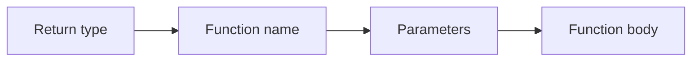

Example:

```dart
double calculateBMI(double weight, double height) {
  return weight / (height * height);
}
```

## 2.5 OOP in Dart

OOP means Object-Oriented Programming. It organizes code using classes and objects.

### Class

A class is a blueprint.

### Object

An object is a real item created from a class.

### Analogy

A class is like a house map. An object is the real house built using that map.

### Example

```dart
class User {
  String name;
  int age;

  User(this.name, this.age);

  void showProfile() {
    print('$name is $age years old');
  }
}

void main() {
  User user = User('Aadarsh', 22);
  user.showProfile();
}
```

### OOP Concepts

| Concept | Meaning | Fitness app example |
|---|---|---|
| Class | Blueprint | User, Workout, Goal |
| Object | Real instance | User('Ram', 20) |
| Encapsulation | Keeping data and methods together | User class stores name and profile method |
| Inheritance | One class gets features from another | PremiumUser extends User |
| Polymorphism | Same method behaves differently | Different workout classes calculate calories differently |

## 2.6 Collections: List, Map, and Set

### List

A List stores multiple values in order. Duplicate values are allowed.

```dart
List<String> workouts = ['Running', 'Yoga', 'Cycling'];
print(workouts[0]); // Running
```

Fitness app use:

- Store workout names
- Store daily step history
- Show items in ListView

### Map

A Map stores data in key-value pairs.

```dart
Map<String, int> weeklySteps = {
  'Monday': 5000,
  'Tuesday': 7000,
  'Wednesday': 8000,
};

print(weeklySteps['Monday']); // 5000
```

Fitness app use:

- Store day name and step count
- Store user settings
- Store API JSON response

### Set

A Set stores unique values only.

```dart
Set<String> completedWorkouts = {'Yoga', 'Running', 'Yoga'};
print(completedWorkouts); // {Yoga, Running}
```

Fitness app use:

- Store unique badges
- Store unique selected workout categories

## 2.7 Null Safety

Null safety helps prevent errors caused by using a value that does not exist.

In Dart, a variable cannot contain null unless we allow it using `?`.

```dart
String name = 'Aadarsh';
// name = null; // Error

String? nickname;
nickname = null; // Allowed
```

### Simple Analogy

Imagine a water bottle. If the bottle is empty and we try to drink from it, we get a problem. Null safety tells us clearly whether the bottle may be empty before we drink.

### Important Operators

| Operator | Meaning | Example |
|---|---|---|
| ? | Variable can be null | String? name |
| ?? | Use default value if null | name ?? 'Guest' |
| ! | I promise this is not null | name! |
| ?. | Access safely if not null | user?.name |

Example:

```dart
String? userName;

print(userName ?? 'Guest User');
```

Avoid using `!` unless you are sure the value is not null.

## 2.8 Diagram: Dart Basics in Fitness App

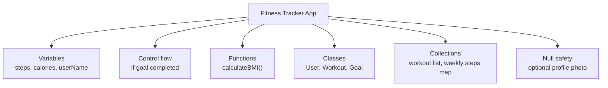

## 2.9 Common Exam Points and Mistakes

Important points:

- Dart is strongly typed.
- `var` infers type, `dynamic` can change type.
- Lists are ordered, Maps are key-value, Sets are unique.
- Null safety prevents many runtime errors.
- Functions help reuse code.

Common mistakes:

- Using `dynamic` everywhere.
- Forgetting that List index starts from 0.
- Confusing Map with List.
- Using `!` without checking null.

## 2.10 Sample Long Question and Answer

### Question

Explain Dart variables, data types, functions, collections, and null safety with examples.

### Answer

Dart is the programming language used in Flutter. It supports variables, data types, functions, collections, object-oriented programming, and null safety.

A variable is used to store data. Dart has different data types such as `int` for whole numbers, `double` for decimal numbers, `String` for text, and `bool` for true or false values. For example, a Fitness Tracker app can store `int steps = 5000`, `double calories = 250.5`, and `String userName = 'Ram'`.

Functions are reusable blocks of code. They help avoid repetition. For example, a function named `calculateBMI()` can take weight and height and return BMI. Dart also supports OOP using classes and objects. A `User` class can store user name, age, and methods related to the user.

Collections are used to store multiple values. A List stores ordered values, a Map stores key-value pairs, and a Set stores unique values. In a Fitness Tracker app, a List can store workout names, a Map can store daily step counts, and a Set can store unique badges.

Null safety is an important Dart feature that prevents errors caused by null values. A normal variable cannot store null, but a nullable variable can be declared using `?`. For example, `String? profilePhoto` means the profile photo may or may not exist. The `??` operator can provide a default value if the variable is null. Thus, Dart features make Flutter app development safer, cleaner, and easier.

Dart also supports operators and control flow. Operators are used for calculation, comparison, and logical decisions. For example, `steps >= goal` can check whether the user completed the daily step goal. Control flow statements such as `if`, `else`, `switch`, `for`, and `while` help the app make decisions and repeat tasks. For example, a `for` loop can display weekly step data, and an `if` statement can show "Goal completed" when steps are greater than the goal.

Object-oriented programming is important because Flutter apps are made of many classes. Widgets themselves are classes. A `Workout` class can represent workout data, and a `WorkoutService` class can contain logic for loading workouts. By using variables, functions, collections, OOP, and null safety together, Dart helps developers write organized and safe Flutter applications.

## 2.11 MCQs

1. Which data type is used for true or false values in Dart?
   - A. String
   - B. int
   - C. bool
   - D. List
   - Answer: C

2. Which collection stores key-value pairs?
   - A. List
   - B. Map
   - C. Set
   - D. String
   - Answer: B

3. Which symbol makes a Dart variable nullable?
   - A. !
   - B. ?
   - C. #
   - D. &
   - Answer: B

4. What is a class?
   - A. A blueprint for objects
   - B. Only a loop
   - C. Only a variable
   - D. A database
   - Answer: A

5. Which collection removes duplicate values?
   - A. List
   - B. Map
   - C. Set
   - D. int
   - Answer: C

---

# 3. Setting Up Flutter

## 3.1 Definition

Setting up Flutter means installing the tools required to create, run, test, and debug Flutter applications.

The common tools are:

- Flutter SDK
- Dart SDK, included with Flutter
- Android Studio
- Android SDK
- Emulator or physical device
- Code editor such as Android Studio or VS Code

## 3.2 Installing Flutter SDK and Android Studio Setup

### Basic Steps

1. Download Flutter SDK from the official Flutter website.
2. Extract the Flutter SDK to a suitable folder.
3. Add Flutter to the system PATH.
4. Install Android Studio.
5. Install Android SDK and command-line tools.
6. Install Flutter and Dart plugins in Android Studio if using Android Studio as editor.
7. Run `flutter doctor`.
8. Fix any missing dependencies shown by `flutter doctor`.
9. Create or open an emulator, or connect a physical Android phone.

### flutter doctor

`flutter doctor` checks whether Flutter is properly installed.

Example:

```bash
flutter doctor
```

It reports problems such as:

- Android SDK missing
- Android licenses not accepted
- Device not connected
- Editor plugin missing

## 3.3 Flutter Project and Folder Structure

After creating a Flutter project, we see folders and files like these:

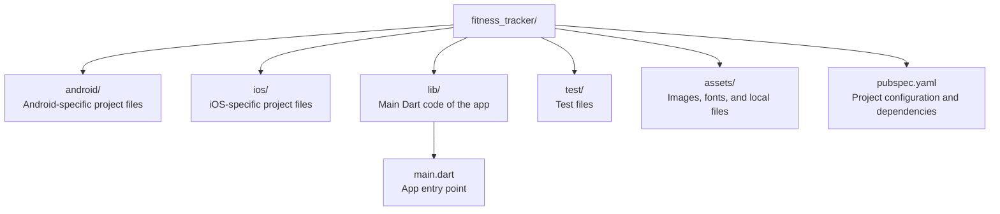

### Important Files

| File/folder | Purpose |
|---|---|
| lib/main.dart | Main starting file of Flutter app |
| pubspec.yaml | Defines app dependencies, assets, fonts |
| android/ | Native Android configuration |
| ios/ | Native iOS configuration |
| test/ | Widget and unit tests |
| assets/ | Images and files used by app |

## 3.4 runApp()

`runApp()` is the function that starts a Flutter application.

Example:

```dart
import 'package:flutter/material.dart';

void main() {
  runApp(const FitnessApp());
}

class FitnessApp extends StatelessWidget {
  const FitnessApp({super.key});

  @override
  Widget build(BuildContext context) {
    return const MaterialApp(
      home: Text('Fitness Tracker'),
    );
  }
}
```

Simple meaning:

- `main()` is the first function that runs.
- `runApp()` tells Flutter which widget is the root of the app.
- `FitnessApp` becomes the starting widget.

## 3.5 App-Level Wrappers: MaterialApp and CupertinoApp

### MaterialApp

`MaterialApp` is used to build apps following Google's Material Design style.

It provides:

- Theme
- Navigation
- Routes
- App title
- Localization support
- Material widgets

Example:

```dart
MaterialApp(
  title: 'Fitness Tracker',
  theme: ThemeData(primarySwatch: Colors.green),
  home: const DashboardScreen(),
)
```

### CupertinoApp

`CupertinoApp` is used to build apps following Apple's iOS design style.

Example:

```dart
CupertinoApp(
  title: 'Fitness Tracker',
  home: CupertinoPageScaffold(
    navigationBar: CupertinoNavigationBar(
      middle: Text('Fitness Tracker'),
    ),
    child: Center(child: Text('Dashboard')),
  ),
)
```

### Difference

| Basis | MaterialApp | CupertinoApp |
|---|---|---|
| Design style | Android/Google Material style | iOS/Apple style |
| Common widgets | Scaffold, AppBar, FloatingActionButton | CupertinoPageScaffold, CupertinoButton |
| Best for | Most Flutter apps | iOS-style apps |

## 3.6 Running First Flutter App

Basic commands:

```bash
flutter create fitness_tracker
cd fitness_tracker
flutter run
```

To run the app:

- Start emulator, or
- Connect phone using USB debugging, then
- Run `flutter run`

## 3.7 Hot Reload vs Hot Restart

### Hot Reload

Hot reload updates UI changes quickly without restarting the whole app. It keeps the current app state in many cases.

Example:

- Change button color.
- Change text.
- Change padding.
- Press hot reload.
- App updates quickly.

### Hot Restart

Hot restart restarts the Dart app from the beginning. It clears the current state.

Example:

- If a counter value was 10, after hot restart it may become 0 again.

### Comparison

| Basis | Hot Reload | Hot Restart |
|---|---|---|
| Speed | Faster | Slower than hot reload |
| Keeps state | Usually yes | No |
| Restarts app | No | Yes |
| Use case | UI changes | App initialization changes |

## 3.8 Diagram: Flutter App Start Flow

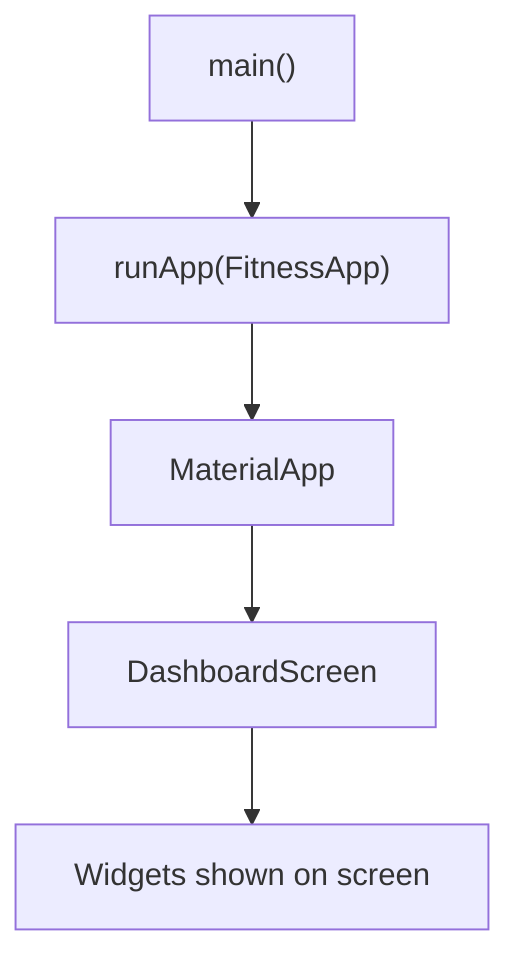

## 3.9 Common Exam Points and Mistakes

Important points:

- `main()` is the entry point of a Dart program.
- `runApp()` starts the Flutter widget tree.
- Most Flutter code is written inside the `lib` folder.
- `pubspec.yaml` manages packages, assets, and fonts.
- Hot reload keeps state in many cases; hot restart resets state.

Common mistakes:

- Forgetting to add assets in `pubspec.yaml`.
- Thinking hot reload always works for every change.
- Confusing `MaterialApp` with `Scaffold`.
- Writing UI directly without a root app widget.

## 3.10 Sample Long Question and Answer

### Question

Explain the steps for setting up Flutter and describe the basic Flutter project structure. Also explain `runApp()`, `MaterialApp`, and hot reload.

### Answer

To set up Flutter, first we download and install the Flutter SDK from the official Flutter website. Then we add Flutter to the system PATH so that the `flutter` command can be used from the terminal. Next, we install Android Studio and required Android SDK tools. If we use Android Studio for development, we install the Flutter and Dart plugins. After installation, we run `flutter doctor` to check whether all required tools are available. If any problem is shown, such as missing Android SDK or unaccepted Android licenses, we fix it.

A Flutter project contains several important folders and files. The `lib` folder contains the main Dart code of the application. The `main.dart` file inside `lib` is usually the starting point. The `pubspec.yaml` file contains project configuration, dependencies, assets, and fonts. The `android` folder contains Android-specific configuration, while the `ios` folder contains iOS-specific configuration. The `test` folder contains testing files.

In Flutter, the `main()` function is the entry point of the app. Inside `main()`, we call `runApp()` and pass the root widget of the application. `MaterialApp` is an app-level wrapper that provides Material Design, theme, navigation, and routing features. `CupertinoApp` is used for iOS-style apps.

Hot reload is a useful Flutter feature that allows developers to see code changes quickly without restarting the entire app. It is mostly used for UI changes and usually keeps the current state. Hot restart restarts the Dart app and clears the state. These features make Flutter development faster and easier.

The app startup flow is also important. The operating system starts the Flutter app, Dart runs the `main()` function, and `runApp()` attaches the root widget to the screen. Usually, this root widget is an app-level wrapper such as `MaterialApp` or `CupertinoApp`. `MaterialApp` gives Material Design features such as theme, routes, navigator, localization support, and scaffold structure. `CupertinoApp` is used when the app needs iOS-style look and behavior.

Students should remember that Flutter project structure separates common Dart code from platform-specific code. Most app logic is written inside `lib`, but Android-specific permissions may be placed in the Android folder and iOS-specific permissions may be placed in the iOS folder. Therefore, understanding project structure helps developers know where to write Flutter code and where to configure platform features.

## 3.11 MCQs

1. Which command checks Flutter installation?
   - A. flutter create
   - B. flutter doctor
   - C. flutter delete
   - D. flutter install only
   - Answer: B

2. Which folder contains main Dart app code?
   - A. android
   - B. ios
   - C. lib
   - D. build
   - Answer: C

3. Which file manages packages and assets?
   - A. main.dart
   - B. pubspec.yaml
   - C. AndroidManifest.xml
   - D. index.html
   - Answer: B

4. Which function starts a Flutter app?
   - A. startApp()
   - B. launch()
   - C. runApp()
   - D. openApp()
   - Answer: C

5. Hot restart usually:
   - A. Keeps all state
   - B. Clears app state and restarts the Dart app
   - C. Only changes text color
   - D. Deletes project files
   - Answer: B

---

# 4. Widgets and Layouts

## 4.1 Definition

Widgets are the basic building blocks of a Flutter user interface. Everything visible on the screen is created using widgets.

Examples:

- Text
- Button
- Image
- Row
- Column
- Container
- ListView
- Full screen/page

Layout means arranging widgets on the screen.

## 4.2 Widget Tree

Flutter apps are built as a tree of widgets.

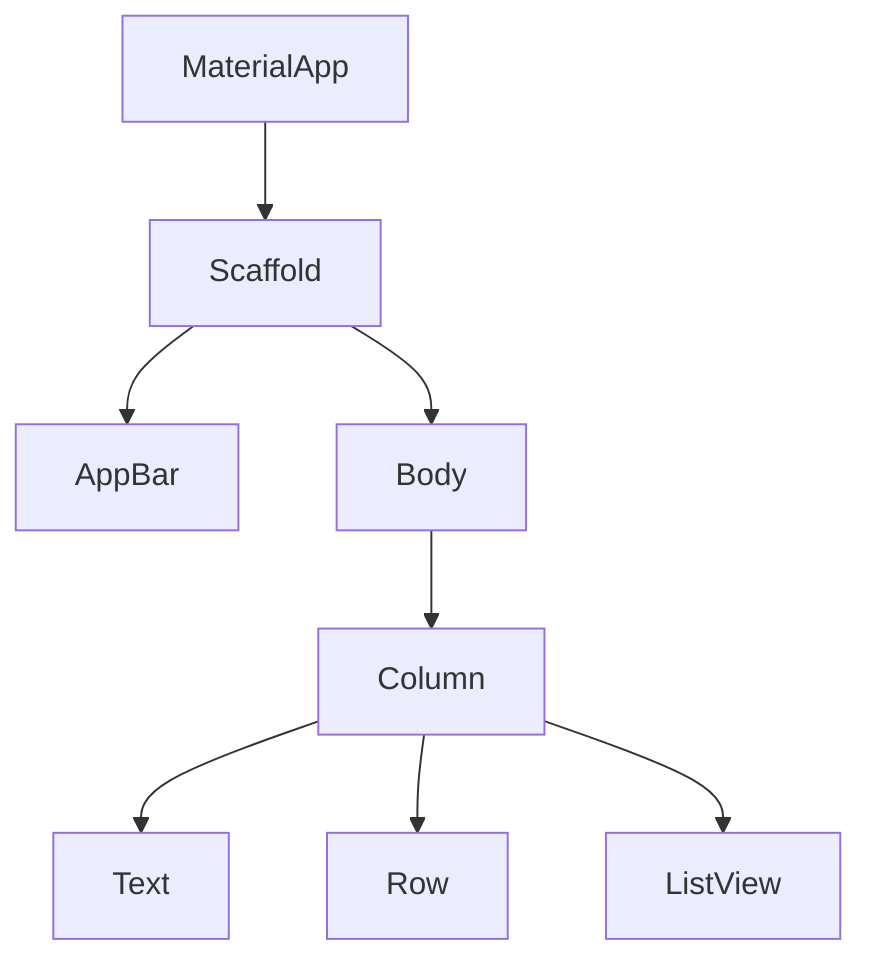

In the Fitness Tracker app, the dashboard screen may contain:

- AppBar showing app title
- Text showing today's steps
- Row showing calories and distance
- ListView showing workouts
- Button to add water intake

## 4.3 StatelessWidget vs StatefulWidget

### StatelessWidget

A StatelessWidget does not change its own internal data after it is built.

Use StatelessWidget when the UI is fixed or receives data from outside.

Example:

```dart
class AppTitle extends StatelessWidget {
  const AppTitle({super.key});

  @override
  Widget build(BuildContext context) {
    return const Text('Fitness Tracker');
  }
}
```

Fitness app example:

- App logo
- Static title
- About page text

### StatefulWidget

A StatefulWidget can change its internal data and rebuild the UI.

Use StatefulWidget when the screen changes because of user interaction.

Example:

```dart
class WaterCounter extends StatefulWidget {
  const WaterCounter({super.key});

  @override
  State<WaterCounter> createState() => _WaterCounterState();
}

class _WaterCounterState extends State<WaterCounter> {
  int glasses = 0;

  @override
  Widget build(BuildContext context) {
    return Column(
      children: [
        Text('Water: $glasses glasses'),
        ElevatedButton(
          onPressed: () {
            setState(() {
              glasses++;
            });
          },
          child: const Text('Add Glass'),
        ),
      ],
    );
  }
}
```

Fitness app example:

- Water counter
- Step counter
- Selected workout screen
- Form input screen

### Comparison

| Basis | StatelessWidget | StatefulWidget |
|---|---|---|
| State change | No internal state change | Can change internal state |
| Rebuild | When parent rebuilds | When `setState()` is called |
| Example | Static title | Counter |
| Complexity | Simpler | More complex |

## 4.4 Basic Widgets

### Text

Used to display text.

```dart
Text(
  'Today: 6500 steps',
  style: TextStyle(fontSize: 22, fontWeight: FontWeight.bold),
)
```

### Container

Used for box styling, size, padding, margin, color, decoration, and alignment.

```dart
Container(
  padding: const EdgeInsets.all(16),
  margin: const EdgeInsets.all(8),
  decoration: BoxDecoration(
    color: Colors.green.shade100,
    borderRadius: BorderRadius.circular(8),
  ),
  child: const Text('Daily Goal'),
)
```

### Row

Arranges children horizontally.

```dart
Row(
  mainAxisAlignment: MainAxisAlignment.spaceAround,
  children: const [
    Text('Steps'),
    Text('Calories'),
    Text('Distance'),
  ],
)
```

### Column

Arranges children vertically.

```dart
Column(
  children: const [
    Text('Morning Run'),
    Text('Yoga'),
    Text('Cycling'),
  ],
)
```

### Stack

Places widgets on top of each other.

```dart
Stack(
  children: [
    Image.asset('assets/banner.png'),
    const Positioned(
      bottom: 10,
      left: 10,
      child: Text('Fitness Challenge'),
    ),
  ],
)
```

Fitness app use:

- Put text over workout image
- Show badge over profile image

### ListView

Used to show a scrollable list.

```dart
ListView(
  children: const [
    ListTile(title: Text('Running')),
    ListTile(title: Text('Yoga')),
    ListTile(title: Text('Cycling')),
  ],
)
```

### ListView.builder

Used for long or dynamic lists. It builds items only when needed.

```dart
final workouts = ['Running', 'Yoga', 'Cycling'];

ListView.builder(
  itemCount: workouts.length,
  itemBuilder: (context, index) {
    return ListTile(
      title: Text(workouts[index]),
    );
  },
)
```

Use `ListView.builder` when the list comes from an API, database, or large collection.

## 4.5 Material and Cupertino Widgets

### Material Widgets

Material widgets follow Google's Material Design.

Examples:

- Scaffold
- AppBar
- ElevatedButton
- FloatingActionButton
- Card
- BottomNavigationBar

```dart
Scaffold(
  appBar: AppBar(title: const Text('Fitness Tracker')),
  body: const Center(child: Text('Dashboard')),
)
```

### Cupertino Widgets

Cupertino widgets follow Apple's iOS design style.

Examples:

- CupertinoButton
- CupertinoNavigationBar
- CupertinoSwitch
- CupertinoPageScaffold

```dart
CupertinoButton(
  onPressed: () {},
  child: const Text('Start Workout'),
)
```

## 4.6 Handling User Inputs

### TextField

Used to take text input from the user.

```dart
TextField(
  decoration: const InputDecoration(
    labelText: 'Enter your weight',
    border: OutlineInputBorder(),
  ),
  keyboardType: TextInputType.number,
)
```

### Buttons

Used to perform actions.

```dart
ElevatedButton(
  onPressed: () {
    print('Workout started');
  },
  child: const Text('Start Workout'),
)
```

### GestureDetector

Used to detect gestures such as tap, double tap, long press, and drag.

```dart
GestureDetector(
  onTap: () {
    print('Workout card tapped');
  },
  child: Container(
    padding: const EdgeInsets.all(16),
    child: const Text('Yoga'),
  ),
)
```

## 4.7 Diagram: Layout Example

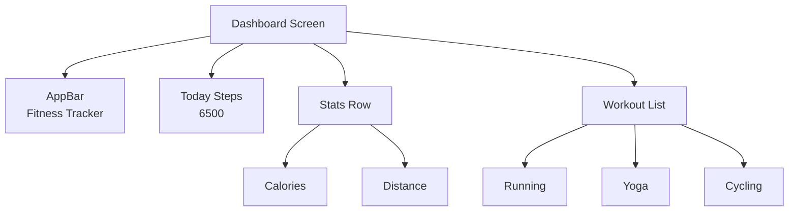

## 4.8 Common Exam Points and Mistakes

Important points:

- Widgets are immutable descriptions of UI.
- Layout widgets arrange other widgets.
- Row is horizontal, Column is vertical.
- ListView is scrollable.
- ListView.builder is better for large/dynamic lists.
- StatefulWidget is used when UI changes due to state.

Common mistakes:

- Putting a large ListView directly inside Column without Expanded.
- Confusing Row and Column axes.
- Using StatefulWidget when StatelessWidget is enough.
- Forgetting to call `setState()` after changing local state.

## 4.9 Sample Long Question and Answer

### Question

Explain StatelessWidget and StatefulWidget. Also describe commonly used Flutter layout widgets with examples.

### Answer

In Flutter, widgets are the basic building blocks of the user interface. A widget describes what should appear on the screen. Flutter has two important types of widgets: StatelessWidget and StatefulWidget.

A StatelessWidget is a widget that does not change its own internal data after it is built. It is used for static UI parts such as titles, icons, labels, and simple display screens. For example, the title "Fitness Tracker" in an app can be created using StatelessWidget.

A StatefulWidget is a widget that can change its internal data and update the user interface. It is used when the UI depends on user interaction or changing data. For example, a water counter in a Fitness Tracker app can increase when the user presses an "Add Glass" button. In this case, `setState()` is called to update the UI.

Flutter provides many layout widgets. `Text` displays text. `Container` is used for box styling, padding, margin, color, and decoration. `Row` arranges widgets horizontally, while `Column` arranges widgets vertically. `Stack` places widgets on top of each other. `ListView` displays a scrollable list, and `ListView.builder` is used for large or dynamic lists because it builds items only when needed.

Thus, widgets and layouts are central to Flutter development. By combining small widgets, developers can build complex and beautiful screens.

A widget tree is formed when widgets are nested inside other widgets. For example, a Fitness Tracker dashboard may have `Scaffold` as the page structure, `Column` as the main vertical layout, `Row` for summary cards, and `ListView.builder` for workout history. Flutter reads this widget tree and decides how to draw the screen.

The difference between `StatelessWidget` and `StatefulWidget` is very important in exams. If the widget only receives data and displays it, `StatelessWidget` is enough. If the widget owns data that changes during runtime, `StatefulWidget` is needed. However, in larger apps, even changing data may be managed by Provider or Bloc instead of keeping all logic inside StatefulWidget. This keeps UI widgets smaller and cleaner.

Students should also mention layout direction. `Row` places children from left to right, and `Column` places children from top to bottom. `Stack` is useful for overlay UI such as putting a progress label above a circular chart. `ListView.builder` is preferred for API/database lists because it builds visible items efficiently instead of creating all items at once.

## 4.10 MCQs

1. Which widget arranges children vertically?
   - A. Row
   - B. Column
   - C. Stack
   - D. Text
   - Answer: B

2. Which widget is used for scrollable lists?
   - A. Container
   - B. Text
   - C. ListView
   - D. Padding
   - Answer: C

3. Which widget can change its internal state?
   - A. StatelessWidget
   - B. StatefulWidget
   - C. Text only
   - D. Icon only
   - Answer: B

4. Which widget places children on top of each other?
   - A. Row
   - B. Column
   - C. Stack
   - D. ListTile
   - Answer: C

5. What does `setState()` do?
   - A. Deletes the app
   - B. Updates state and rebuilds UI
   - C. Creates database
   - D. Installs packages
   - Answer: B

---

# 5. Styling and Theming

## 5.1 Definition

Styling means changing the appearance of widgets. It includes color, size, font, spacing, border, images, icons, and alignment.

Theming means defining common design rules for the whole app, such as primary color, text style, button style, dark theme, and light theme.

## 5.2 Padding, Margin, and Alignment

### Padding

Padding is space inside a widget, between the content and the border.

```dart
Padding(
  padding: const EdgeInsets.all(16),
  child: const Text('Daily Steps'),
)
```

### Margin

Margin is space outside a widget. In Flutter, margin is often added using `Container`.

```dart
Container(
  margin: const EdgeInsets.all(12),
  child: const Text('Workout Card'),
)
```

### Simple Analogy

Think of a photo frame.

- Padding is the space between the photo and the frame.
- Margin is the space between the frame and other objects on the wall.

### Alignment

Alignment controls where a child is placed inside its parent.

```dart
Container(
  alignment: Alignment.center,
  child: const Text('Goal Completed'),
)
```

## 5.3 Custom Fonts and Icons

### Icons

Flutter provides built-in Material icons.

```dart
Icon(Icons.directions_run, color: Colors.green, size: 32)
```

Fitness app examples:

- Running icon for workout
- Water drop icon for water intake
- Heart icon for health

### Custom Fonts

Custom fonts can be added by placing font files in the project and registering them in `pubspec.yaml`.

Example:

```yaml
flutter:
  fonts:
    - family: Poppins
      fonts:
        - asset: assets/fonts/Poppins-Regular.ttf
```

Then use:

```dart
Text(
  'Fitness Tracker',
  style: TextStyle(fontFamily: 'Poppins'),
)
```

## 5.4 Using Images in Flutter

Flutter supports different types of images.

### Asset Image

Asset images are stored inside the app project.

```yaml
flutter:
  assets:
    - assets/images/workout.png
```

```dart
Image.asset('assets/images/workout.png')
```

Use case:

- App logo
- Workout banners
- Local icons

### Network Image

Network images are loaded from the internet.

```dart
Image.network('https://example.com/workout.png')
```

Use case:

- User profile image from server
- Online workout image

### File Image

File image is loaded from a file on the device.

```dart
Image.file(imageFile)
```

Use case:

- User selects profile photo from phone gallery

### Memory Image

Memory image is loaded from bytes in memory.

```dart
Image.memory(imageBytes)
```

Use case:

- Image received as bytes from API or generated inside app

## 5.5 google_fonts Package

The `google_fonts` package allows using Google Fonts easily without manually adding font files.

Add dependency:

```bash
flutter pub add google_fonts
```

Use in code:

```dart
import 'package:google_fonts/google_fonts.dart';

Text(
  'Fitness Tracker',
  style: GoogleFonts.poppins(
    fontSize: 24,
    fontWeight: FontWeight.bold,
  ),
)
```

Exam note: `flutter pub add google_fonts` adds the latest suitable package version to `pubspec.yaml`.

## 5.6 Theming App: Light Theme and Dark Theme

Theme defines the common look of the whole app.

Example:

```dart
MaterialApp(
  theme: ThemeData(
    brightness: Brightness.light,
    primaryColor: Colors.green,
  ),
  darkTheme: ThemeData(
    brightness: Brightness.dark,
    primaryColor: Colors.greenAccent,
  ),
  themeMode: ThemeMode.system,
  home: const DashboardScreen(),
)
```

### Light Theme

Light theme uses bright background and dark text.

### Dark Theme

Dark theme uses dark background and light text.

### Why Theme is Useful

- Consistent design
- Easier maintenance
- Better user experience
- Supports system dark mode
- Avoids repeating style code everywhere

## 5.7 Diagram: Styling Concepts

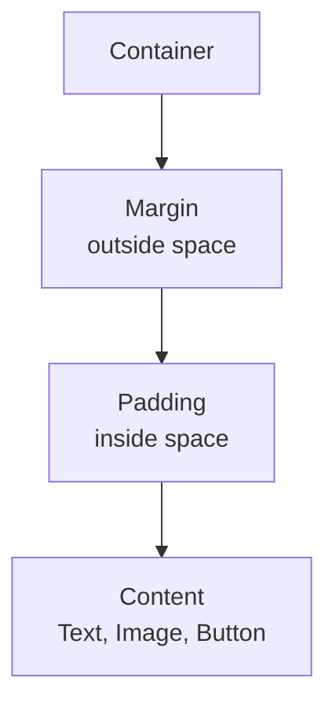

## 5.8 Common Exam Points and Mistakes

Important points:

- Padding is inside space.
- Margin is outside space.
- Assets must be registered in `pubspec.yaml`.
- ThemeData controls common app design.
- `google_fonts` helps use custom fonts easily.
- Dark theme improves usability in low light.

Common mistakes:

- Forgetting correct indentation in `pubspec.yaml`.
- Confusing padding and margin.
- Using too many different colors and fonts.
- Not handling network image loading errors in real apps.

## 5.9 Sample Long Question and Answer

### Question

Explain styling and theming in Flutter. Discuss padding, margin, images, custom fonts, and dark theme with examples.

### Answer

Styling in Flutter means changing the visual appearance of widgets. It includes color, font, size, spacing, border, images, and alignment. Theming means defining common styles for the entire application so that the design remains consistent.

Padding is the space inside a widget, between the content and its boundary. Margin is the space outside a widget, between that widget and other widgets. Alignment controls the position of a child inside its parent. For example, in a Fitness Tracker app, padding can be used inside a workout card so that the text does not touch the card border.

Flutter supports different types of images. `Image.asset()` is used for images stored inside the app project. `Image.network()` is used for images loaded from the internet. `Image.file()` is used for images stored on the device, and `Image.memory()` is used for image bytes in memory. Assets must be declared in the `pubspec.yaml` file.

Custom fonts can be added manually using font files or easily by using the `google_fonts` package. Icons can be added using Flutter's built-in icon library. In a Fitness Tracker app, running icons, water icons, and health icons improve the user interface.

Theming is done using `ThemeData`. A light theme uses a bright background and dark text, while a dark theme uses a dark background and light text. Flutter allows defining both `theme` and `darkTheme` in `MaterialApp`. This makes the app visually consistent and user-friendly.

In a real app, theming avoids repeated styling. Without theme, a developer may manually set button color, text color, and font size on every screen. This becomes difficult to maintain. With `ThemeData`, the same primary color, text style, button style, and app bar style can be applied across the whole app.

For example, a Fitness Tracker app may use green as the primary color for health and progress. The same green can appear in buttons, progress indicators, selected icons, and app bars. If the college or client later asks to change the primary color, the developer can update the theme in one place instead of changing every widget.

Dark theme is important because many users prefer using apps at night. Flutter can define `theme` for light mode and `darkTheme` for dark mode. The app can also use system theme mode so that it follows the phone setting. Good styling and theming improve readability, consistency, accessibility, and user experience.

## 5.10 MCQs

1. Padding means:
   - A. Space outside widget
   - B. Space inside widget
   - C. Database space
   - D. Internet speed
   - Answer: B

2. Which file is used to register assets?
   - A. main.dart
   - B. pubspec.yaml
   - C. styles.css
   - D. index.php
   - Answer: B

3. Which widget loads an image from internet?
   - A. Image.asset
   - B. Image.network
   - C. Image.file only
   - D. Text
   - Answer: B

4. Which class defines app theme in Flutter?
   - A. ThemeData
   - B. ListView
   - C. SetState
   - D. Navigator
   - Answer: A

5. The `google_fonts` package is used for:
   - A. Using Google Fonts
   - B. Creating database
   - C. Opening camera only
   - D. Sending SMS only
   - Answer: A

---

# 6. Navigation and Routing

## 6.1 Definition

Navigation means moving from one screen to another screen in an app.

Routing means defining and managing the paths or rules used to open different screens.

In a Fitness Tracker app, navigation is used to move between:

- Dashboard screen
- Workout detail screen
- Profile screen
- Settings screen
- Progress screen

## 6.2 Imperative vs Declarative Routing

### Imperative Routing

Imperative routing means telling the app directly what to do.

Example:

- Push this screen.
- Pop this screen.
- Go back.

In Flutter, `Navigator.push()` and `Navigator.pop()` are examples of imperative navigation.

### Declarative Routing

Declarative routing means describing what the navigation state should be, and the framework builds the correct screen stack.

Declarative routing is often used in larger apps and web-friendly navigation.

Examples:

- Router API
- go_router package

### Comparison

| Basis | Imperative Routing | Declarative Routing |
|---|---|---|
| Style | Command-based | State-based |
| Example | Navigator.push() | Router/go_router |
| Easy for beginners | Yes | More advanced |
| Best for | Small and medium apps | Large apps, deep links, web |

## 6.3 Stack Data Structure in Navigator

Flutter Navigator works like a stack.

A stack follows LIFO:

Last In, First Out.

This means the last screen pushed is the first screen popped.

### Simple Analogy

Think of plates kept one above another. The last plate placed on top is removed first.

### Navigator Stack Example

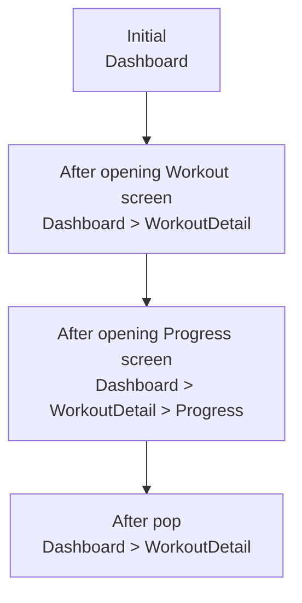

## 6.4 Navigator.push and Navigator.pop

### Navigator.push

Used to open a new screen.

```dart
Navigator.push(
  context,
  MaterialPageRoute(
    builder: (context) => const WorkoutDetailScreen(),
  ),
);
```

### Navigator.pop

Used to go back to the previous screen.

```dart
Navigator.pop(context);
```

Fitness app example:

- User taps a workout card.
- App pushes WorkoutDetailScreen.
- User presses back.
- App pops WorkoutDetailScreen and returns to DashboardScreen.

## 6.5 Named Routes

Named routes use string names for screens.

Example:

```dart
MaterialApp(
  initialRoute: '/',
  routes: {
    '/': (context) => const DashboardScreen(),
    '/profile': (context) => const ProfileScreen(),
    '/workout': (context) => const WorkoutScreen(),
  },
)
```

Navigate using:

```dart
Navigator.pushNamed(context, '/profile');
```

### Advantages of Named Routes

- Cleaner navigation code
- Central route management
- Useful for medium apps
- Easier to understand screen paths

## 6.6 Passing Data Between Screens

### Passing Data Through Constructor

```dart
class WorkoutDetailScreen extends StatelessWidget {
  final String workoutName;

  const WorkoutDetailScreen({
    super.key,
    required this.workoutName,
  });

  @override
  Widget build(BuildContext context) {
    return Scaffold(
      appBar: AppBar(title: Text(workoutName)),
      body: Text('Details for $workoutName'),
    );
  }
}
```

Navigation:

```dart
Navigator.push(
  context,
  MaterialPageRoute(
    builder: (context) => const WorkoutDetailScreen(
      workoutName: 'Running',
    ),
  ),
);
```

### Passing Data With Named Routes

```dart
Navigator.pushNamed(
  context,
  '/workoutDetail',
  arguments: 'Running',
);
```

Inside destination screen:

```dart
final workoutName = ModalRoute.of(context)!.settings.arguments as String;
```

## 6.7 Diagram: Navigator Stack

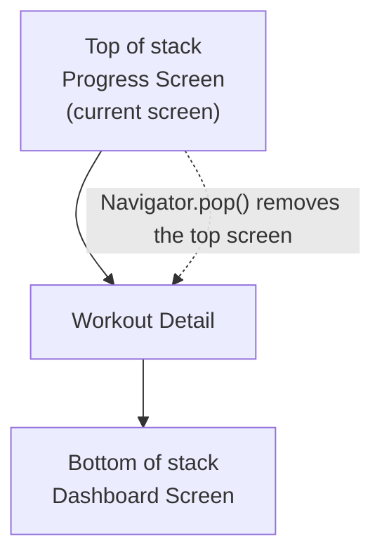

## 6.8 Common Exam Points and Mistakes

Important points:

- Navigation means moving between screens.
- Navigator uses stack behavior.
- `push()` adds a new screen.
- `pop()` removes the current screen.
- Named routes give names to screens.
- Data can be passed using constructors or route arguments.

Common mistakes:

- Calling Navigator without valid `BuildContext`.
- Forgetting to register named routes.
- Passing wrong argument type.
- Using complex declarative routing before understanding Navigator basics.

## 6.9 Sample Long Question and Answer

### Question

Explain navigation and routing in Flutter. Describe Navigator stack, push, pop, named routes, and passing data between screens.

### Answer

Navigation in Flutter means moving from one screen to another. Routing means defining and managing screen paths in an application. In a Fitness Tracker app, navigation is needed to move from the dashboard to workout details, profile, progress, and settings screens.

Flutter uses a Navigator to manage screens. The Navigator works like a stack data structure. A stack follows the Last In, First Out rule. When a new screen is opened using `Navigator.push()`, it is added to the top of the stack. When `Navigator.pop()` is called, the top screen is removed and the previous screen becomes visible.

For example, if the user is on the Dashboard screen and taps a workout card, the app can use `Navigator.push()` to open the WorkoutDetail screen. If the user presses the back button, `Navigator.pop()` removes the WorkoutDetail screen and returns to Dashboard.

Named routes allow developers to give names to screens, such as `/profile` or `/workout`. They are registered inside `MaterialApp` using the `routes` property. The app can then navigate using `Navigator.pushNamed()`. Named routes make navigation cleaner and easier to manage.

Data can be passed between screens using constructors or route arguments. For example, when opening a workout detail screen, the selected workout name such as "Running" can be passed to the next screen. This allows the detail screen to show correct information. Therefore, navigation and routing are important for building multi-screen Flutter applications.

Flutter has imperative and declarative routing styles. Imperative routing is command-based. The developer directly says `push` or `pop`. Declarative routing describes which screens should be visible based on app state. For beginner apps, `Navigator.push()` and `pop()` are easier to understand. For complex apps with authentication, deep linking, and web URLs, declarative routing is often more suitable.

The Navigator stack can be compared to plates stacked on top of each other. The last screen opened is placed on top. When the user goes back, the top screen is removed. In a Fitness Tracker app, Dashboard may be first, WorkoutList second, and WorkoutDetail third. Pressing back removes WorkoutDetail and shows WorkoutList again.

Passing data is also a common exam point. Constructor passing is simple and type-safe. Named route arguments are useful when using route names. For example, the app can pass a workout id to the detail screen, and the detail screen can load the correct workout. Without data passing, every screen would show the same static information, which is not useful in real apps.

## 6.10 MCQs

1. Navigator in Flutter works like:
   - A. Queue
   - B. Stack
   - C. Tree only
   - D. Database
   - Answer: B

2. Which method opens a new screen?
   - A. Navigator.push
   - B. Navigator.pop
   - C. print
   - D. setState only
   - Answer: A

3. Which method returns to previous screen?
   - A. Navigator.push
   - B. Navigator.pop
   - C. runApp
   - D. ThemeData
   - Answer: B

4. LIFO means:
   - A. Last In, First Out
   - B. Last In, Final Output
   - C. Long Input, Fast Output
   - D. Local Input File Output
   - Answer: A

5. Named routes are useful because:
   - A. They remove all widgets
   - B. They give string names to screens
   - C. They only change color
   - D. They replace Dart
   - Answer: B

---

# 7. State Management

## 7.1 Definition

State is the data that can change in an application.

State management means controlling how data changes and how the UI updates when data changes.

In a Fitness Tracker app, state includes:

- Current step count
- Water glasses
- Selected workout
- Login status
- Theme mode
- User profile
- API loading status

## 7.2 Why State Management is Needed

Without state management, it becomes difficult to:

- Update UI correctly
- Share data between screens
- Avoid repeated code
- Handle API loading and errors
- Keep app logic organized

### Simple Analogy

State is like the scoreboard in a game. When the score changes, everyone should see the new score. State management is the system that updates the scoreboard correctly.

## 7.3 setState for Local State

`setState()` is the simplest way to manage local state inside a StatefulWidget.

Use `setState()` when:

- State is used only in one widget or one screen
- App is small
- Logic is simple

Example:

```dart
class StepCounter extends StatefulWidget {
  const StepCounter({super.key});

  @override
  State<StepCounter> createState() => _StepCounterState();
}

class _StepCounterState extends State<StepCounter> {
  int steps = 0;

  void addSteps() {
    setState(() {
      steps += 100;
    });
  }

  @override
  Widget build(BuildContext context) {
    return Column(
      children: [
        Text('Steps: $steps'),
        ElevatedButton(
          onPressed: addSteps,
          child: const Text('Add 100 Steps'),
        ),
      ],
    );
  }
}
```

### Limitations of setState

- Not good for large apps
- Hard to share state between far screens
- UI and logic can become mixed
- Testing can become harder

### How setState Works

When `setState()` is called, Flutter marks that widget as dirty. Dirty means the widget needs to be rebuilt because its data has changed. After that, Flutter calls the `build()` method again for that widget and updates the visible UI.

Important point: `setState()` does not rebuild the whole app. It rebuilds the widget where it is called and the child widgets below it. This is why students should keep widgets small. If one very large screen uses one big `setState()`, a lot of UI may rebuild unnecessarily.

Exam example:

In a Fitness Tracker app, if only the water glass counter changes, `setState()` is enough. But if water data must also update dashboard, history screen, notification logic, and profile achievement badge, `setState()` becomes difficult. In that case, Provider or Bloc is better.

## 7.4 Dependency Injection

Dependency Injection means providing an object from outside instead of creating it inside the class.

### Simple Explanation

If a screen needs a service, we pass the service to it. The screen does not create the service itself.

### Analogy

In a classroom, a student does not build a projector. The projector is provided to the class. In the same way, dependencies are provided to widgets or classes.

### Example

```dart
class FitnessService {
  int getTodaySteps() {
    return 6500;
  }
}

class DashboardScreen extends StatelessWidget {
  final FitnessService service;

  const DashboardScreen({super.key, required this.service});

  @override
  Widget build(BuildContext context) {
    return Text('Steps: ${service.getTodaySteps()}');
  }
}
```

### Benefits

- Easier testing
- Cleaner code
- Less tight coupling
- Easier to replace services

## 7.5 BuildContext

`BuildContext` is a handle to the location of a widget in the widget tree.

It helps widgets access:

- Theme
- Navigator
- MediaQuery
- Providers
- Parent widget information

Example:

```dart
Theme.of(context).colorScheme.primary;
Navigator.pushNamed(context, '/profile');
```

### Simple Analogy

BuildContext is like a home address. If Flutter knows your address in the widget tree, it can find nearby services such as theme, navigator, and provider.

### Common Uses

```dart
Navigator.of(context);
Theme.of(context);
MediaQuery.of(context);
Provider.of<FitnessProvider>(context);
```

## 7.6 InheritedWidget

`InheritedWidget` is a low-level Flutter widget used to pass data down the widget tree efficiently.

It allows child widgets to access shared data from an ancestor widget.

### Simple Explanation

If many children need the same data, the parent can provide that data using InheritedWidget.

### Diagram

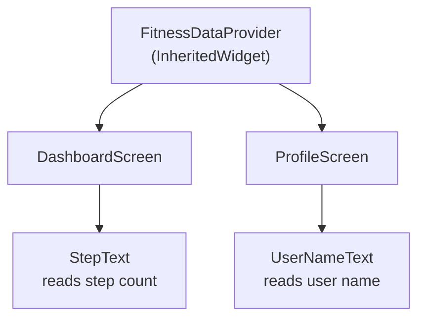

### Why It Matters

Many state management libraries are built on similar ideas. Provider also uses inherited mechanisms internally to make data available down the widget tree.

### How InheritedWidget Works

`InheritedWidget` is placed above other widgets in the widget tree. Child widgets can search upward through their `BuildContext` and get the nearest matching inherited widget. When the inherited data changes, Flutter can rebuild only the widgets that depend on that data.

This is important because it avoids manually passing data through many constructors. Without this idea, a step goal value may need to be passed from `FitnessApp` to `DashboardScreen`, then to `ProgressSection`, then to `StepGoalText`. This is called prop drilling. InheritedWidget and Provider reduce this problem.

## 7.7 Provider

Provider is a popular Flutter state management package. It makes it easier to provide and read state across the widget tree.

### Main Provider Concepts

1. Provider  
   Provides an object to child widgets.

2. ChangeNotifier  
   A class that holds state and notifies listeners when data changes.

3. ChangeNotifierProvider  
   Provides a ChangeNotifier to the widget tree.

4. Consumer  
   Rebuilds part of the UI when provided data changes.

5. MultiProvider  
   Provides multiple providers at the same place.

6. Provider.of  
   Reads provider data using BuildContext.

Important note: In the Provider package, the common widget is `Consumer`. `ConsumerWidget` is commonly associated with Riverpod, not basic Provider. If an exam says Provider, write about `Consumer` unless your class specifically taught `ConsumerWidget`.

### ChangeNotifier Example

```dart
class FitnessProvider extends ChangeNotifier {
  int steps = 0;

  void addSteps() {
    steps += 100;
    notifyListeners();
  }
}
```

### Providing State

```dart
ChangeNotifierProvider(
  create: (context) => FitnessProvider(),
  child: const FitnessApp(),
)
```

### Reading State with Consumer

```dart
Consumer<FitnessProvider>(
  builder: (context, fitness, child) {
    return Text('Steps: ${fitness.steps}');
  },
)
```

### Updating State

```dart
ElevatedButton(
  onPressed: () {
    context.read<FitnessProvider>().addSteps();
  },
  child: const Text('Add Steps'),
)
```

### MultiProvider Example

```dart
MultiProvider(
  providers: [
    ChangeNotifierProvider(create: (_) => FitnessProvider()),
    ChangeNotifierProvider(create: (_) => ThemeProvider()),
  ],
  child: const FitnessApp(),
)
```

### Provider Data Flow Diagram

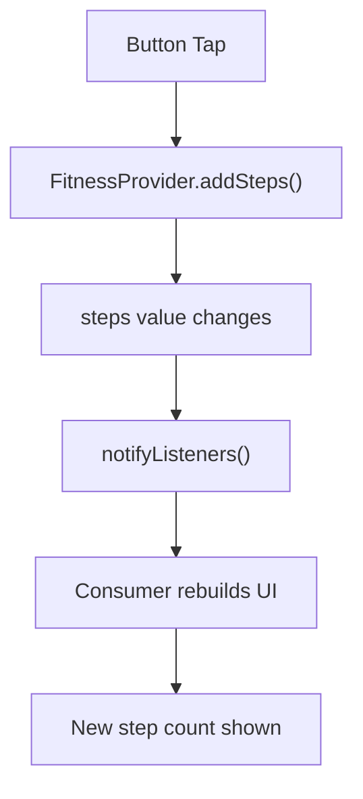

### How Provider Works Internally

Provider puts an object above the widgets that need it. That object may be a simple service, a repository, or a `ChangeNotifier`.

When a child widget uses `context.watch<FitnessProvider>()` or `Consumer<FitnessProvider>`, it becomes a listener. This means the widget is interested in changes from that provider. When the provider calls `notifyListeners()`, all listening widgets are told to rebuild.

`context.read<FitnessProvider>()` is different. It reads the provider once but does not listen for changes. It is commonly used inside button clicks because a button only needs to call a method, not rebuild itself.

### context.read, context.watch, and Consumer

| Method/Widget | Listens for changes? | Common Use |
|---|---|---|
| `context.read<T>()` | No | Call methods, button click |
| `context.watch<T>()` | Yes | Rebuild widget when value changes |
| `Consumer<T>` | Yes | Rebuild only a small part of UI |
| `Selector<T, S>` | Yes, selected value only | Rebuild only when selected field changes |

Example:

```dart
ElevatedButton(
  onPressed: () {
    context.read<FitnessProvider>().addSteps();
  },
  child: const Text('Add Steps'),
)
```

Here `read` is correct because the button only sends an action. The `Text` widget showing step count should use `watch` or `Consumer`.

### Provider With API State

Provider can also manage API loading, success, and error state.

```dart
class WorkoutProvider extends ChangeNotifier {
  final WorkoutApiService api;

  WorkoutProvider(this.api);

  bool isLoading = false;
  String? error;
  List<Workout> workouts = [];

  Future<void> loadWorkouts() async {
    isLoading = true;
    error = null;
    notifyListeners();

    try {
      workouts = await api.fetchWorkouts();
    } catch (e) {
      error = 'Could not load workouts';
    }

    isLoading = false;
    notifyListeners();
  }
}
```

This keeps API logic away from the widget. The screen only decides what to show:

- If `isLoading == true`, show loader.
- If `error != null`, show error message.
- If data exists, show workout list.

## 7.8 Bloc and flutter_bloc Concepts

Bloc means Business Logic Component. It separates business logic from UI.

The `flutter_bloc` package helps use Bloc pattern in Flutter.

### Main Bloc Concepts

| Concept | Meaning |
|---|---|
| Event | Something that happens |
| State | Current data/status |
| Bloc | Receives events and emits states |
| BlocProvider | Provides Bloc to widget tree |
| BlocBuilder | Rebuilds UI based on state |
| BlocListener | Performs one-time actions like showing snackbar |
| BlocConsumer | Combines builder and listener |

### Simple Example Meaning

In a Fitness Tracker app:

- Event: AddStepsPressed
- Bloc: StepBloc
- State: StepCountUpdated
- UI: Shows new step count

### Bloc Data Flow Diagram

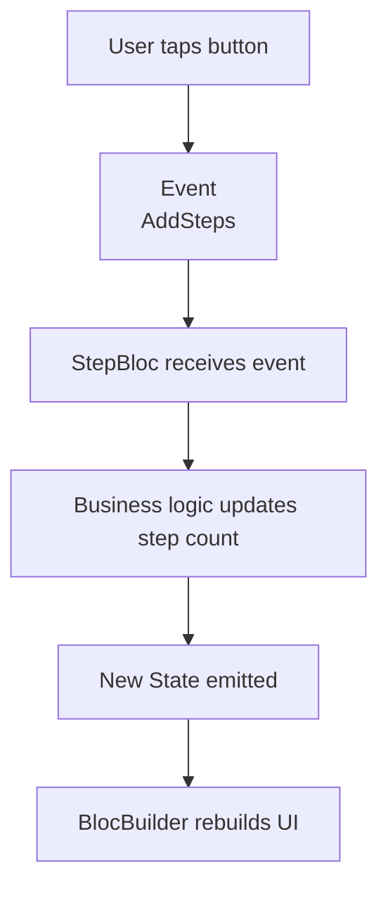

### Small Bloc-Style Example

```dart
abstract class StepEvent {}

class AddSteps extends StepEvent {}

class StepState {
  final int steps;
  StepState(this.steps);
}
```

In real Flutter Bloc code, the Bloc class receives events and emits new states.

### How BlocProvider Works

`BlocProvider` creates or provides a Bloc/Cubit and makes it available to child widgets below it in the widget tree. It works like a provider for Bloc objects.

Example:

```dart
BlocProvider(
  create: (context) => WorkoutBloc(
    repository: context.read<WorkoutRepository>(),
  ),
  child: const WorkoutScreen(),
)
```

Here, `WorkoutBloc` is created above `WorkoutScreen`. Inside `WorkoutScreen`, any child widget can access the same bloc using:

```dart
context.read<WorkoutBloc>().add(LoadWorkouts());
```

Important points:

- `BlocProvider` controls where the Bloc is available.
- If it is placed above `MaterialApp`, many screens can access it.
- If it is placed above only one screen, only that screen and its children can access it.
- When `BlocProvider` creates the Bloc, it also closes it automatically when that part of widget tree is removed.
- If an existing Bloc is passed using `BlocProvider.value`, the developer is responsible for its lifecycle.

### BlocBuilder, BlocListener, and BlocConsumer in Detail

`BlocBuilder` is used to build UI from state. It should be used for visual changes.

```dart
BlocBuilder<WorkoutBloc, WorkoutState>(
  builder: (context, state) {
    if (state is WorkoutLoading) {
      return const CircularProgressIndicator();
    }
    if (state is WorkoutLoaded) {
      return WorkoutList(workouts: state.workouts);
    }
    if (state is WorkoutError) {
      return Text(state.message);
    }
    return const SizedBox();
  },
)
```

`BlocListener` is used for one-time side effects. A side effect is an action that should happen once, not a UI rebuild. Examples are showing a snackbar, navigating to another screen, or displaying a dialog.

```dart
BlocListener<WorkoutBloc, WorkoutState>(
  listener: (context, state) {
    if (state is WorkoutError) {
      ScaffoldMessenger.of(context).showSnackBar(
        SnackBar(content: Text(state.message)),
      );
    }
  },
  child: const WorkoutView(),
)
```

`BlocConsumer` combines both. It has `listener` and `builder` in the same widget. Use it when one screen needs both UI rebuild and side effects.

### Bloc Event-State Example

```dart
sealed class WorkoutEvent {}

class LoadWorkouts extends WorkoutEvent {}

sealed class WorkoutState {}

class WorkoutInitial extends WorkoutState {}
class WorkoutLoading extends WorkoutState {}

class WorkoutLoaded extends WorkoutState {
  final List<Workout> workouts;
  WorkoutLoaded(this.workouts);
}

class WorkoutError extends WorkoutState {
  final String message;
  WorkoutError(this.message);
}
```

The flow is:

1. User opens workout screen.
2. UI sends `LoadWorkouts` event.
3. Bloc receives the event.
4. Bloc emits `WorkoutLoading`.
5. Bloc calls repository/API.
6. If API succeeds, Bloc emits `WorkoutLoaded`.
7. If API fails, Bloc emits `WorkoutError`.
8. `BlocBuilder` rebuilds UI according to state.

### Provider vs Bloc

| Basis | Provider | Bloc |
|---|---|---|
| Complexity | Easier | More structured |
| Best for | Small to medium apps | Medium to large apps |
| Data flow | ChangeNotifier notifies UI | Event goes in, state comes out |
| Learning curve | Lower | Higher |
| Testing | Good | Very good for business logic |

## 7.9 Choosing State Management

| Situation | Recommended |
|---|---|
| One small counter on one screen | setState |
| Shared theme or user data | Provider |
| Medium app with simple shared state | Provider |
| Large app with many events and states | Bloc |
| Need strong separation of UI and logic | Bloc |

For exams, explain that no single solution is best for all cases. The choice depends on app size, complexity, team experience, and testing needs.

## 7.10 Common Exam Points and Mistakes

Important points:

- State means changing data.
- State management updates UI when data changes.
- `setState()` is simple but local.
- Dependency injection improves testability and flexibility.
- BuildContext represents widget location in widget tree.
- InheritedWidget passes data down the tree.
- Provider uses ChangeNotifier and Consumer commonly.
- Bloc uses events and states.

Common mistakes:

- Using `setState()` for whole app state.
- Calling `notifyListeners()` before changing data.
- Rebuilding too much UI unnecessarily.
- Confusing Provider `Consumer` with Riverpod `ConsumerWidget`.
- Putting business logic directly inside UI widgets in large apps.

## 7.11 Sample Long Question and Answer

### Question

Explain state management in Flutter. Discuss `setState`, dependency injection, BuildContext, InheritedWidget, Provider, and Bloc with examples.

### Answer

State is the data that can change in an application. State management is the process of controlling how data changes and how the user interface updates when that data changes. In a Fitness Tracker app, examples of state include step count, water intake, selected workout, login status, theme mode, and user profile information.

The simplest state management technique in Flutter is `setState()`. It is used inside a `StatefulWidget` to update local state. For example, a water counter can increase when the user presses a button. After changing the value, `setState()` is called so Flutter marks that widget as dirty and calls its `build()` method again. This updates the visible UI. `setState()` is best when the changing data belongs to one widget or one screen only.

However, `setState()` is not suitable for large shared app state. If a Fitness Tracker app has step count shown on dashboard, profile, achievement, and history screens, passing the value manually becomes difficult. The logic also gets mixed with UI code, and testing becomes harder.

Dependency injection means providing required objects from outside instead of creating them inside a class. For example, a DashboardScreen can receive a FitnessService object from outside. This makes code easier to test and maintain. `BuildContext` represents the location of a widget in the widget tree. It is used to access Navigator, Theme, MediaQuery, and Provider data.

`InheritedWidget` is a low-level Flutter widget used to pass data down the widget tree. It allows child widgets to access shared data from parent widgets using `BuildContext`. When inherited data changes, Flutter knows which dependent widgets need rebuilding. This avoids passing the same data through many constructors. Provider is built on a similar inherited mechanism.

Provider is a popular state management package in Flutter. It commonly uses `ChangeNotifier` to store state and `notifyListeners()` to update listening widgets. `ChangeNotifierProvider` provides the state object above the widgets that need it. Widgets can read data using `context.read`, `context.watch`, or `Consumer`. `context.read` is used to call methods and does not listen for changes. `context.watch` listens and rebuilds the widget when data changes. `Consumer` is useful when only a small part of UI should rebuild. `MultiProvider` is used when there are multiple providers such as FitnessProvider, ThemeProvider, and AuthProvider.

Bloc stands for Business Logic Component. It separates business logic from UI. In Bloc, the UI sends events, the Bloc processes those events, and then emits states. `BlocProvider` creates or provides the Bloc to the widget tree. `BlocBuilder` rebuilds the UI based on state, while `BlocListener` handles one-time actions such as snackbar and navigation. For example, when the workout screen opens, the UI sends a `LoadWorkouts` event. The Bloc emits `WorkoutLoading`, calls the repository/API, and then emits either `WorkoutLoaded` or `WorkoutError`. Bloc is useful for large applications because it gives a structured, predictable, and testable data flow.

Therefore, state management is one of the most important topics in Flutter. Small local state can use `setState()`. Shared app state can use Provider. Large apps with many actions, API states, and business rules can use Bloc. The correct choice depends on app size, data-sharing requirement, testing need, and team experience.

## 7.12 MCQs

1. State means:
   - A. Data that can change
   - B. Only app icon
   - C. Only project name
   - D. Only Android folder
   - Answer: A

2. Which method updates local state inside StatefulWidget?
   - A. runApp
   - B. setState
   - C. MaterialApp
   - D. Image.asset
   - Answer: B

3. Which class is commonly used with Provider to notify UI?
   - A. ChangeNotifier
   - B. Navigator
   - C. TextField
   - D. AppBar
   - Answer: A

4. Bloc mainly uses:
   - A. Events and states
   - B. Only images
   - C. Only CSS
   - D. Only database tables
   - Answer: A

5. BuildContext represents:
   - A. Widget location in widget tree
   - B. Internet address
   - C. File extension
   - D. Android version only
   - Answer: A

---

# 8. API Calls in Flutter

## 8.1 Definition

An API call in Flutter means sending a request from a Flutter app to a server and receiving data or sending data back.

In mobile apps, APIs are commonly used to:

- Get data from a database through a backend server
- Send login information
- Save user progress
- Load product, workout, attendance, or profile data
- Connect the app with cloud services

In Flutter, API calls are usually handled using packages such as `http` or `dio`.

## 8.2 Beginner Explanation

Think of an API as a waiter in a restaurant.

- The Flutter app is the customer.
- The API is the waiter.
- The server/database is the kitchen.
- The app asks for data.
- The API brings the data back.

The Flutter app does not directly open the server database. It talks to the server through API endpoints.

Example endpoint: `https://api.fitnessapp.com/workouts`

This endpoint may return workout data in JSON format.

## 8.3 REST API and JSON

REST API is a common style for building APIs. It uses HTTP methods.

| HTTP Method | Meaning | Fitness Tracker Example |
|---|---|---|
| GET | Read data | Get workout list |
| POST | Create data | Add new workout |
| PUT/PATCH | Update data | Edit user profile |
| DELETE | Delete data | Delete a workout plan |

JSON is a simple text format used to transfer data.

Example JSON:

```json
{
  "id": 1,
  "title": "Morning Run",
  "duration": 30
}
```

## 8.4 Using Dio Package

`dio` is a powerful HTTP client package for Dart and Flutter. It supports API requests, interceptors, timeout settings, file upload/download, and error handling.

Add the dependency using Flutter command:

```bash
flutter pub add dio
```

Then import it:

```dart
import 'package:dio/dio.dart';
```

## 8.5 Model Class

A model class converts raw JSON into a Dart object.

Fitness Tracker example:

```dart
class Workout {
  final int id;
  final String title;
  final int duration;

  Workout({
    required this.id,
    required this.title,
    required this.duration,
  });

  factory Workout.fromJson(Map<String, dynamic> json) {
    return Workout(
      id: json['id'],
      title: json['title'],
      duration: json['duration'],
    );
  }
}
```

## 8.6 API Service Class

It is a good practice to keep API logic outside the UI widget.

```dart
class WorkoutApiService {
  final Dio dio = Dio();

  Future<List<Workout>> fetchWorkouts() async {
    final response = await dio.get(
      'https://api.example.com/workouts',
    );

    final List data = response.data;
    return data.map((item) => Workout.fromJson(item)).toList();
  }
}
```

### Repository Layer

In bigger apps, developers often add a repository layer between UI/state management and API service.

Simple meaning:

- API service knows how to call the server.
- Repository decides where data should come from.
- UI or Bloc/Provider asks repository for data.

The repository may get data from API, local database, cache, or Firebase. This makes the app easier to change later.

Fitness Tracker example:

```dart
class WorkoutRepository {
  final WorkoutApiService api;

  WorkoutRepository(this.api);

  Future<List<Workout>> getWorkouts() {
    return api.fetchWorkouts();
  }
}
```

If the app later adds offline cache, only the repository needs to change. The UI does not need to know whether data came from API or local storage.

## 8.7 Loading, Success, and Error States

API calls take time. The app should show different UI for different states.

| State | Meaning | UI Example |
|---|---|---|
| Loading | Data is coming | CircularProgressIndicator |
| Success | Data received | List of workouts |
| Error | Something failed | Error message and retry button |

## 8.8 Using FutureBuilder

`FutureBuilder` builds UI according to the status of a `Future`.

```dart
FutureBuilder<List<Workout>>(
  future: WorkoutApiService().fetchWorkouts(),
  builder: (context, snapshot) {
    if (snapshot.connectionState == ConnectionState.waiting) {
      return CircularProgressIndicator();
    }

    if (snapshot.hasError) {
      return Text('Failed to load workouts');
    }

    final workouts = snapshot.data ?? [];

    return ListView.builder(
      itemCount: workouts.length,
      itemBuilder: (context, index) {
        return ListTile(
          title: Text(workouts[index].title),
          subtitle: Text('${workouts[index].duration} minutes'),
        );
      },
    );
  },
)
```

## 8.9 API Call With Provider or Bloc

For small screens, `FutureBuilder` is acceptable. For bigger apps, Provider or Bloc gives better structure.

In a Fitness Tracker app:

- API service fetches workouts
- Provider/Bloc stores loading, data, and error
- UI listens to Provider/Bloc
- UI updates automatically when state changes

## 8.10 Diagram: API Data Flow

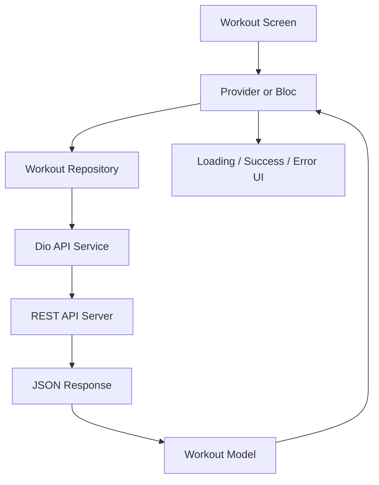

## 8.11 Common Exam Points and Mistakes

Important points:

- API calls are asynchronous.
- `Future` represents a value available later.
- JSON should be converted into model classes.
- UI should handle loading, success, and error states.
- API code should not be mixed heavily inside widgets.
- Dio and http are both used for networking.

Common mistakes:

- Forgetting `async` and `await`
- Not handling API errors
- Assuming API response is always successful
- Displaying blank screen during loading
- Writing all API logic inside `build()`
- Calling API repeatedly every time `build()` runs
- Not separating model, service, repository, and UI

## 8.12 Sample Long Question and Answer

### Question

Explain API integration in Flutter using Dio. Include REST API, JSON, model class, API service, and loading/error/success UI states.

### Answer

API integration means connecting a Flutter app with a server using API endpoints. In modern mobile apps, data usually lives on a server, not inside the phone only. REST APIs use HTTP methods such as GET, POST, PUT/PATCH, and DELETE. GET reads data, POST creates data, PUT/PATCH updates data, and DELETE removes data. The server commonly returns data in JSON format because JSON is simple and easy to convert into Dart objects.

In Flutter, packages such as Dio can be used to send HTTP requests. Dio is powerful because it supports GET/POST requests, timeout settings, interceptors, file upload/download, cancellation, and error handling. The dependency can be added using `flutter pub add dio`, and then imported using `import 'package:dio/dio.dart';`.

First, a model class is created to represent the JSON data in Dart. For example, a `Workout` model may contain `id`, `title`, and `duration`. The `Workout.fromJson()` factory constructor converts JSON map data into a Dart object. This is important because working with model objects is safer and clearer than using raw JSON everywhere in the UI.

Second, an API service class is created. This class uses Dio to call the endpoint, for example `/workouts`. It receives the response, reads `response.data`, converts the JSON list into a list of `Workout` objects, and returns `Future<List<Workout>>`. Because API calls take time, the method must be `async` and must use `await`.

Third, in a well-structured app, a repository can be added between the state management layer and API service. The repository hides the source of data. Today data may come from REST API, but later it may come from cache, local database, or Firebase. This keeps the UI stable even if the data source changes.

Fourth, the UI must handle loading, success, and error states. While data is loading, the app can show `CircularProgressIndicator`. If data is received, the app can show it using `ListView.builder`. If an error occurs, the app should show an error message and a retry button. In small examples, `FutureBuilder` can be used. In larger apps, Provider or Bloc should manage these states so API logic does not stay inside the widget.

In a Fitness Tracker app, the workout screen can call a workout API, receive JSON workout data, convert it into `Workout` objects, and display the workouts in a list. If the user pulls to refresh, the state management class calls the repository again. If internet fails, the UI shows an error instead of a blank screen. This makes the app reliable and user-friendly.

## 8.13 MCQs

1. Which package is commonly used for advanced HTTP requests in Flutter?
   - A. dio
   - B. google_fonts
   - C. image_picker only
   - D. shared_preferences only
   - Answer: A

2. JSON data from API should usually be converted into:
   - A. Model objects
   - B. App icons
   - C. Android manifest only
   - D. CSS files
   - Answer: A

3. Which HTTP method is mainly used to read data?
   - A. GET
   - B. POST
   - C. DELETE
   - D. PATCH
   - Answer: A

4. What should be shown while API data is loading?
   - A. Loading indicator
   - B. Blank error-free assumption
   - C. Only app logo forever
   - D. Android folder
   - Answer: A

5. `FutureBuilder` is used with:
   - A. Future
   - B. Set only
   - C. Image.asset only
   - D. ThemeData only
   - Answer: A

---

# 9. Platform Features and Plugins

## 9.1 Definition

Platform features are mobile device features provided by Android or iOS, such as camera, gallery, location, storage, microphone, contacts, and notifications.

Flutter can access these features using plugins.

A plugin is a package that connects Dart code with native Android/iOS code.

## 9.2 Beginner Explanation

Flutter is like the main app body. But some features belong to the phone operating system.

For example:

- Camera belongs to Android/iOS
- Location belongs to Android/iOS
- Notification system belongs to Android/iOS
- Gallery permission belongs to Android/iOS

Flutter uses plugins as bridges to talk to these platform features.

## 9.3 Platform Channels

Platform channels allow Dart code to communicate with native Android and iOS code.

Most students do not need to write platform channel code directly because plugins already provide ready-made methods.

Example:

- `image_picker` uses native camera/gallery APIs
- `permission_handler` uses native permission APIs
- `geolocator` uses native location APIs

### How a Plugin Works

A plugin usually has two sides:

- Dart API used by Flutter developer
- Native Android/iOS code hidden inside the package

When the Flutter app calls a plugin method, the plugin sends a message to the native platform. The native platform performs the action and returns the result to Dart.

Example:

1. User taps profile image.
2. Flutter calls `pickImage()`.
3. Plugin opens native Android/iOS gallery.
4. User selects image.
5. Plugin returns image path to Dart.
6. Flutter displays selected image.

## 9.4 image_picker Plugin

`image_picker` is used to select images or videos from gallery or camera.

Fitness Tracker example:

The user uploads a profile photo or meal photo.

```dart
final picker = ImagePicker();

final image = await picker.pickImage(
  source: ImageSource.gallery,
);

if (image != null) {
  print(image.path);
}
```

Common sources:

- `ImageSource.camera`
- `ImageSource.gallery`

## 9.5 permission_handler Plugin

`permission_handler` is used to ask and check permissions.

Fitness Tracker example:

The app asks permission before accessing camera, gallery, or location.

```dart
final status = await Permission.camera.request();

if (status.isGranted) {
  print('Camera permission granted');
} else {
  print('Camera permission denied');
}
```

## 9.6 Permission Flow

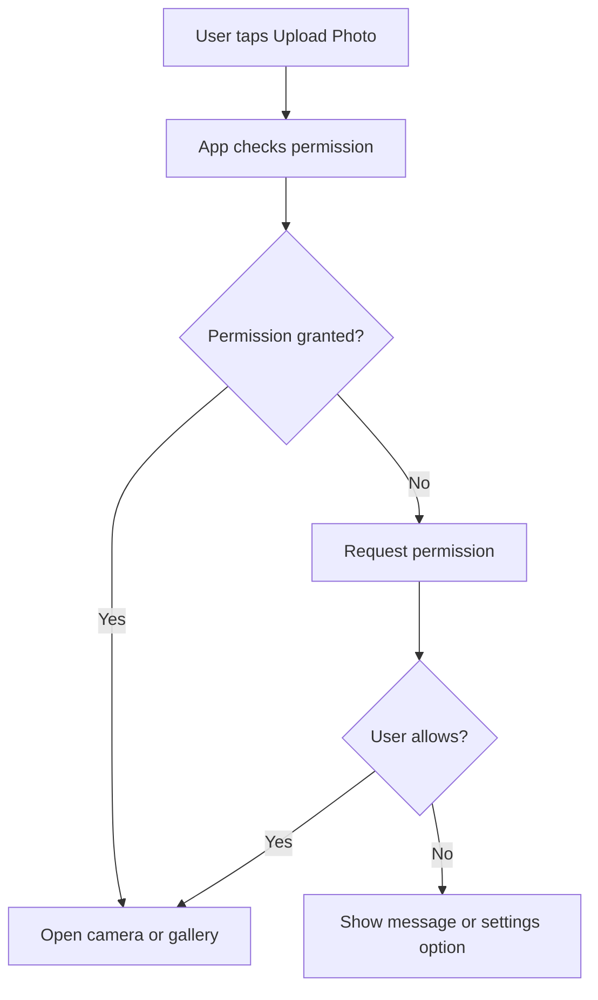

## 9.7 Common Exam Points and Mistakes

Important points:

- Plugins connect Flutter with native device features.
- Permissions are required for sensitive features.
- Android and iOS may need extra configuration files.
- Always handle denied permission.
- Do not assume permission is always granted.

Common mistakes:

- Forgetting Android/iOS permission setup
- Asking permission without explaining why
- Not handling user denial
- Calling camera/location before permission check

## 9.8 Sample Long Question and Answer

### Question

Explain how Flutter accesses platform-specific features using plugins. Describe the use of `image_picker` and `permission_handler` with examples.

### Answer

Flutter apps are written mainly in Dart, but many mobile features belong to the native operating system. Camera, gallery, location, storage, microphone, and notifications are examples of platform-specific features. Flutter accesses these features using plugins. A plugin works as a bridge between Dart code and native Android/iOS code.

Most plugins provide a simple Dart API. Internally, the plugin communicates with native Android/iOS code using platform channels or platform-specific implementations. The developer writes simple Flutter code, but the actual camera, gallery, or location operation is done by the mobile operating system.

The `image_picker` plugin allows the app to pick an image from the camera or gallery. In a Fitness Tracker app, it can be used to upload a profile picture, progress photo, or meal photo. The user taps a button, the app requests permission if needed, the plugin opens the camera/gallery, and then it returns the selected image path.

The `permission_handler` plugin is used to request and check permissions before using sensitive features like camera and location. Permissions are important because mobile operating systems protect user privacy. The app should not access camera, photos, or location without user approval.

Before accessing camera or gallery, the app should check permission. If permission is granted, the app can open the camera or gallery. If permission is denied, the app should show a proper message or guide the user to settings. A good app also explains why the permission is needed, for example: "We need camera permission to upload your workout progress photo." This makes the app safe, user-friendly, and platform-compliant.

## 9.9 MCQs

1. A Flutter plugin is mainly used to:
   - A. Access platform-specific features
   - B. Delete widgets
   - C. Replace Dart language
   - D. Remove Android and iOS folders
   - Answer: A

2. Which plugin is commonly used to pick image from gallery or camera?
   - A. image_picker
   - B. google_fonts
   - C. provider
   - D. bloc_test
   - Answer: A

3. Which plugin is used to request camera or location permission?
   - A. permission_handler
   - B. dio
   - C. intl only
   - D. url_launcher only
   - Answer: A

4. If user denies permission, the app should:
   - A. Handle it gracefully
   - B. Crash immediately
   - C. Ignore user choice
   - D. Delete app state
   - Answer: A

5. Platform channels connect:
   - A. Dart and native platform code
   - B. Two Text widgets only
   - C. Only Firebase and Firestore
   - D. Only Row and Column
   - Answer: A

---

# 10. Firebase Integration

## 10.1 Definition

Firebase is a backend platform by Google that provides services such as authentication, cloud database, storage, hosting, analytics, and notifications.

In Flutter, Firebase is commonly used to build apps without writing a full backend server from the beginning.

## 10.2 Beginner Explanation

Firebase can be imagined as a ready-made backend toolbox.

Instead of creating a server, database, login system, and hosting manually, Firebase gives many of these services in one platform.

For a Fitness Tracker app, Firebase can store:

- User profile
- Daily steps
- Workout records
- Progress history
- Uploaded images

## 10.3 Firebase Setup Overview

Basic steps:

1. Create Firebase project.
2. Register Android/iOS app.
3. Add Firebase configuration files.
4. Add Firebase packages in Flutter.
5. Initialize Firebase before running the app.

Add common Firebase packages using Flutter command:

```bash
flutter pub add firebase_core cloud_firestore
```

Initialize Firebase:

```dart
void main() async {
  WidgetsFlutterBinding.ensureInitialized();
  await Firebase.initializeApp();
  runApp(const FitnessApp());
}
```

## 10.4 Cloud Firestore

Cloud Firestore is a NoSQL cloud database.

It stores data in:

- Collections
- Documents
- Fields

Fitness Tracker example:

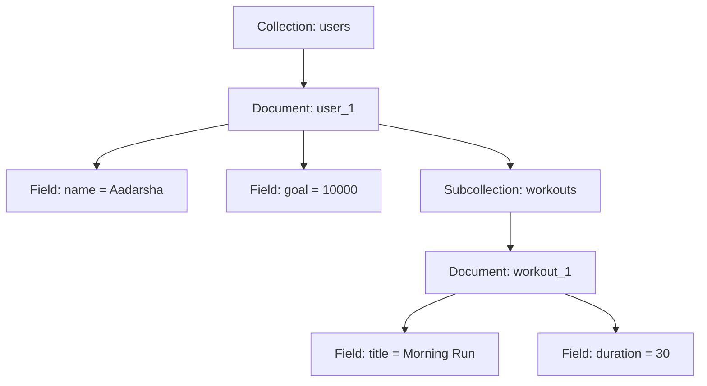

### Collection, Document, and Field

| Term | Simple Meaning | Fitness Tracker Example |
|---|---|---|
| Collection | Group of documents | `users`, `workouts` |
| Document | One record inside collection | `user_1`, `workout_1` |
| Field | Data inside document | `name`, `duration`, `goal` |

Firestore is not like a traditional SQL table. It does not use rows and columns in the same way. It uses flexible documents. Each document can have different fields, but in a real app it is better to keep a consistent structure.

## 10.5 Add Data to Firestore

```dart
await FirebaseFirestore.instance
    .collection('workouts')
    .add({
      'title': 'Morning Run',
      'duration': 30,
      'createdAt': FieldValue.serverTimestamp(),
    });
```

## 10.6 Read Data from Firestore

```dart
StreamBuilder<QuerySnapshot>(
  stream: FirebaseFirestore.instance
      .collection('workouts')
      .snapshots(),
  builder: (context, snapshot) {
    if (!snapshot.hasData) {
      return CircularProgressIndicator();
    }

    final docs = snapshot.data!.docs;

    return ListView.builder(
      itemCount: docs.length,
      itemBuilder: (context, index) {
        final workout = docs[index];
        return Text(workout['title']);
      },
    );
  },
)
```

## 10.7 Firestore Data Flow

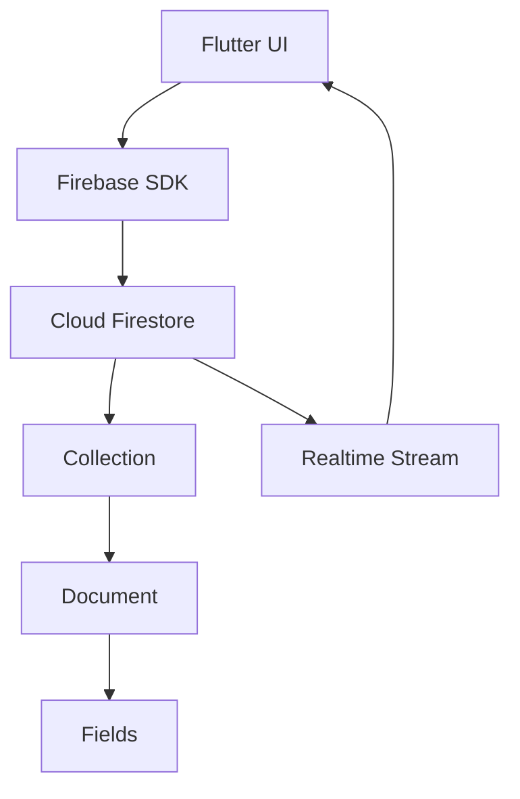

## 10.8 Firebase vs REST API

| Point | Firebase Firestore | REST API |
|---|---|---|
| Backend | Managed by Firebase | Built by backend team |
| Data update | Realtime support | Usually request-response |
| Structure | Collections/documents | Endpoints/resources |
| Setup | Faster for small apps | More flexible for custom backend |
| Example | Live step data | Fetch workout plans |

## 10.9 Firestore CRUD Operations

CRUD means Create, Read, Update, and Delete.

| Operation | Firestore Method | Example |
|---|---|---|
| Create | `add()` or `set()` | Add workout |
| Read | `get()` or `snapshots()` | Read workout list |
| Update | `update()` | Edit workout duration |
| Delete | `delete()` | Delete workout |

Update example:

```dart
await FirebaseFirestore.instance
    .collection('workouts')
    .doc('workout_1')
    .update({'duration': 45});
```

Delete example:

```dart
await FirebaseFirestore.instance
    .collection('workouts')
    .doc('workout_1')
    .delete();
```

`get()` reads data once. `snapshots()` listens continuously and updates UI in realtime when Firestore data changes.

## 10.10 Common Exam Points and Mistakes

Important points:

- Firebase provides backend services.
- Firestore is a NoSQL database.
- Firestore stores data in collections and documents.
- `StreamBuilder` is useful for realtime updates.
- Firebase must be initialized before use.

Common mistakes:

- Forgetting `WidgetsFlutterBinding.ensureInitialized()`
- Forgetting Firebase configuration
- Confusing collection and document
- Not securing Firestore rules
- Storing deeply nested data without planning

## 10.11 Sample Long Question and Answer

### Question

Explain Firebase integration in Flutter. Describe Firebase setup and Firestore CRUD operation with a Fitness Tracker example.

### Answer

Firebase is a backend platform by Google that provides services such as authentication, database, storage, analytics, hosting, and notifications. Flutter apps can use Firebase to store and retrieve data without building a complete backend server manually. This is useful for student projects and startup-style apps because Firebase reduces backend setup time.

To integrate Firebase, a Firebase project is created first in Firebase Console. Then the Android and iOS apps are registered. Firebase configuration files are added to the Flutter project. Required packages such as `firebase_core` and `cloud_firestore` are installed. Before using Firebase, the app must call `WidgetsFlutterBinding.ensureInitialized()` and `Firebase.initializeApp()` inside `main()` before `runApp()`. This ensures Firebase is ready before the app tries to read or write data.

Cloud Firestore is a NoSQL cloud database. It stores data in collections, documents, and fields. A collection is a group of documents, a document is one record, and fields are the values inside that document. In a Fitness Tracker app, the `users` collection may contain user documents. Each user document may contain fields like name, age, daily goal, and email. A `workouts` collection may store workout documents with title, duration, calories, and date.

Firestore supports CRUD operations. Create means adding a new document using `add()` or `set()`. Read means getting data using `get()` for one-time reading or `snapshots()` for realtime reading. Update means changing fields using `update()`. Delete means removing a document using `delete()`. In Flutter, `StreamBuilder` is commonly used with Firestore snapshots because it automatically rebuilds the UI when database data changes.

Firebase is useful because it reduces backend development time and supports realtime updates. However, developers must plan database structure carefully. They should avoid unnecessary deep nesting, keep data secure using Firestore security rules, and avoid storing sensitive information without protection. In a Fitness Tracker app, Firestore can make the dashboard update immediately when a new workout is added.

## 10.12 MCQs

1. Firebase is mainly used as:
   - A. Backend platform
   - B. Font package only
   - C. Dart operator
   - D. Widget tree only
   - Answer: A

2. Cloud Firestore is:
   - A. NoSQL cloud database
   - B. Image widget
   - C. Navigation method
   - D. Android emulator
   - Answer: A

3. Firestore stores data mainly in:
   - A. Collections and documents
   - B. Rows and columns only
   - C. CSS selectors
   - D. Routes only
   - Answer: A

4. Which widget is commonly used for realtime Firestore data?
   - A. StreamBuilder
   - B. MaterialApp only
   - C. GestureDetector only
   - D. Padding only
   - Answer: A

5. Firebase should be initialized:
   - A. Before runApp
   - B. After app is closed
   - C. Only in AndroidManifest
   - D. Inside pubspec.lock
   - Answer: A

---

# 11. Advanced State Management

## 11.1 Definition

Advanced state management means managing app data using organized patterns and packages when the app becomes large or complex.

Common advanced state management solutions in Flutter are:

- Bloc / Cubit
- Riverpod
- GetX

## 11.2 Why Advanced State Management is Needed

`setState` is good for small local changes. But large apps need better structure.

In a Fitness Tracker app, advanced state management may be needed for:

- Login state
- Workout API state
- Theme state
- User profile
- Step counter
- Offline cache
- Multiple screens sharing same data

## 11.3 Bloc and Cubit

Bloc separates UI from business logic using events and states.

Cubit is a simpler version of Bloc. It does not require separate event classes.

### Bloc Flow

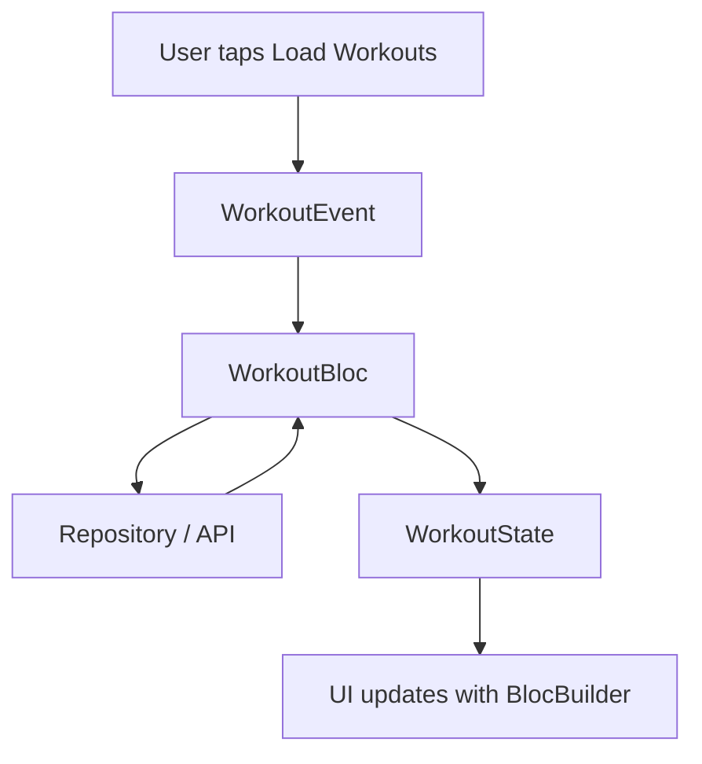

### Cubit Example

```dart
class CounterCubit extends Cubit<int> {
  CounterCubit() : super(0);

  void increment() {
    emit(state + 1);
  }
}
```

## 11.4 Important flutter_bloc Widgets

| Widget | Use |
|---|---|
| BlocProvider | Provides Bloc/Cubit to widget tree |
| BlocBuilder | Rebuilds UI when state changes |
| BlocListener | Performs one-time actions like snackbar/navigation |
| BlocConsumer | Combines builder and listener |
| MultiBlocProvider | Provides multiple blocs |

### How BlocProvider Works

`BlocProvider` is usually placed above the screen that needs the Bloc. It creates the Bloc object and stores it in the widget tree. Child widgets can then find the Bloc using `BuildContext`.

```dart
BlocProvider(
  create: (_) => WorkoutBloc(repository),
  child: const WorkoutScreen(),
)
```

Inside `WorkoutScreen`, the same Bloc can be used:

```dart
context.read<WorkoutBloc>().add(LoadWorkouts());
```

This is dependency injection because the screen does not create the Bloc itself. The Bloc is provided from above. This makes the screen cleaner and easier to test.

### BlocProvider Scope

Scope means where the Bloc is available.

| Placement | Available To |
|---|---|
| Above one screen | Only that screen and child widgets |
| Above `MaterialApp` | Almost whole app |
| Inside a list item | Only that list item subtree |

In a Fitness Tracker app, `AuthBloc` may be placed near the top of the app because login state is needed by many screens. `WorkoutBloc` may be placed only above the workout screen because workout loading is needed there only.

### BlocBuilder vs BlocListener

`BlocBuilder` is for building UI. It runs when state changes and returns a widget.

`BlocListener` is for actions that should happen once. It does not return UI. It is good for:

- Snackbar
- Dialog
- Navigation
- Showing success/error message once

Do not use `BlocBuilder` for navigation. If navigation is done inside the builder, it may run many times because build can be called many times.

## 11.5 Riverpod

Riverpod is a state management and dependency injection solution for Dart and Flutter.

It is similar in idea to Provider, but it is more flexible and does not depend directly on `BuildContext`.

Simple provider:

```dart
final stepGoalProvider = Provider<int>((ref) {
  return 10000;
});
```

Reading in widget:

```dart
class GoalText extends ConsumerWidget {
  const GoalText({super.key});

  @override
  Widget build(BuildContext context, WidgetRef ref) {
    final goal = ref.watch(stepGoalProvider);
    return Text('Goal: $goal steps');
  }
}
```

### How Riverpod Works

Riverpod stores providers outside the widget tree as normal Dart objects. A widget reads the provider using `ref.watch`, `ref.read`, or `ref.listen`.

| Riverpod Method | Meaning |
|---|---|
| `ref.watch` | Listen and rebuild when value changes |
| `ref.read` | Read once or call method |
| `ref.listen` | Listen for side effects |

Because Riverpod does not depend directly on `BuildContext`, it is easier to test and can be used more flexibly. In a Fitness Tracker app, Riverpod can provide `WorkoutRepository`, `AuthService`, and `StepGoalProvider` in a clean way.

## 11.6 GetX

GetX is a Flutter package that provides state management, dependency injection, and route management with less boilerplate.

Simple GetX controller:

```dart
class StepController extends GetxController {
  var steps = 0.obs;

  void addStep() {
    steps.value++;
  }
}
```

UI:

```dart
Obx(() => Text('Steps: ${controller.steps.value}'))
```

### How GetX Works

GetX often uses controller classes. A controller stores state and methods. Reactive values are created using `.obs`. When an `.obs` value changes, widgets wrapped with `Obx` rebuild automatically.

In a Fitness Tracker app, a `StepController` can store step count. When `steps.value++` is called, only the `Obx` widget reading that value rebuilds.

GetX can reduce boilerplate, but students should remember that less boilerplate does not mean no structure. Business logic should still be kept away from UI widgets.

## 11.7 Provider vs Bloc vs Riverpod vs GetX

| Tool | Simple Meaning | Best Use |
|---|---|---|
| Provider | Provides and listens to objects | Small to medium apps |
| Bloc | Event-state structured pattern | Large apps, testable logic |
| Riverpod | Provider-like but more flexible | Scalable apps with DI |
| GetX | All-in-one simple package | Fast development, less boilerplate |

## 11.8 Common Exam Points and Mistakes

Important points:

- Bloc uses events and states.
- Cubit uses methods and states.
- Riverpod does not require `BuildContext` for reading providers.
- GetX uses reactive variables like `.obs`.
- Advanced state management improves separation of concerns.

Common mistakes:

- Using advanced packages for very small local state
- Putting business logic inside widgets
- Rebuilding too much UI unnecessarily
- Using `BlocListener` for UI building
- Using `BlocBuilder` for navigation side effects

## 11.9 Sample Long Question and Answer

### Question

Compare Bloc, Riverpod, and GetX for advanced state management in Flutter.

### Answer

Advanced state management is used when a Flutter application becomes large and has many screens sharing data. In small apps, `setState()` may be enough. But in large apps, state may come from login, API calls, local database, theme settings, notifications, and user profile. If all this logic is kept inside widgets, the app becomes difficult to maintain and test. Bloc, Riverpod, and GetX are popular solutions for organizing such state.

Bloc separates UI from business logic using events and states. The UI sends events to the Bloc, the Bloc performs logic, and then emits states. `BlocProvider` provides the Bloc to the widget tree. `BlocBuilder` rebuilds UI when state changes. `BlocListener` handles side effects such as snackbar and navigation. In a Fitness Tracker app, a workout screen can send `LoadWorkouts` event. The Bloc emits `WorkoutLoading`, calls repository/API, and then emits `WorkoutLoaded` or `WorkoutError`. Bloc is highly structured and testable, so it is suitable for large applications with many business rules.

Riverpod is a flexible state management and dependency injection solution. It improves many ideas from Provider and does not depend directly on `BuildContext`. Widgets use `ref.watch` to listen, `ref.read` to call methods or read once, and `ref.listen` for side effects. Riverpod is useful when the app needs clean dependency management. For example, it can provide an API service, repository, auth state, and theme state separately.

GetX provides state management, routing, and dependency injection with less boilerplate. It uses controller classes and reactive variables such as `.obs`. Widgets wrapped with `Obx` rebuild when the reactive value changes. For example, a `StepController` may store `steps = 0.obs`; when steps changes, the step text updates automatically. GetX can be fast for development, but students should still keep business logic organized in controllers instead of mixing everything inside widgets.

In conclusion, Bloc is best for highly structured and testable large apps, Riverpod is good for scalable dependency management, and GetX is useful for quick reactive development with less boilerplate. The best choice depends on project size, team knowledge, testing needs, and how complex the app state is.

## 11.10 MCQs

1. Bloc mainly works with:
   - A. Events and states
   - B. Only images
   - C. Only CSS
   - D. Only AndroidManifest
   - Answer: A

2. Cubit is simpler than Bloc because:
   - A. It uses methods instead of separate event classes
   - B. It removes all states
   - C. It works only on iOS
   - D. It cannot emit values
   - Answer: A

3. Riverpod reads providers using:
   - A. WidgetRef
   - B. Android SDK
   - C. ImageSource only
   - D. AppBar
   - Answer: A

4. GetX reactive variables commonly use:
   - A. .obs
   - B. .png
   - C. .yaml only
   - D. .route only
   - Answer: A

5. BlocListener is best for:
   - A. One-time side effects like snackbar/navigation
   - B. Building every list item only
   - C. Defining font family
   - D. Adding image asset path
   - Answer: A

---

# 12. Geolocation and Local Notifications

## 12.1 Definition

Geolocation means finding the current physical location of the device.

Local notification means showing a notification from the app itself, even without receiving a push message from a server.

## 12.2 Beginner Explanation

In a Fitness Tracker app:

- Geolocation can track running route.
- Local notification can remind the user to drink water or start workout.

Both features need platform-specific support and permissions.

## 12.3 geolocator Plugin

`geolocator` is commonly used to get device location.

Example:

```dart
final position = await Geolocator.getCurrentPosition();

print(position.latitude);
print(position.longitude);
```

Before using location, the app should:

1. Check whether location service is enabled.
2. Check permission.
3. Request permission if needed.
4. Handle denied permission.
5. Get current position.

### Location Permission States

Location permission can have different states.

| State | Meaning | App Action |
|---|---|---|
| Granted | User allowed location | Get location |
| Denied | User denied for now | Ask again or explain |
| Denied forever | User blocked permission | Open app settings |
| Service disabled | GPS/location is off | Ask user to turn on location |

Fitness Tracker example:

If a user starts "Outdoor Run", the app should first check location service. If service is off, it should ask the user to turn on location. If permission is denied, it should explain why location is needed.

### Position Data

Location gives data such as:

- Latitude
- Longitude
- Accuracy
- Speed
- Timestamp

In a running tracker, latitude and longitude can be used to draw route. Speed and timestamp can help calculate pace.

## 12.4 flutter_local_notifications Plugin

`flutter_local_notifications` is used to display local notifications.

Fitness Tracker example:

- Daily workout reminder
- Water reminder
- Step goal reminder

Basic idea:

```dart
await notificationsPlugin.show(
  1,
  'Workout Reminder',
  'Time for your evening walk',
  notificationDetails,
);
```

### Notification Types

| Notification Type | Meaning | Fitness Tracker Example |
|---|---|---|
| Immediate notification | Shows now | "Workout saved successfully" |
| Scheduled notification | Shows later | "Time for morning walk" |
| Repeating notification | Shows repeatedly | Daily water reminder |

Local notifications are different from push notifications. Push notifications usually come from a server. Local notifications are scheduled or shown by the app on the device.

### Good Notification Practice

A good app should not disturb the user too much. Notifications should be useful, timely, and related to user goals.

Good examples:

- "You are 500 steps away from your goal."
- "Time for your planned workout."

Bad example:

- Sending too many random reminders without user control.

## 12.5 Location and Notification Flow

```mermaid
flowchart TD
  A["Fitness Tracker App"] --> B["Check Permission"]
  B --> C{"Allowed?"}
  C -->|"Yes"| D["Get Location or Show Notification"]
  C -->|"No"| E["Request Permission"]
  E --> F{"User Allows?"}
  F -->|"Yes"| D
  F -->|"No"| G["Show Helpful Message"]
```

## 12.6 Common Exam Points and Mistakes

Important points:

- Location requires permission.
- Location service may be turned off.
- Local notification may require platform setup.
- Notifications improve user engagement.
- Permission denial must be handled.

Common mistakes:

- Not checking location service status
- Ignoring denied permission
- Forgetting Android/iOS notification setup
- Showing too many notifications
- Not explaining why permission is required

## 12.7 Sample Long Question and Answer

### Question

Explain how geolocation and local notifications can be implemented in a Flutter Fitness Tracker app.

### Answer

Geolocation is used to get the physical location of the device. In a Fitness Tracker app, it can be used to track outdoor running route, calculate distance, measure speed, and show the user's path on a map. The `geolocator` plugin can get the current latitude and longitude of the device. Location data may also include accuracy, speed, altitude, and timestamp.

Before getting location, the app should check whether location service is enabled. Even if permission is granted, location cannot work properly if GPS/location service is turned off. After that, the app should check permission. If permission is denied, the app can request permission. If permission is denied forever, the app should guide the user to app settings. This is important because location is sensitive personal data.

Local notifications are notifications generated by the app itself. They do not always require a server message. In a Fitness Tracker app, local notifications can remind users to exercise, drink water, or complete their step goal. The `flutter_local_notifications` plugin is commonly used for this feature. Notifications can be immediate, scheduled, or repeating. For example, the app may show a daily reminder at 6 AM for morning walk.

Both geolocation and notifications need platform-specific configuration and permission handling. A good app should clearly explain why permission is required, handle denial gracefully, and avoid disturbing the user with too many notifications. These features make a Fitness Tracker app more useful because they connect the app with real-world movement and user routine.

## 12.8 MCQs

1. Geolocation is used to:
   - A. Get device location
   - B. Change font only
   - C. Create Dart class only
   - D. Build theme only
   - Answer: A

2. Which plugin is commonly used for location in Flutter?
   - A. geolocator
   - B. google_fonts
   - C. bloc_test
   - D. dio only
   - Answer: A

3. Local notifications are:
   - A. Notifications generated by the app/device
   - B. Only server database rows
   - C. Only app icons
   - D. Only widgets
   - Answer: A

4. Before using location, app should check:
   - A. Permission and service status
   - B. Only app color
   - C. Only font size
   - D. Only route name
   - Answer: A

5. Fitness app can use notification for:
   - A. Workout reminder
   - B. Deleting main.dart
   - C. Removing widgets
   - D. Changing Android folder name
   - Answer: A

---

# 13. Animations and Custom UI

## 13.1 Definition

Animation in Flutter means changing UI values smoothly over time, such as size, position, color, opacity, or rotation.

Custom UI means creating user interface designs that go beyond basic ready-made widgets.

## 13.2 Beginner Explanation

Animation makes an app feel alive.

In a Fitness Tracker app:

- Progress ring fills smoothly
- Step counter number increases smoothly
- Workout card expands when tapped
- Achievement badge appears with fade animation

## 13.3 Types of Animation

| Type | Meaning | Example |
|---|---|---|
| Implicit animation | Flutter handles animation automatically | AnimatedContainer |
| Explicit animation | Developer controls animation | AnimationController |
| Hero animation | Shared element animation between screens | Profile image transition |

## 13.4 Animation Building Blocks

Flutter animation is based on changing values over time.

Important building blocks:

| Concept | Meaning |
|---|---|
| Duration | How long animation takes |
| Curve | Speed style of animation |
| Tween | Start value and end value |
| AnimationController | Controls animation time |
| AnimatedBuilder | Rebuilds only animated part |
| Ticker | Provides frame-by-frame signal |

### Duration

Duration decides animation time.

```dart
duration: const Duration(milliseconds: 300)
```

A very short animation may not be visible. A very long animation may make the app feel slow.

### Curve

Curve controls how animation moves.

Example:

- `Curves.linear`: same speed
- `Curves.easeIn`: starts slow
- `Curves.easeOut`: ends slow
- `Curves.easeInOut`: smooth start and end

Fitness Tracker example:

A progress ring should fill smoothly using `Curves.easeOut` so the motion feels natural.

## 13.5 Implicit Animation Example

`AnimatedContainer` automatically animates changes.

```dart
AnimatedContainer(
  duration: Duration(milliseconds: 300),
  width: isSelected ? 200 : 120,
  height: 80,
  color: isSelected ? Colors.green : Colors.grey,
)
```

Implicit animations are beginner-friendly because the developer only changes the value. Flutter compares old value and new value, then animates between them.

Common implicit animation widgets:

- `AnimatedContainer`
- `AnimatedOpacity`
- `AnimatedPadding`
- `AnimatedAlign`
- `TweenAnimationBuilder`

Fitness Tracker example:

When the user completes 80% of daily step goal, a progress card can change from grey to green using `AnimatedContainer`.

## 13.6 Explicit Animation

Explicit animation gives more control.

Common classes:

- `AnimationController`
- `Tween`
- `AnimatedBuilder`

Simple meaning:

- Controller controls time.
- Tween controls value range.
- Builder rebuilds animated UI.

Example:

```dart
class ProgressRing extends StatefulWidget {
  const ProgressRing({super.key});

  @override
  State<ProgressRing> createState() => _ProgressRingState();
}

class _ProgressRingState extends State<ProgressRing>
    with SingleTickerProviderStateMixin {
  late final AnimationController controller;

  @override
  void initState() {
    super.initState();
    controller = AnimationController(
      vsync: this,
      duration: const Duration(seconds: 1),
    )..forward();
  }

  @override
  void dispose() {
    controller.dispose();
    super.dispose();
  }

  @override
  Widget build(BuildContext context) {
    return AnimatedBuilder(
      animation: controller,
      builder: (context, child) {
        return Text('${(controller.value * 100).toInt()}%');
      },
    );
  }
}
```

### Why dispose is Important

`AnimationController` uses resources to listen to screen frames. If the widget is removed but the controller is not disposed, memory/resource problems can happen. Therefore, always call `controller.dispose()` inside `dispose()`.

## 13.7 Hero Animation

Hero animation is used when the same visual element moves from one screen to another.

Fitness Tracker example:

The user's profile photo appears small on dashboard. When the user opens profile screen, the same photo expands smoothly.

```dart
Hero(
  tag: 'profile-photo',
  child: Image.network(user.photoUrl),
)
```

Both screens must use the same `tag`.

## 13.8 Custom Widgets

A custom widget is a widget created by the developer to reuse UI.

Fitness Tracker example:

```dart
class WorkoutCard extends StatelessWidget {
  final String title;
  final int duration;

  const WorkoutCard({
    super.key,
    required this.title,
    required this.duration,
  });

  @override
  Widget build(BuildContext context) {
    return Card(
      child: ListTile(
        title: Text(title),
        subtitle: Text('$duration minutes'),
      ),
    );
  }
}
```

### Why Custom Widgets Matter

Custom widgets make code reusable and clean. Instead of copying the same workout card UI in many screens, the developer creates one `WorkoutCard` and uses it everywhere.

Benefits:

- Less duplicate code
- Easier maintenance
- Consistent UI
- Easier testing
- Cleaner screen files

## 13.9 CustomPainter

`CustomPainter` is used when normal widgets are not enough and we need to draw custom shapes.

Fitness Tracker example:

- Circular progress chart
- Step goal ring
- Calories graph

How `CustomPainter` works:

1. Create a class extending `CustomPainter`.
2. Override `paint(Canvas canvas, Size size)`.
3. Use `Canvas` to draw lines, circles, arcs, or paths.
4. Use `Paint` to define color, stroke width, and style.
5. Use `CustomPaint` widget to display it.

Simple example idea:

```dart
class StepRingPainter extends CustomPainter {
  @override
  void paint(Canvas canvas, Size size) {
    final paint = Paint()
      ..color = Colors.green
      ..strokeWidth = 8
      ..style = PaintingStyle.stroke;

    canvas.drawCircle(size.center(Offset.zero), 40, paint);
  }

  @override
  bool shouldRepaint(covariant CustomPainter oldDelegate) {
    return false;
  }
}
```

`shouldRepaint` tells Flutter whether the custom drawing should be repainted. Returning `false` is good when drawing does not change. If progress value changes, `shouldRepaint` should compare old and new values.

## 13.10 Animation Flow

```mermaid
flowchart TD
  A["User Action or State Change"] --> B["Animation Starts"]
  B --> C["Value Changes Over Time"]
  C --> D["Widget Rebuilds Smoothly"]
  D --> E["User Sees Motion"]
```

## 13.11 Common Exam Points and Mistakes

Important points:

- Animation improves user experience.
- Use implicit animations for simple cases.
- Use explicit animations for more control.
- `AnimationController` controls time.
- `Tween` defines start and end values.
- `Curve` controls motion feeling.
- Custom widgets improve reuse.
- CustomPainter is used for custom drawing.

Common mistakes:

- Overusing animations
- Making animations too slow
- Forgetting to dispose `AnimationController`
- Repeating same UI instead of creating custom widget
- Using same Hero tag for unrelated elements
- Repainting custom painter unnecessarily

## 13.12 Sample Long Question and Answer

### Question

Explain animations and custom UI in Flutter with examples.

### Answer

Animation in Flutter means smoothly changing UI values over time. It can change size, color, opacity, position, rotation, or progress value. Animation improves user experience because it gives visual feedback and makes the app feel smooth and interactive. In a Fitness Tracker app, animation can be used when a progress ring fills, a step count increases, a workout card expands, or an achievement badge appears.

Flutter supports implicit and explicit animations. Implicit animations are easier. In implicit animation, the developer changes a property value and Flutter automatically animates from the old value to the new value. Examples include `AnimatedContainer`, `AnimatedOpacity`, `AnimatedPadding`, and `AnimatedAlign`. For example, a workout card can become green when the workout is completed using `AnimatedContainer`.

Explicit animation gives more control. It uses classes such as `AnimationController`, `Tween`, and `AnimatedBuilder`. `AnimationController` controls the time of the animation. `Tween` defines the beginning and ending value. `AnimatedBuilder` rebuilds the animated part of the UI efficiently. Explicit animation is useful when the developer needs to start, stop, reverse, repeat, or coordinate animations. When using `AnimationController`, the controller must be disposed inside `dispose()` to avoid resource problems.

Flutter also supports Hero animation. Hero animation moves the same visual element between two screens. In a Fitness Tracker app, a small profile photo on dashboard can smoothly expand into a larger profile photo on the profile screen. Both Hero widgets must have the same tag.

Custom UI means creating reusable and specialized widgets. In a Fitness Tracker app, a `WorkoutCard` widget can be created and reused in many screens. This reduces duplicate code and keeps design consistent. If normal widgets are not enough, `CustomPainter` can be used to draw custom shapes such as circular progress chart, step goal ring, or calories graph. `CustomPainter` uses `Canvas` and `Paint` to draw directly.

Animations and custom UI should be used carefully. They should improve clarity and user experience, not distract the user. A good Flutter developer uses simple implicit animations for common UI changes and explicit animations only when more control is needed.

## 13.13 MCQs

1. AnimatedContainer is an example of:
   - A. Implicit animation
   - B. Database
   - C. Permission plugin
   - D. REST API
   - Answer: A

2. Which class controls explicit animation time?
   - A. AnimationController
   - B. MaterialApp
   - C. FirebaseFirestore
   - D. Dio
   - Answer: A

3. CustomPainter is used for:
   - A. Custom drawing
   - B. API request only
   - C. Permission request only
   - D. Navigation stack only
   - Answer: A

4. Custom widgets help in:
   - A. Reusing UI code
   - B. Removing Dart
   - C. Deleting app screens
   - D. Replacing Android SDK
   - Answer: A

5. A good animation should be:
   - A. Smooth and meaningful
   - B. Random and confusing
   - C. Always very slow
   - D. Used everywhere without reason
   - Answer: A

---

# 14. Flutter App Testing

## 14.1 Definition

Testing in Flutter means checking whether app logic, widgets, and complete user flows work correctly.

Testing helps developers find bugs early and build reliable apps.

## 14.2 Beginner Explanation

Testing is like checking homework before submission.

In a Fitness Tracker app, testing can check:

- Step calculation works correctly
- Workout card appears on screen
- Login flow works
- Bloc emits correct states
- API error message is shown properly

## 14.3 Types of Flutter Tests

| Test Type | What It Tests | Example |
|---|---|---|
| Unit test | Single function/class | Calories calculation |
| Widget test | Single widget UI | WorkoutCard displays title |
| Integration test | Full app flow | Login and view dashboard |
| Bloc test | Bloc/Cubit state flow | Load workouts success/error |

## 14.4 Testing Pyramid

Testing pyramid means most tests should be small and fast, and fewer tests should be large and slow.

```mermaid
flowchart TB
  A["Few Integration Tests<br/>Full app flow"] --> B["Some Widget Tests<br/>UI components"]
  B --> C["Many Unit Tests<br/>Logic and classes"]
```

Unit tests are at the bottom because they are fast and easy to write. Integration tests are at the top because they run more of the app and take more time.

## 14.5 Unit Test Example

```dart
int calculateCalories(int minutes) {
  return minutes * 8;
}
```

Test:

```dart
test('calculates calories', () {
  expect(calculateCalories(10), 80);
});
```

## 14.6 Widget Test Example

```dart
testWidgets('shows workout title', (tester) async {
  await tester.pumpWidget(
    MaterialApp(
      home: WorkoutCard(title: 'Run', duration: 30),
    ),
  );

  expect(find.text('Run'), findsOneWidget);
});
```

### How Widget Test Works

In a widget test, Flutter creates the widget in a test environment. The tester can:

- Pump a widget
- Find text or widgets
- Tap buttons
- Enter text
- Rebuild after state changes

`pumpWidget()` puts the widget on test screen. `find.text()` searches for text. `expect()` checks the result.

## 14.7 Bloc Test Idea

Bloc test checks whether correct states are emitted after events/actions.

Example flow:

```mermaid
flowchart TD
  A["Add LoadWorkouts event"] --> B["WorkoutLoading"]
  B --> C["API returns data"]
  C --> D["WorkoutLoaded"]
```

Example idea:

```dart
blocTest<WorkoutBloc, WorkoutState>(
  'emits loading and loaded when API succeeds',
  build: () => WorkoutBloc(fakeRepository),
  act: (bloc) => bloc.add(LoadWorkouts()),
  expect: () => [
    isA<WorkoutLoading>(),
    isA<WorkoutLoaded>(),
  ],
);
```

This checks business logic without manually opening the full app.

## 14.8 Integration Testing

Integration tests check a real app flow.

Fitness Tracker example:

1. Open app.
2. Enter login details.
3. Tap login.
4. Dashboard opens.
5. Workout list appears.

Integration tests are useful because they test how screens work together. But they are slower than unit tests and widget tests. Therefore, developers should not depend only on integration tests.

## 14.9 Mocking and Fake Services

Real APIs can be slow, unstable, or unavailable during tests. For this reason, developers use fake or mock services.

Example:

- Real service calls internet.
- Fake service returns fixed sample workout data.

This makes tests faster and more reliable.

Fitness Tracker example:

Instead of calling the real workout API during unit test, a fake repository can return:

```dart
[
  Workout(id: 1, title: 'Morning Run', duration: 30),
]
```

Then the test can check whether Bloc emits `WorkoutLoaded`.

## 14.10 Common Exam Points and Mistakes

Important points:

- Unit tests are fast and test logic.
- Widget tests test UI widgets.
- Integration tests test complete app flows.
- Bloc tests check state transitions.
- Testing improves reliability and confidence.

Common mistakes:

- Testing only happy path
- Ignoring error cases
- Writing tests after app is already broken
- Depending on real API in every test
- Not mocking dependencies

## 14.11 Sample Long Question and Answer

### Question

Explain different types of testing in Flutter. Include examples from a Fitness Tracker app.

### Answer

Testing in Flutter is the process of checking whether app logic, widgets, state management, and user flows work correctly. Testing helps developers find bugs early, maintain app quality, and change code with confidence. In a Fitness Tracker app, tests can check calories calculation, workout card UI, login flow, and Bloc state changes.

Unit testing checks a single function or class. It is fast and does not need a real phone UI. In a Fitness Tracker app, a calorie calculation function can be tested using `expect()`. For example, if 10 minutes of workout should burn 80 calories, the unit test checks that the function returns 80. Unit tests are suitable for services, repositories, utility functions, and business logic.

Widget testing checks whether a widget appears and behaves correctly. Flutter provides a widget testing environment where the tester can pump widgets, tap buttons, enter text, and search for widgets. For example, a `WorkoutCard` widget can be tested to confirm that it displays the workout title and duration.

Integration testing checks a complete user flow in the app. For example, the test can open the app, perform login, navigate to dashboard, and check whether workout data appears. Integration tests are closer to real user behavior, but they are slower than unit and widget tests.

Bloc testing checks whether a Bloc or Cubit emits the correct states. For example, after the UI sends `LoadWorkouts`, the Bloc should emit `WorkoutLoading` and then `WorkoutLoaded` if API succeeds. If API fails, it should emit `WorkoutError`. This makes business logic predictable and testable.

Testing often uses fake or mock services. A fake workout repository can return sample data instead of calling a real API. This makes tests faster and more reliable. A good testing strategy uses many unit tests, some widget tests, and fewer integration tests.

## 14.12 MCQs

1. Unit test mainly checks:
   - A. Single function or class
   - B. App store account
   - C. Phone camera only
   - D. UI color only
   - Answer: A

2. Widget test checks:
   - A. Flutter widget UI
   - B. Firebase billing only
   - C. Android hardware only
   - D. App icon only
   - Answer: A

3. Integration test checks:
   - A. Complete app flow
   - B. Only one variable
   - C. Only pubspec comments
   - D. Only font name
   - Answer: A

4. Bloc test checks:
   - A. State changes emitted by Bloc/Cubit
   - B. Image file extension only
   - C. Device screen size only
   - D. Play Store description only
   - Answer: A

5. Testing helps to:
   - A. Find bugs early
   - B. Remove all widgets
   - C. Avoid writing code
   - D. Delete API
   - Answer: A

---

# 15. Releasing Flutter App

## 15.1 Definition

Releasing a Flutter app means preparing the app for real users and publishing it to app stores such as Google Play Store or Apple App Store.

Release build is different from debug build. It is optimized for performance and does not include debugging tools.

## 15.2 Beginner Explanation

During development, the app is like a draft copy.

Before publishing, the developer must:

- Set app name and icon
- Set package name or bundle identifier
- Add permissions properly
- Test app
- Build release file
- Upload to store

## 15.3 Android Release

Common Android release files:

| File | Meaning |
|---|---|
| APK | Android app package |
| AAB | Android App Bundle, commonly used for Play Store |

Build commands:

```bash
flutter build apk --release
flutter build appbundle --release
```

For Play Store, AAB is usually preferred.

## 15.4 iOS Release

iOS apps are released through Apple tools and App Store Connect.

Common requirements:

- Apple Developer account
- Bundle identifier
- Signing certificate
- Provisioning profile
- Xcode archive
- App Store Connect listing

Build command:

```bash
flutter build ipa
```

## 15.5 Release Checklist

Before release:

- Test app on real device
- Check permissions
- Check API base URL
- Add app icon
- Add splash screen
- Set version number
- Check privacy policy
- Remove debug logs if needed
- Build release artifact
- Upload to store

## 15.6 App Signing

App signing proves that the app was built by the correct developer.

For Android:

- Developer creates or uses an upload key.
- The app is signed before uploading.
- Play Console verifies the app identity.

For iOS:

- Apple Developer account is required.
- Signing certificate and provisioning profile are used.
- Xcode/App Store Connect verifies the app.

Without correct signing, the store may reject the app or the app may not install properly.

## 15.7 Versioning

Flutter version is usually written in `pubspec.yaml`.

```yaml
version: 1.0.0+1
```

Meaning:

- `1.0.0` is version name shown to user
- `+1` is build number used by store

## 15.8 Build Modes

Flutter has different build modes.

| Build Mode | Use |
|---|---|
| Debug | Development and hot reload |
| Profile | Performance testing |
| Release | Final optimized app for users |

Debug mode is not used for publishing. Release mode removes debugging overhead and improves performance.

## 15.9 Release Flow

```mermaid
flowchart TD
  A["Complete Flutter App"] --> B["Test on Device"]
  B --> C["Configure App Name, Icon, Version"]
  C --> D["Build Release APK/AAB/IPA"]
  D --> E["Upload to Play Console or App Store Connect"]
  E --> F["Review Process"]
  F --> G["Published App"]
```

## 15.10 Common Exam Points and Mistakes

Important points:

- Debug build is for development.
- Release build is for users.
- Play Store commonly uses AAB.
- iOS release requires Apple Developer account and signing.
- App version and build number are important.
- App signing is required for store publishing.
- Privacy policy may be required for sensitive data/permissions.

Common mistakes:

- Uploading debug build
- Forgetting app signing
- Using wrong API URL
- Not testing on real device
- Missing privacy policy for sensitive permissions

## 15.11 Sample Long Question and Answer

### Question

Explain the process of releasing a Flutter app to Android and iOS app stores.

### Answer

Releasing a Flutter app means preparing it for real users and publishing it to app stores such as Google Play Store and Apple App Store. During development, Flutter apps usually run in debug mode. Debug mode supports hot reload and debugging tools, but it is not suitable for publishing. For users, developers must create a release build, which is optimized for performance.

Before release, the developer should configure app name, app icon, package name or bundle identifier, version number, permissions, API base URL, and privacy policy. The app should be tested on real devices because emulator testing may not reveal all issues. For example, camera, location, notification, and performance should be tested on real phones.

For Android, the developer should configure signing. App signing proves that the app belongs to the correct developer. Then the app can be built using `flutter build apk --release` or `flutter build appbundle --release`. APK can be installed directly, but for Google Play Store, Android App Bundle (AAB) is commonly preferred. The app is uploaded to Google Play Console with screenshots, description, category, content rating, privacy policy, and release notes.

For iOS, the developer needs an Apple Developer account, bundle identifier, signing certificate, provisioning profile, and App Store Connect setup. The app can be built using Flutter and Xcode tools, archived, and uploaded to App Store Connect. Apple reviews the app before publishing.

Versioning is also important. In Flutter, version is written in `pubspec.yaml`, for example `1.0.0+1`. Here `1.0.0` is the version name shown to users and `+1` is the build number used by app stores. Every new upload usually needs a higher build number.

In conclusion, releasing a Flutter app includes preparing app metadata, testing, signing, building release artifacts, uploading to store, and passing review. A Fitness Tracker app must especially check health data privacy, location permission, notification permission, and API production URL before release.

## 15.12 MCQs

1. Release build is used for:
   - A. Real users/app publishing
   - B. Only writing comments
   - C. Deleting source code
   - D. Only hot reload
   - Answer: A

2. Which Android file is commonly preferred for Play Store?
   - A. AAB
   - B. DOCX
   - C. PNG only
   - D. YAML only
   - Answer: A

3. Which command builds Android App Bundle?
   - A. flutter build appbundle --release
   - B. flutter doctor delete
   - C. dart run ios only
   - D. flutter clean store
   - Answer: A

4. iOS release commonly requires:
   - A. Apple Developer account
   - B. Only Android Studio emulator
   - C. Firebase only
   - D. Dio only
   - Answer: A

5. `version: 1.0.0+1` means:
   - A. Version name and build number
   - B. Only app color
   - C. Only font size
   - D. Only API URL
   - Answer: A

---

# 16. Quick Revision Tables

## 16.1 Flutter Core Summary

| Topic | One-line exam answer |
|---|---|
| Flutter | UI SDK for building multi-platform apps using Dart |
| Dart | Programming language used by Flutter |
| Widget | Basic building block of Flutter UI |
| StatelessWidget | Widget without internal changing state |
| StatefulWidget | Widget with internal changing state |
| MaterialApp | Root wrapper for Material Design apps |
| CupertinoApp | Root wrapper for iOS-style apps |
| Scaffold | Basic page structure with app bar, body, drawer, etc. |
| Navigator | Manages screen stack |
| Provider | State management package using provided objects and listeners |
| Bloc | Pattern that separates business logic using events and states |
| Dio | HTTP client package for API calls |
| Firebase | Backend platform for database, auth, storage, and more |
| Firestore | NoSQL cloud database using collections and documents |
| Plugin | Package that connects Flutter with platform features |
| Animation | Smooth UI change over time |
| Testing | Checking logic, widgets, and app flows |

## 16.2 Exam Difference Table

| Pair | Main Difference |
|---|---|
| Native vs Cross-platform | Native uses separate platform code; cross-platform uses mostly one codebase |
| Hot reload vs Hot restart | Hot reload keeps state usually; hot restart clears state |
| Row vs Column | Row is horizontal; Column is vertical |
| Padding vs Margin | Padding is inside space; margin is outside space |
| ListView vs ListView.builder | ListView builds fixed list; builder is better for dynamic/large list |
| push vs pop | push opens screen; pop closes current screen |
| setState vs Provider | setState is local; Provider shares state |
| Provider vs Bloc | Provider is simpler; Bloc is more structured |
| REST API vs Firestore | REST uses endpoints; Firestore uses collections/documents |
| Unit test vs Widget test | Unit tests logic; widget tests UI widgets |
| Debug build vs Release build | Debug is for development; release is optimized for users |

---

# 17. Important Long Questions for Practice

## Question 1

Compare native and cross-platform development. Explain why Flutter is suitable for building a Fitness Tracker app.

### Answer Outline

- Define native development.
- Define cross-platform development.
- Compare codebase, cost, time, performance, team size.
- Explain Flutter advantages: one codebase, widgets, hot reload, performance, packages.
- Connect with Fitness Tracker app: dashboard, workout list, profile, progress screen reused across Android and iOS.

## Question 2

Explain Flutter architecture with a neat diagram.

### Answer Outline

- Flutter is layered.
- Dart code and Flutter framework.
- Widgets, rendering, animation, gestures.
- `dart:ui` connects framework to engine.
- Engine handles rendering, text, input.
- Impeller/Skia convert UI to pixels.
- Platform embedder connects with OS.
- Platform channels connect Dart and native code.

## Question 3

Explain Dart null safety and collections with examples.

### Answer Outline

- Null safety prevents null errors.
- `String?` means nullable.
- `??` provides default value.
- `!` should be used carefully.
- List stores ordered data.
- Map stores key-value data.
- Set stores unique data.
- Fitness app examples: workout list, weekly steps map, badge set.

## Question 4

Explain navigation stack in Flutter.

### Answer Outline

- Navigation means moving between screens.
- Navigator manages route stack.
- Stack follows LIFO.
- `push()` adds a screen.
- `pop()` removes current screen.
- Named routes use string route names.
- Data can be passed with constructors or arguments.

## Question 5

Explain Provider and Bloc state management.

### Answer Outline

- State means changing app data.
- Provider uses ChangeNotifier and Consumer.
- `notifyListeners()` updates UI.
- MultiProvider provides multiple state objects.
- Bloc uses event, bloc, and state.
- Bloc separates business logic from UI.
- Provider is simpler; Bloc is better for large structured apps.

## Question 6

Explain API integration in Flutter using Dio.

### Answer Outline

- Define API call.
- Explain REST API and JSON.
- Add Dio dependency.
- Create model class.
- Create API service or repository.
- Use async/await.
- Handle loading, success, and error.
- Display data using ListView.builder.

## Question 7

Explain Firebase Firestore integration in Flutter.

### Answer Outline

- Define Firebase.
- Explain Firestore as NoSQL database.
- Explain collections, documents, and fields.
- Initialize Firebase.
- Add data using add/set.
- Read realtime data using snapshots and StreamBuilder.
- Mention security rules and proper data planning.

## Question 8

Explain Flutter testing and releasing process.

### Answer Outline

- Define testing.
- Unit test checks logic.
- Widget test checks UI.
- Integration test checks app flow.
- Bloc test checks emitted states.
- Release build is optimized.
- Android uses APK/AAB.
- iOS uses App Store Connect and signing.

---

# 18. Extra MCQ Practice

1. Which widget provides basic Material page structure?
   - A. Scaffold
   - B. Text
   - C. Map
   - D. Set
   - Answer: A

2. Which file usually contains `main()` in a Flutter app?
   - A. lib/main.dart
   - B. ios/main.swift
   - C. android/app.gradle only
   - D. pubspec.lock only
   - Answer: A

3. Which widget is commonly used for app title bar in Material apps?
   - A. AppBar
   - B. Stack
   - C. GestureDetector
   - D. Set
   - Answer: A

4. Which widget detects taps and gestures?
   - A. GestureDetector
   - B. MaterialApp
   - C. ThemeData
   - D. List
   - Answer: A

5. Which routing style is command-based?
   - A. Imperative routing
   - B. Declarative routing
   - C. Database routing
   - D. CSS routing
   - Answer: A

6. Which package is commonly used for Provider state management?
   - A. provider
   - B. google_maps only
   - C. http only
   - D. image_picker only
   - Answer: A

7. Which widget is used to show iOS-style button?
   - A. CupertinoButton
   - B. ElevatedButton only
   - C. TextField
   - D. Row
   - Answer: A

8. Which command creates a new Flutter project?
   - A. flutter create app_name
   - B. flutter doctor app_name
   - C. dart delete app_name
   - D. pub remove all
   - Answer: A

9. Which keyword is used to create a class in Dart?
   - A. class
   - B. object
   - C. design
   - D. page
   - Answer: A

10. Which operator gives a default value when a variable is null?
    - A. ??
    - B. &&
    - C. ||
    - D. ++
    - Answer: A

11. Which package is used for Dio API calls?
    - A. dio
    - B. flutter_test only
    - C. cloud_firestore only
    - D. google_fonts only
    - Answer: A

12. Which Firebase database stores collections and documents?
    - A. Cloud Firestore
    - B. ThemeData
    - C. Navigator
    - D. AnimationController
    - Answer: A

13. Which test checks UI widgets?
    - A. Widget test
    - B. Unit test only
    - C. Store test only
    - D. Font test only
    - Answer: A

14. Which command creates Android release app bundle?
    - A. flutter build appbundle --release
    - B. flutter run debug only
    - C. dart format ios
    - D. firebase init widget
    - Answer: A

15. Which plugin can get current location?
    - A. geolocator
    - B. google_fonts
    - C. provider only
    - D. dio only
    - Answer: A

---

# 19. References for Current Flutter Terminology

These references are useful for teachers and students who want official wording:

- Flutter architectural overview: https://docs.flutter.dev/resources/architectural-overview
- Impeller rendering engine: https://docs.flutter.dev/perf/impeller
- Platform channels: https://docs.flutter.dev/platform-integration/platform-channels
- Flutter UI and widgets: https://docs.flutter.dev/ui
- Flutter layout guide: https://docs.flutter.dev/ui/layout
- Networking in Flutter: https://docs.flutter.dev/cookbook/networking/fetch-data
- Flutter testing: https://docs.flutter.dev/testing
- Flutter deployment: https://docs.flutter.dev/deployment
- Flutter animations: https://docs.flutter.dev/ui/animations
- Dio package: https://pub.dev/packages/dio
- Firebase for Flutter: https://firebase.google.com/docs/flutter/setup
- Cloud Firestore for Flutter: https://firebase.google.com/docs/firestore/quickstart
- flutter_bloc package: https://pub.dev/packages/flutter_bloc
- Riverpod documentation: https://riverpod.dev
- GetX package: https://pub.dev/packages/get
- geolocator package: https://pub.dev/packages/geolocator
- flutter_local_notifications package: https://pub.dev/packages/flutter_local_notifications
